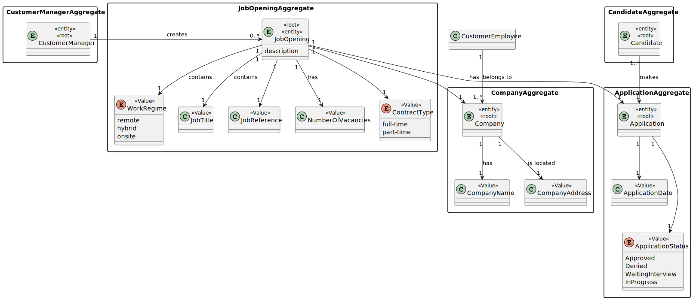
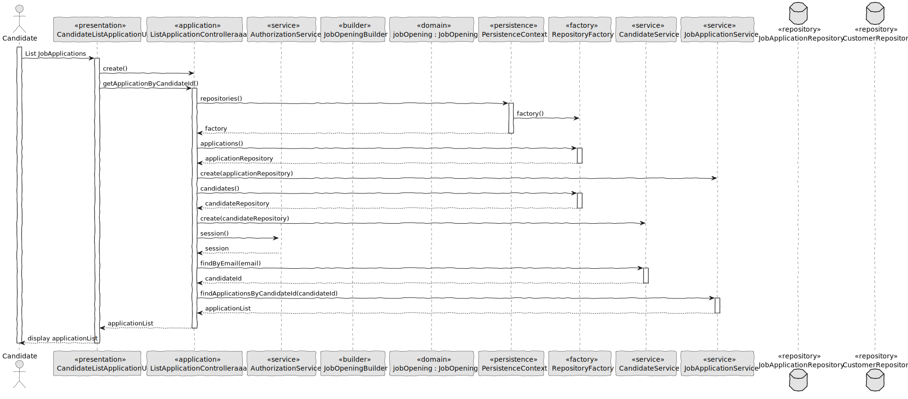
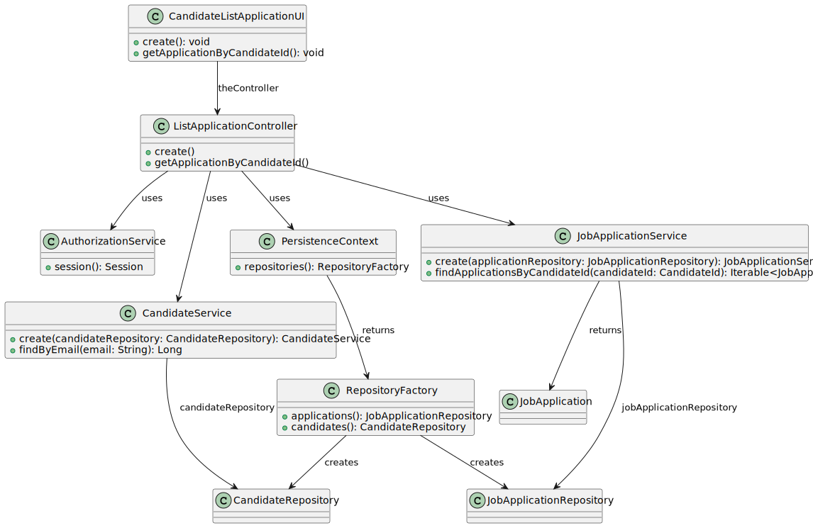

# 3000 - US list all my applications and their state (including the number of applicants). #

## 1. Context

This Us consist into the Candidate to be capable of list all my applications and their state (including the number of applicants). 

## 2. Requirements

**US 3000** As a Candidate, I want to list all my applications and their state (including the number of applicants).

**Acceptance Criteria:**

- 3000.1. The system should list every application.
- 3000.2. The listed application must include its state and number of applicants.
- 3000.3. The UI shoud be easy and straight foward to use. 

**Dependencies/References:**

> Question : Relativamente aos critérios para a listagem das candidaturas: Devem aparecer candidaturas que estão a decorrer ou podem aparecer candidaturas feitas no passado? Podem aparecer quaisquer candidaturas ou apenas as que tenham sido aceites? Que informação deverá ser mostrada em cada candidatura?

> Answer : Tal como refere a descrição da US, devem ser listadas todas as candidaturas para um job opening. Faz sentido mostrar todas as candidaturas, independentemente do seu estado. Assim, para cada cada candidatura deve ser identificado o candidato e o estado da sua candidatura.

## 3. Analysis

## 4. Design

### 4.1. Realization

### 4.2. Class Diagram

### 4.3. Applied Patterns

- 4.3.1 Service
> Services are operations with the responsibility of an entity or value object. They are used to model operations that involve multiple objects or complex behaviour.

- 4.3.2. Factory
> Our PersistenceContext will create a RepositoryFactory then the RepositoryFactory will create the repository that we need in order to persist our domain entity, in this case the Job Opening

- 4.3.3 Tell, Don't Ask
> Ensure that objects do not expose their internal state or behaviour to the outside world. On the contrary, objects should receive commands telling them what they should do, rather than being asked for information about their current state.

### 4.4. Tests

Test related to 3000.2
When listing all job applications for a candidate who has multiple job applications, the system should display each job applications with the job reference, candidate's name, application status and date and the number of applicants. Each detail should be accurate and correctly formatted.

Test related to 3000.1.
List job applications for a candidate with no job applications should be empty.