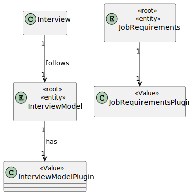

# US 1008

## 1. Context

As Language Engineer, I want to deploy and configure a plugin (i.e., Job Requirement Specification or Interview Model) to be used by the system.
## 2. Requirements

*Example*

**US 1008** As Language Engineer, I want to deploy and configure a plugin (i.e., Job Requirement Specification or Interview Model) to be used by the system.

**Acceptance Criteria:**

- 1008.1. The system should generate a jar file with all the plugins used by the system.

**Dependencies/References:**


## 3. Analysis



## 4. Design

### 4.3. Applied Patterns

- To develop this US we start to create two interfaces **InterviewModelPlugin** and **JobRequirementsPlugin**, then we created **JobRequirements** and **InterviewModel**.
- In the module **jobs4u.plugins** is presented the jar file with all the plugins.

### 4.4. Tests

Include here the main tests used to validate the functionality. Focus on how they relate to the acceptance criteria.

**Test 1:** *Verifies that it is not possible to ...*

**Refers to Acceptance Criteria:** G002.1


```
@Test(expected = IllegalArgumentException.class)
public void ensureXxxxYyyy() {
	...
}
````

## 5. Implementation
**JobRequirementsPlugin**
````
package eapli.jobs4u.pluginsmanagement;

public interface JobRequirementsPlugin {
    String generateTemplateJobRequirement(String name);
    String evaluateJobRequirement(String name);
    String evaluateJobRequirementAndStatus(String name);

}
````

**InterviewModelPlugin**

````
package eapli.jobs4u.pluginsmanagement;

public interface InterviewModelPlugin {
    String generateTemplateInterviewModel(String name);
    String evaluateInterview(String name);
    String evaluateInterviewAndShowGrades(String name);
}
````

**Interview Model for Backend Engineer**

````
package eapli.jobs4u.plugins.interviewmodel;

import eapli.jobs4u.pluginsmanagement.InterviewModelPlugin;

public class BackendEngineer implements InterviewModelPlugin {
    @Override
    public String generateTemplateInterviewModel(String name) {
        return "Template file Backend Engineer generated";
    }

    @Override
    public String evaluateInterview(String name) {
        return "Evaluate interview for Backend Engineer";
    }

    @Override
    public String evaluateInterviewAndShowGrades(String name) {
        return "Interview grades for Backend Engineer";
    }
}
````

**Five Years Experience Plugin**

````
package eapli.jobs4u.plugins.jobrequirements;

import eapli.jobs4u.pluginsmanagement.JobRequirementsPlugin;

public class FiveYearsExperience implements JobRequirementsPlugin {

    @Override
    public String generateTemplateJobRequirement(String name) {
        return "Template five years experience generated";
    }

    @Override
    public String evaluateJobRequirement(String name) {
        return "Five years experience evaluated requirement";
    }

    @Override
    public String evaluateJobRequirementAndStatus(String name) {
        return "Five years experience was approved!";
    }
}
````