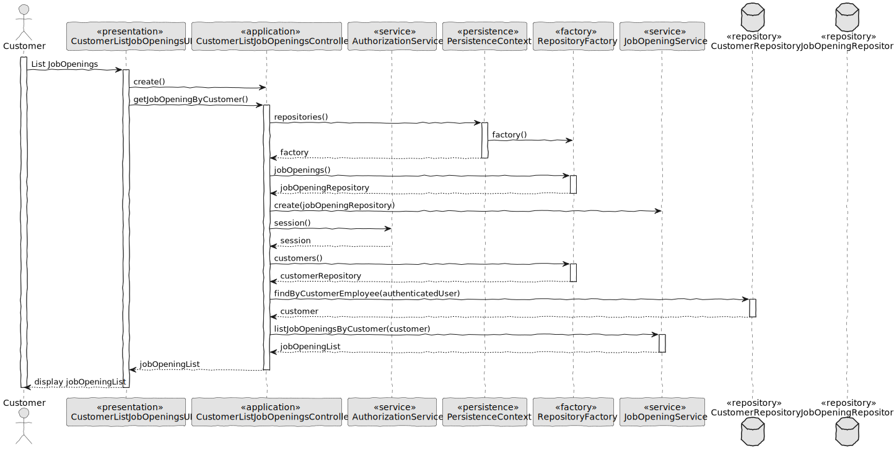
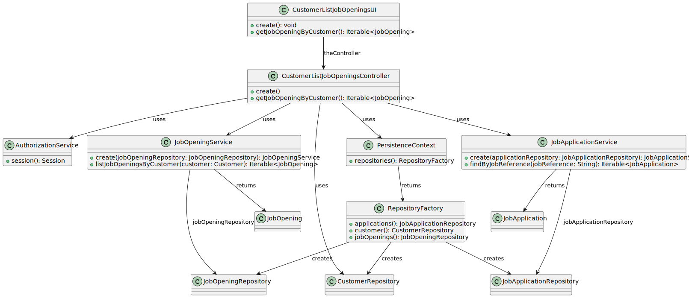

# 3002 - US list all my job openings, including job reference, position, active since, number of applicants. #

## 1. Context

This Us consist into the Customer to be capable of list all my list all my job openings, including job reference, position, active since, number of applicants. 

## 2. Requirements

**US 3002** As a Customer, I want to list all my job openings, including job reference, position, active since, number of applicants.

**Acceptance Criteria:**

- 3002.1. The system should list every job opening.
- 3002.2. The listed application must include its job reference, position, active since and number of applicants.
- 3002.3. The UI shoud be easy and straight foward to use. 

**Dependencies/References:**

> Question :  Relativamente a job opening, o que significa 'position'?

> Answer : Nessa US quando referimos “position” tem o mesmo significado que “title or function”.

## 3. Analysis

## 4. Design

### 4.1. Realization

### 4.2. Class Diagram

### 4.3. Applied Patterns

- 4.3.1 Service
> Services are operations with the responsibility of an entity or value object. They are used to model operations that involve multiple objects or complex behaviour.

- 4.3.2. Factory
> Our PersistenceContext will create a RepositoryFactory then the RepositoryFactory will create the repository that we need in order to persist our domain entity, in this case the Job Opening

- 4.3.3 Tell, Don't Ask
> Ensure that objects do not expose their internal state or behaviour to the outside world. On the contrary, objects should receive commands telling them what they should do, rather than being asked for information about their current state.

### 4.4. Tests

Test related to 3002.2
When listing all job openings for a customer who has multiple job postings, the system should display each job opening with job reference, position, active since date, and the number of applicants. Each detail should be accurate and correctly formatted.

Test related to 3002.1.
List job openings for a customer with no job openings should be empty.
