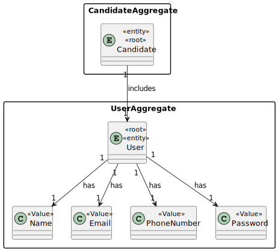
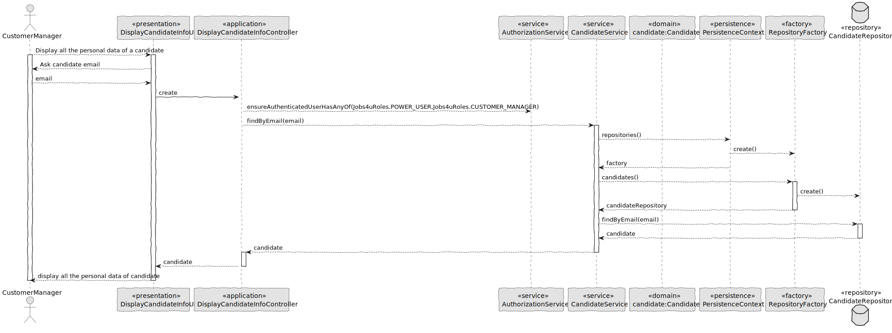
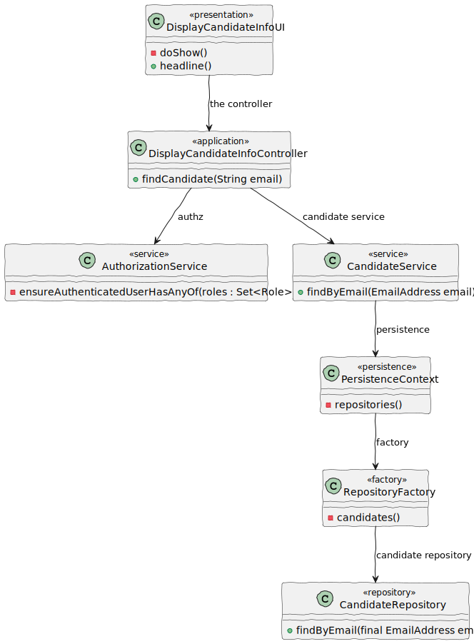

# US 1006

## 1. Context

*This feature is being created for the first time, and the customer manager is asked to display all the information about a candidate.*

## 2. Requirements

*In this section you should present the functionality that is being developed, how do you understand it, as well as possible correlations to other requirements (i.e., dependencies). You should also add acceptance criteria.*

**US 1006** As Customer Manager, I want to display all the personal data of a candidate.

**Acceptance Criteria:**

- 1006.1. The system should display all personal data of a candidate.

**Dependencies/References:**

>Q42 : US1006, Qual a informação do nome do candidato deve aparecer (nome completo, primeiro e ultimo nome , etc)?

>A42 : À partida diria que seria o nome, tal como foi recebido na application que fez (página 6, “name of the candidate”).


>Q43 : Para os candidato e para os utilizadores do sistema que informações são necessárias?

>A43 : Alguma informação anterior é referida na Q11. Para além disso a secção 2.2.3 refere que relativamente aos candidatos temos a seguinte informação: email of the candidate, name of the candidate, phone number of the candidate.


>Q75 : US1006 – Em relação à listagem dos dados pessoais de um determinado candidato, um customer manager vai ter acesso a todos os candidatos do sistema ou apenas aos candidatos que submeteram uma application para uma job opening de um cliente que é gerido por esse customer manager?

>A75 : No contexto actual vamos assumir que o Customer Manager pode aceder (consultar) os dados pessoais de qualquer candidato.


>Q90 : US1006 – Em relação ao processo de selecionar um candidato e mostrar a sua informação pessoal, para facilitar a procura de um candidato especifico. Faria sentido perguntar ao utilizador se quer listar todos os candidatos existentes ou se quer reduzir a lista, selecionando um job opening e assim mostrar todos os candidatos para esse job opening, e por fim selecionar um candidato dessa lista mais pequena?

>A90 : O product owner espera que o sistema aplique as melhores práticas de UI/UX mas, não sendo especialista nessa área técnica, não arrisca sugerir soluções.


>Q113 : US1006 - Informações do candidato - Na us1006 é necessário mostrar os dados pessoais dos candidatos. Para isso, que informações acha pertinente demonstrar?

>A113 : Será toda a informação pessoal de um candidato que o sistema tenha registado.


>Q128 : Na us 1006, seria aceitavel perguntar ao costumer manager o id do candidato de que deseja visualizar os dados, ou seria mais pertinente dar uma lista de todos os candidos e deixa-lo escolher dessa lista, assumindo que este não tem maneira de saber o id do candidato de que quer obter dados.

>A128 : Pergunta similar à anterior Q127. Note-se que a US1005 permite obter as candidaturas para uma job opening. Esta US é para mostrar os dados de um candidato. Portanto parece existir forma de aceder ao id do candidato, caso não se saiba qual é. Mais uma vez, espero que apliquem boas práticas de UI/UX.


## 3. Analysis

*In this section, the team should report the study/analysis/comparison that was done in order to take the best design decisions for the requirement. This section should also include supporting diagrams/artifacts (such as domain model; use case diagrams, etc.),*



## 4. Design

*In this sections, the team should present the solution design that was adopted to solve the requirement. This should include, at least, a diagram of the realization of the functionality (e.g., sequence diagram), a class diagram (presenting the classes that support the functionality), the identification and rational behind the applied design patterns and the specification of the main tests used to validade the functionality.*

### 4.1. Realization



### 4.2. Class Diagram



### 4.3. Applied Patterns

- 4.3.1. Factory
> Our PersistenceContext will create a RepositoryFactory then the RepositoryFactory will create the repository that we need in order to persist our domain entity, in this case the Candidate

- 4.3.2 Service
> Services are operations with the responsibility of an entity or value object. They are used to model operations that involve multiple objects or complex behaviour.

- 4.3.3 Tell, Don't Ask
> Ensure that objects do not expose their internal state or behaviour to the outside world. On the contrary, objects should receive commands telling them what they should do, rather than being asked for information about their current state.

- 4.3.6 Model-View-Controller (MVC)
> Model is responsible for managing the data and business logic of the application. (UserManagementService, AuthorizationService)
> View is responsible for presenting the data to the user in a human-readable format. (AddBackofficeUserUI)
> Controller is responsible for handling the user input and updating the model and the view accordingly. (AddBackofficeUserController)

### 4.4. Tests

Include here the main tests used to validate the functionality. Focus on how they relate to the acceptance criteria.

**Refers to methods for validate a Candidate:**

````
    @Test
    public void testConstructor() {
        assertNotNull(candidate);
    }

    @Test
    public void testGetUser() {
        assertEquals(systemUser, candidate.user());
    }

    @Test
    public void testEqualsAndHashCode() {
        Candidate candidate1 = new Candidate(phoneNumber, systemUser);
        Candidate candidate2 = new Candidate(phoneNumber, systemUser);

        assertEquals(candidate1, candidate2);
        assertEquals(candidate1.hashCode(), candidate2.hashCode());
    }

    @Test
    public void testGetPhoneNumber() {
        assertEquals(phoneNumber, candidate.phoneNumber());
    }

    @Test
    public void testEqualsWithDifferentObject() {
        Candidate candidate1 = new Candidate();
        assertFalse(candidate.equals(candidate1));
    }

    @Test
    public void testSameAs() {
        Candidate candidate1 = new Candidate(phoneNumber, systemUser);
        assertTrue(candidate.sameAs(candidate1));
    }

    @Test
    public void testNotSameAs() {
        PhoneNumber phoneNumber2 = new PhoneNumber("919965231");
        String username2 = "jorgenuno@email.com";
        SystemUser systemUser2 = dummyUser(username2,Jobs4uRoles.CANDIDATE);
        candidate = new Candidate(phoneNumber, systemUser);
        Candidate differentCandidate = new Candidate(phoneNumber2, systemUser2);
        assertFalse(candidate.sameAs(differentCandidate));
    }
````


**Refers to methods for validate candidate phone number:**

````
    @Test
    public void testValidPhoneNumber() {
        // Arrange
        String validNumber = "912345678";

        // Act
        PhoneNumber phoneNumber = PhoneNumber.valueOf(validNumber);

        // Assert
        assertNotNull(phoneNumber);
        assertEquals(validNumber, phoneNumber.toString());
    }

    @Test(expected = IllegalArgumentException.class)
    public void testNullPhoneNumber() {
        // Arrange
        String nullNumber = null;

        // Act
        PhoneNumber phoneNumber = PhoneNumber.valueOf(nullNumber);

        // Assert
        // Expecting IllegalArgumentException
    }

    @Test(expected = IllegalArgumentException.class)
    public void testEmptyPhoneNumber() {
        // Arrange
        String emptyNumber = "";

        // Act
        PhoneNumber phoneNumber = PhoneNumber.valueOf(emptyNumber);

        // Assert
        // Expecting IllegalArgumentException
    }

    @Test(expected = IllegalArgumentException.class)
    public void testInvalidPhoneNumber() {
        // Arrange
        String invalidNumber = "123456789";

        // Act
        PhoneNumber phoneNumber = PhoneNumber.valueOf(invalidNumber);

        // Assert
        // Expecting IllegalArgumentException
    }

    @Test
    public void testCompareTo(){
        PhoneNumber phoneNumber1 = new PhoneNumber("928987654");
        PhoneNumber phoneNumber2 = new PhoneNumber("963215672");

        assertTrue(phoneNumber1.compareTo(phoneNumber2)<0);
    }
````

## 5. Implementation

*In this section the team should present, if necessary, some evidencies that the implementation is according to the design. It should also describe and explain other important artifacts necessary to fully understand the implementation like, for instance, configuration files.*
*It is also a best practice to include a listing (with a brief summary) of the major commits regarding this requirement.*


**DisplayCandidateInfoController**

````
public class DisplayCandidateInfoController {

    private final AuthorizationService authz = AuthzRegistry.authorizationService();
    private CandidateRepository candidateRepository = PersistenceContext.repositories().candidates();
    private CandidateService candidateService = new CandidateService(candidateRepository);


    public Optional<Candidate> findCandidate(String email) {
        authz.ensureAuthenticatedUserHasAnyOf(Jobs4uRoles.POWER_USER, Jobs4uRoles.CUSTOMER_MANAGER);
        EmailAddress emailAddress = EmailAddress.valueOf(email);
        return candidateService.findByEmail(emailAddress);
    }
}

````

## 6. Integration/Demonstration

*In this section the team should describe the efforts realized in order to integrate this functionality with the other parts/components of the system*
*It is also important to explain any scripts or instructions required to execute an demonstrate this functionality*


````
+= Jobs4u [ @poweruser ] ======================================================+

| 1. My account > | 2. Backoffice Users > | 3. Candidates > | 4. Customers > | 5. Job Openings > | 6. Settings > | 0. Exit |
Please choose an option
3

>> Candidates >
1. Register Candidate
2. Display Candidate Info
0. Return

Please choose an option
2
Enter the email address of the candidate you are looking for
vasco@gmail.com
Candidate Data:
EMAIL ADDRESS                 FIRST NAME                    LAST NAME                     ROLE                         PHONE NUMBER
vasco@gmail.com                Vasco                         Teixeira                   [CANDIDATE]                      918000000

+= Jobs4u [ @poweruser ] ======================================================+

````

