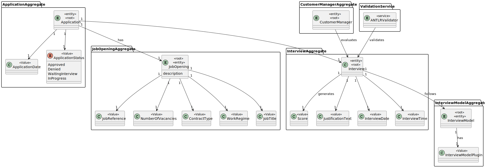
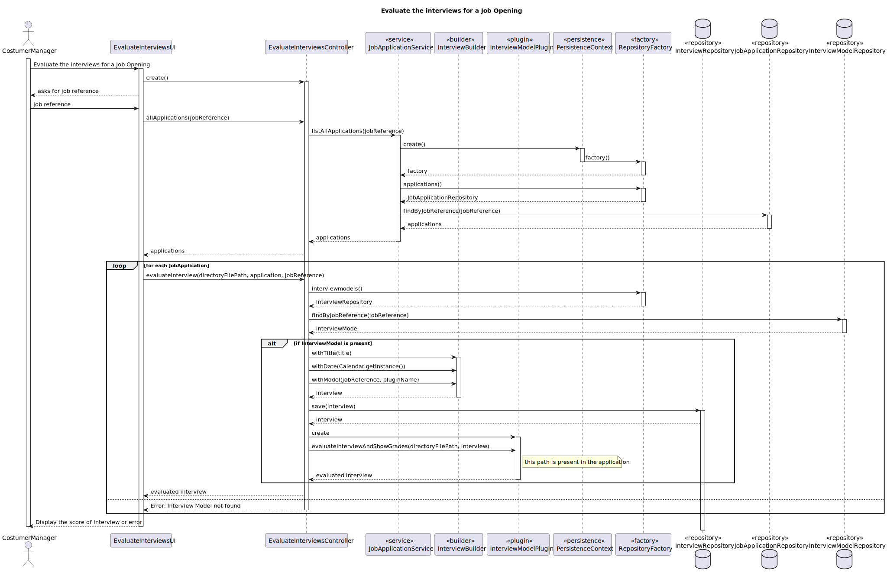
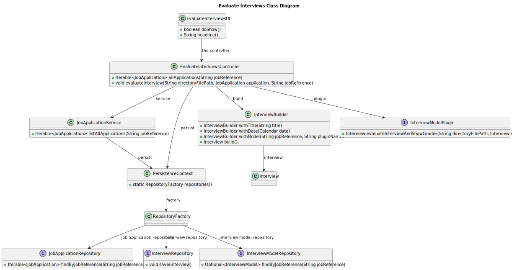

# US 1018

## 1. Context

*In this task story we are asked to carry out the process of evaluating interviews for a job opening, as customer manager*

## 2. Requirements

*In this section you should present the functionality that is being developed, how do you understand it, as well as possible correlations to other requirements (i.e., dependencies). You should also add acceptance criteria.*

**US 1018** As Customer Manager, I want to execute the process that evaluates (grades) the interviews for a job opening.

**Acceptance Criteria:**

- 1018.1. The system should execute the process that evaluates the interviews for a job opening.

- 1018.2. The system should ask the user for the job reference.

**Dependencies/References:**

>Q199 : US1018 – Relativamente à US1018, após a execução do processo de avalição de todas as entrevistas da job opening, a fase em que esta se encontra deve ser automaticamente mudado para "Result" ou deve ser mantida em "Analysis" e apenas pode ser mudada pela execução da US1010?

>A199 : A US1018 não deve alterar a fase actual. A US1010 permite fazer a mudança de fases do processo de recrutamento.


>Q214 : O nosso grupo tem uma dúvida em relação ao processamento dos ficheiros de respostas dos candidatos para a entrevista. No caso de upload de um ficheiro, se a pergunta que requer um número como resposta for preenchida com um formato inválido, por exemplo, uma letra, devemos considerar isso como um formato inválido na US 1017 (e pedir para o user voltar a dar upload a um ficheiro válido) ou devemos, na US1018, considerar que está incorreta e atribuir 0 pontos automaticamente para essa resposta inválida? Isto é, na US 1017, devemos apenas verificar o formato do ficheiro ou devemos verificar também se as respostas são preenchidas com o tipo de dados correto?

>A214 : O caso mencionado deve ser considerado um erro de validação do ficheiro (ou seja, o ficheiro submetido não corresponde à gramática definida).


>Q237 : Pontuação de questões em interviews - Todos os tipos de questões têm uma cotação associada ou uma questão do tipo Date, por exemplo, não necessita de cotação associada?

>A237 : Secção 2.2.4: “A job interview is a form with a set of questions. Each question has a value associated. The sum of the values for all the questions should be 100.“ Pela descrição parece claro que cada pergunta deve ser avaliada. No entanto, o importante é que a soma das avaliações de todas as perguntas resulte em 100 (nota máxima). Ou seja, seria possivel definir perguntas que não são avaliadas (ou são sempre avaliadas em 0). O facto da perguntas ser do tipo data não a torma particular/especial.


>Q238 : US1018 - Relativamente a resposta que forneceu na Q206, referiu que uma jobOpening suporta apenas uma entrevista, isto significa que só um candidato que fez uma candidatura pode ser entrevistado de cada vez ou que cada candidatura está associada aquela entrevista em específico? Além disso cada candidatura que sofre uma entrevista terá de ter uma resposta a essa entrevista ou será antes a entrevista de uma job Opening terá uma resposta? Esta dúvida surge pois na US1018 é suposto avaliar todas as entrevistas de uma jobOpening quando disse que uma jobOpening suporta apenas uma entrevista.

>A238 : Peço desculpa se não ficou claro, mas então deviam ter colocar a questão há mais tempo. Para cada job opening define-se o processo de recrutamento. Este pode ter ou não uma fase e entrevista. Se tiver fase de entrevista, então podemos admitir que é apenas uma entrevista. Mas quando digo isso, quero dizer uma entrevista para cada candidato e não uma entrevista para todos os candidatos a essa job opening. Penso que isso era claro. Caso contrário não fazia sentido ter, por exemplo, uma US para marcar uma entrevista com um candidato. Marcava-se uma entrevista com “todos” os candidatos ao mesmo tempo? Cada candidato, quando é entrevistado, são preenchidas as respostas que esse candidato deu na sua entrevista no documento que depois é submetido (US1017). Portanto, se houver fase de entrevistas, cada candidato deve ter a sua entrevista e a sua “classificação” nessa sua entrevista.


## 3. Analysis

*In this section, the team should report the study/analysis/comparison that was done in order to take the best design decisions for the requirement. This section should also include supporting diagrams/artifacts (such as domain model; use case diagrams, etc.),*



## 4. Design

*In this sections, the team should present the solution design that was adopted to solve the requirement. This should include, at least, a diagram of the realization of the functionality (e.g., sequence diagram), a class diagram (presenting the classes that support the functionality), the identification and rational behind the applied design patterns and the specification of the main tests used to validade the functionality.*

### 4.1. Realization



### 4.2. Class Diagram



### 4.3. Tests

# Test 1 - Test Invalid Job Reference
    - Select to evaluate interviews for a job opening
    - Asks to insert jobReference
    - Inserts a invalid job reference
    - Throws an exception saying that the job reference does not exist

# Test 2 - Test Interview Model Plugin Doesn't Exist
    - Select to evaluate interviews for a job opening
    - Asks to insert jobReference
    - Inserts a valid job reference
    - Verify the interview model and that plugin name
    - Throws an exception saying that plugin does not exist

# Test 3 - Test Interview Model Plugin Exist
    - Select to evaluate interviews for a job opening
    - Asks to insert jobReference
    - Inserts a valid job reference
    - Verify the interview model and that plugin name
    - The interview score and interview grades justification are update and interview is now evaluated


## 5. Implementation

**EvaluateInterviewsController**


````
package eapli.jobs4u.interviewmanagement.application;

import eapli.jobs4u.applicationsmanagement.application.JobApplicationService;
import eapli.jobs4u.applicationsmanagement.domain.JobApplication;
import eapli.jobs4u.applicationsmanagement.repositories.JobApplicationRepository;
import eapli.jobs4u.infrastructure.persistence.PersistenceContext;
import eapli.jobs4u.interviewmanagement.domain.Interview;
import eapli.jobs4u.interviewmanagement.domain.InterviewBuilder;
import eapli.jobs4u.interviewmanagement.repositories.InterviewRepository;
import eapli.jobs4u.interviewmodelmanagement.domain.InterviewModel;
import eapli.jobs4u.interviewmodelmanagement.repositories.InterviewModelRepository;
import eapli.jobs4u.pluginsmanagement.InterviewModelPlugin;

import java.lang.reflect.InvocationTargetException;
import java.util.Calendar;
import java.util.Optional;

public class EvaluateInterviewsController {

    private JobApplicationRepository jobApplicationRepository = PersistenceContext.repositories().applications();
    private JobApplicationService jobApplicationService = new JobApplicationService(jobApplicationRepository);

    public Iterable<JobApplication> allApplications(String jobReference){
        return jobApplicationService.listAllApplications(jobReference);
    }

    public void evaluateInterview(String directoryFilePath, JobApplication application, String jobReference) throws ClassNotFoundException, NoSuchMethodException, InvocationTargetException, InstantiationException, IllegalAccessException {
        InterviewRepository interviewRepository = PersistenceContext.repositories().interviews();
        InterviewModelRepository interviewModelRepository = PersistenceContext.repositories().interviewModels();
        Optional<InterviewModel> interviewModel = interviewModelRepository.findByJobReference(jobReference);
        InterviewBuilder builder = new InterviewBuilder();
        String title = application.jobOpening().jobTitle().toString();
        String pluginName = interviewModel.get().pluginName();
        Interview interview = builder.withTitle(title).withDate(Calendar.getInstance()).withModel(jobReference,pluginName).withId(application.identity()).build();
        try {
            InterviewModelPlugin interviewModelPlugin = (InterviewModelPlugin) Class.forName("eapli.jobs4u.pluginsmanagement.interviewmodel." + pluginName).getDeclaredConstructor().newInstance();
            Interview interview1 = interviewModelPlugin.evaluateInterviewAndShowGrades(directoryFilePath,interview);
            interviewRepository.save(interview1);
        } catch (ClassNotFoundException | NoSuchMethodException | InvocationTargetException | InstantiationException |
                 IllegalAccessException e) {
            throw new RuntimeException(e);
        }
    }
}


````

**EvaluateInterviewsUI**

````
package eapli.jobs4u.app.backoffice.console.presentation.interviewmodel;

import eapli.framework.io.util.Console;
import eapli.framework.presentation.console.AbstractUI;
import eapli.jobs4u.applicationsmanagement.domain.JobApplication;
import eapli.jobs4u.interviewmanagement.application.EvaluateInterviewsController;

import java.lang.reflect.InvocationTargetException;
import java.util.Iterator;

public class EvaluateInterviewsUI extends AbstractUI {

    private EvaluateInterviewsController theController = new EvaluateInterviewsController();
    @Override
    protected boolean doShow() {
        String jobReference = Console.readLine("Insert the job reference of the job opening you want:");
        Iterable<JobApplication> jobApplications = theController.allApplications(jobReference);
        Iterator<JobApplication> iterator = jobApplications.iterator();
        try {
        while (iterator.hasNext()) {
            JobApplication jobApplication = iterator.next();
            String directoryPath = jobApplication.applicationDirectory();
            System.out.println("Candidate : " + jobApplication.candidate().user().name().toString());
            theController.evaluateInterview(directoryPath,jobApplication,jobReference);
        }
        } catch (ClassNotFoundException | NoSuchMethodException | InvocationTargetException |
                 InstantiationException |
                 IllegalAccessException e) {
            throw new RuntimeException(e);
        }
        return false;
    }

    @Override
    public String headline() {
        return "Evaluate Interviews";
    }
}
````


## 6. Integration/Demonstration

*In this section the team should describe the efforts realized in order to integrate this functionality with the other parts/components of the system*
*It is also important to explain any scripts or instructions required to execute an demonstrate this functionality*
