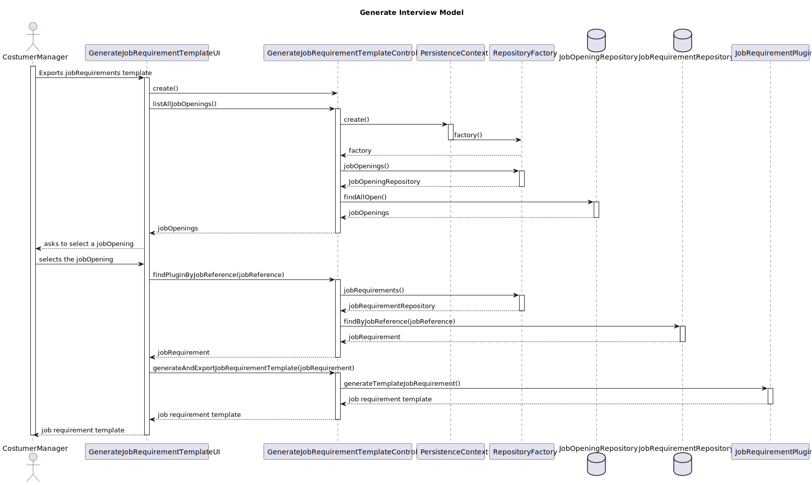
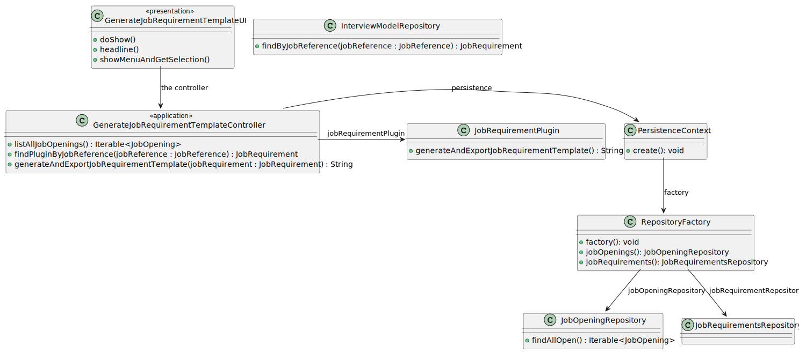

# US 2003

## 1. Context

*As Operator, I want to generate and export a template text file to help collect data fields for candidates of a job opening (so the data is used to verify the requirements of the job opening).*

## 2. Requirements

*In this section you should present the functionality that is being developed, how do you understand it, as well as possible correlations to other requirements (i.e., dependencies). You should also add acceptance criteria.*

**US 2003** As Operator, I want to generate and export a template text file to help collect data fields for candidates of a job opening (so the data is used to verify the requirements of the job opening).

**Acceptance Criteria:**

- 2003.1. The system should generate and export a template text file to help collect data fields for candidates of a job opening.

**Dependencies/References:**

*Regarding this requirement we understand that it relates to...*

## 3. Analysis

*In this section, the team should report the study/analysis/comparison that was done in order to take the best design decisions for the requirement. This section should also include supporting diagrams/artifacts (such as domain model; use case diagrams, etc.),*

## 4. Design

*In this sections, the team should present the solution design that was adopted to solve the requirement. This should include, at least, a diagram of the realization of the functionality (e.g., sequence diagram), a class diagram (presenting the classes that support the functionality), the identification and rational behind the applied design patterns and the specification of the main tests used to validade the functionality.*

### 4.1. Realization


### 4.2. Class Diagram



### 4.3. Applied Patterns

## 5. Implementation

**GenerateJobRequirementTemplateController**

````
package eapli.jobs4u.jobrequirementsmanagement.application;

import eapli.framework.infrastructure.authz.application.AuthorizationService;
import eapli.framework.infrastructure.authz.application.AuthzRegistry;
import eapli.jobs4u.infrastructure.persistence.PersistenceContext;
import eapli.jobs4u.jobOpeningsManagement.domain.JobOpening;
import eapli.jobs4u.jobOpeningsManagement.domain.JobReference;
import eapli.jobs4u.jobOpeningsManagement.repositories.JobOpeningRepository;
import eapli.jobs4u.jobrequirementsmanagement.domain.JobRequirements;
import eapli.jobs4u.jobrequirementsmanagement.repositories.JobRequirementsRepository;
import eapli.jobs4u.pluginsmanagement.JobRequirementsPlugin;
import eapli.jobs4u.usermanagement.domain.Jobs4uRoles;

import java.lang.reflect.InvocationTargetException;
import java.util.Optional;

public class GenerateJobRequirementsTemplateController {
    AuthorizationService authorizationService = AuthzRegistry.authorizationService();
    public Iterable<JobOpening> listAllJobOpenings(){
        authorizationService.ensureAuthenticatedUserHasAnyOf(Jobs4uRoles.POWER_USER,Jobs4uRoles.CUSTOMER_MANAGER);
        JobOpeningRepository jobOpeningRepository = PersistenceContext.repositories().jobOpenings();
        return jobOpeningRepository.findAllOpen();
    }

    public Optional<JobRequirements> findPluginByJobReference(JobReference jobReference){
        JobRequirementsRepository jobRequirementsRepository = PersistenceContext.repositories().jobRequirements();
        return jobRequirementsRepository.findByJobReference(jobReference);
    }

    public String generateAndExportInterviewTemplate(JobRequirements jobRequirements) throws ClassNotFoundException, NoSuchMethodException, InvocationTargetException, InstantiationException, IllegalAccessException {
        JobRequirementsPlugin jobRequirementsPlugin = build(jobRequirements.pluginName());
        return jobRequirementsPlugin.generateTemplateJobRequirement();

    }

    public JobRequirementsPlugin build(String pluginName) {
        try {
            return (JobRequirementsPlugin) Class.forName(pluginName).getDeclaredConstructor().newInstance();
        } catch (ClassNotFoundException | IllegalAccessException | InstantiationException | IllegalArgumentException
                 | InvocationTargetException | NoSuchMethodException | SecurityException ex) {
            throw new IllegalStateException("Unable to dynamically load the Plugin: " + pluginName, ex);
        }
    }
}

````

**GenerateJobRequirementsTemplateUI**

````
package eapli.jobs4u.app.backoffice.console.presentation.jobOpening;

import eapli.framework.io.util.Console;
import eapli.framework.presentation.console.AbstractUI;
import eapli.jobs4u.interviewmodelmanagement.application.GenerateInterviewTemplateController;
import eapli.jobs4u.interviewmodelmanagement.domain.InterviewModel;
import eapli.jobs4u.jobOpeningsManagement.domain.JobOpening;
import eapli.jobs4u.jobOpeningsManagement.domain.JobReference;
import eapli.jobs4u.jobrequirementsmanagement.application.GenerateJobRequirementsTemplateController;
import eapli.jobs4u.jobrequirementsmanagement.domain.JobRequirements;

import java.lang.reflect.InvocationTargetException;
import java.util.List;
import java.util.Optional;

public class GenerateJobRequirementsTemplateUI extends AbstractUI{
    GenerateJobRequirementsTemplateController theController = new GenerateJobRequirementsTemplateController();
    @Override
    protected boolean doShow(){
        List<JobOpening> jobOpenings = (List<JobOpening>) theController.listAllJobOpenings();
        JobOpening jobOpening = showMenuAndGetSelection(jobOpenings);
        JobReference jobReference = jobOpening.identity();
        Optional<JobRequirements> jobRequirements = theController.findPluginByJobReference(jobReference);

        if(jobRequirements.isEmpty()){
            throw new IllegalArgumentException("That job opening doesn´t have a interview model associated");
        } else {
            try {
                System.out.println(theController.generateAndExportInterviewTemplate(jobRequirements.get()));
            } catch (ClassNotFoundException e) {
                throw new RuntimeException(e);
            } catch (NoSuchMethodException e) {
                throw new RuntimeException(e);
            } catch (InvocationTargetException e) {
                throw new RuntimeException(e);
            } catch (InstantiationException e) {
                throw new RuntimeException(e);
            } catch (IllegalAccessException e) {
                throw new RuntimeException(e);
            }
        }
        return false;
    }

    @Override
    public String headline(){
        return "Generate Interview Model Template";
    }

    public JobOpening showMenuAndGetSelection(List<JobOpening> jobOpenings) {

        System.out.println("=== Select a JobOpening ===");
        System.out.printf(" %-30s%-20s%-20s%-30s%-20s%n","JOB_REFERENCE","JOB_TITLE","NUMBER_VACANCIES","CUSTOMER","STATUS");
        for (int i = 0; i < jobOpenings.size(); i++) {
            JobOpening jobOpening = jobOpenings.get(i);
            System.out.print((i + 1)+ ".");
            System.out.printf(" %-30s%-20s%-20s%-30s%-20s%n", jobOpening.identity().toString(), jobOpening.jobTitle().toString(), jobOpening.numberOfVacancies().toString(), jobOpening.customer().name().toString(), jobOpening.jobOpeningStatus().toString());
        }
        System.out.println("0. Exit");

        int choice;
        do {
            choice = Console.readInteger("Select a jobOpening");

        } while (choice < 0 || choice > jobOpenings.size());

        if (choice == 0) {
            return null;
        } else {
            return jobOpenings.get(choice - 1);
        }
    }
}

````

## 6. Integration/Demonstration
