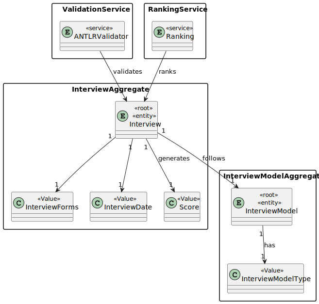
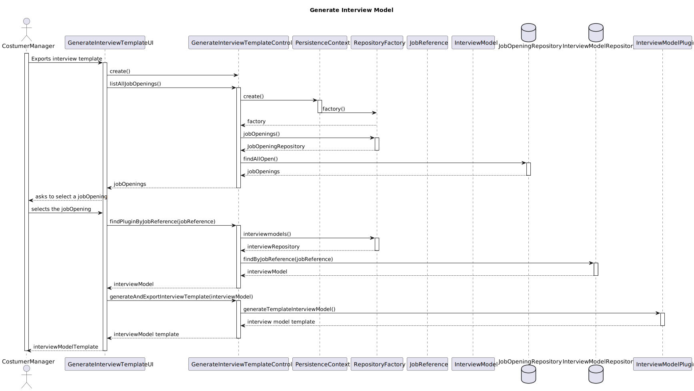
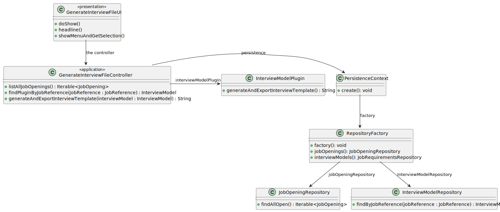

# US 1012

## 1. Context

*As Customer Manager, I want to generate and export a template text file to help collect the candidate answers during the interviews.*


## 2. Requirements

*In this section you should present the functionality that is being developed, how do you understand it, as well as possible correlations to other requirements (i.e., dependencies). You should also add acceptance criteria.*

**US 1012**  As Customer Manager, I want to generate and export a template text file to help collect the candidate answers during the interviews.

**Acceptance Criteria:**

- 1012.1. The system should generate and export a template text file.


**Dependencies/References:**

*Regarding this requirement we understand that it relates to...*


>Q14 : Quem informa o Customer manager do tipo de entrevista/perguntas?

>A14 : Isso pode ser obtido pelo Customer manager em dialogo com o Customer. Depois disso, com a ajuda do Language engineer é elaborado o suporte para a entrevista.


>Q121 : Perguntas para os plugins.- É possível esclarecer-nos se as perguntas a serem feitas para os Interview Models e os Requirement Especifications são aquelas que estão no exemplo da documentação ou tem algum grupo de questões que gostaria que nós utiliza-se-mos?

>A121 : O documento de especificação apresenta, como disse, exemplos. São apenas exemplos indicativos. Podem usar esses exemplos como casos de teste e como ponto de partida para definirem outros. Mas é suposto a solução suportar mais do que apenas os exemplos que estão no documento. Em qualquer dos plugins, o tipo de perguntas que deve ser suportado é o que está apresentado na página 8 do documento. Como product onwer eu gostaria que uma demonstração funcional do sistema incluísse pelo menos 2 plugins de cada tipo, para se poder demonstrar, minimamente, o suporte para mais do que um plugin usado (de cada tipo) em simultâneo. Deve ainda demonstrar o uso de todos os tipos de perguntas apresentados na página 8 (atualizado em 2024-04-27).


>Q125 : Devem ser registadas mais algum tipo de perguntas para a entrevista para além das que nos foram fornecidas no projeto?

>A125 : Ver Q121.


>Q132 : Usage of ANTLR- Is it possible to clarify the usage of ANTRL within user story 2003? You've stated in Q15, Q102 and Q119, that US2003 simply generates the file, while in US2004 the Operator defines the answers and uploads the file. Where is this file uploaded to? Given this, where is the usage of ANTRL in US2003 directed to?

>A132 : Regarding the first question, although difficult it is possible to generate the template text file using ANTLR. If so, there we have the usage o ANTLR. Although, unless there is some specific evaluation requirement from LPROG, it is acceptable that the template file is hardcoded in the plugin (no need for any “complex” generation process/function). Regarding the second question, the file is uploaded to the system. The last question was answered first.


>Q139 : Interview model e Requirements specification – Os nomes a usar nestes “conceitos” têm restrições?

>A139 : O nome dado aos interview models ou requirements specifications é uma string que descreve o “objetivo” desse plugin. Um exemplo já dado é “5 anos experiência java” para um plugin de requirements specification que valida as candidaturas a um job opening para um trabalho que necessita de 5 anos de experiência em java.


## 3. Analysis

*In this section, the team should report the study/analysis/comparison that was done in order to take the best design decisions for the requirement. This section should also include supporting diagrams/artifacts (such as domain model; use case diagrams, etc.),*



## 4. Design

*In this sections, the team should present the solution design that was adopted to solve the requirement. This should include, at least, a diagram of the realization of the functionality (e.g., sequence diagram), a class diagram (presenting the classes that support the functionality), the identification and rational behind the applied design patterns and the specification of the main tests used to validade the functionality.*

### 4.1. Realization



### 4.2. Class Diagram




### 4.4. Tests

## 5. Implementation

**GenerateInterviewTemplateController**

````
package eapli.jobs4u.interviewmodelmanagement.application;

import eapli.framework.infrastructure.authz.application.AuthorizationService;
import eapli.framework.infrastructure.authz.application.AuthzRegistry;
import eapli.jobs4u.infrastructure.persistence.PersistenceContext;
import eapli.jobs4u.interviewmodelmanagement.domain.InterviewModel;
import eapli.jobs4u.interviewmodelmanagement.repositories.InterviewModelRepository;
import eapli.jobs4u.jobOpeningsManagement.domain.JobOpening;
import eapli.jobs4u.jobOpeningsManagement.domain.JobReference;
import eapli.jobs4u.jobOpeningsManagement.repositories.JobOpeningRepository;
import eapli.jobs4u.pluginsmanagement.InterviewModelPlugin;
import eapli.jobs4u.usermanagement.domain.Jobs4uRoles;
import org.hibernate.sql.exec.spi.StandardEntityInstanceResolver;

import java.lang.reflect.InvocationTargetException;
import java.util.Optional;

public class GenerateInterviewTemplateController {
    AuthorizationService authorizationService = AuthzRegistry.authorizationService();
    public Iterable<JobOpening> listAllJobOpenings(){
        authorizationService.ensureAuthenticatedUserHasAnyOf(Jobs4uRoles.POWER_USER,Jobs4uRoles.CUSTOMER_MANAGER);
        JobOpeningRepository jobOpeningRepository = PersistenceContext.repositories().jobOpenings();
        return jobOpeningRepository.findAllOpen();
    }

    public Optional<InterviewModel> findPluginByJobReference(JobReference jobReference){
        InterviewModelRepository interviewModelRepository = PersistenceContext.repositories().interviewModels();
        return interviewModelRepository.findByJobReference(jobReference);
    }

    public String generateAndExportInterviewTemplate(InterviewModel interviewModel) throws ClassNotFoundException, NoSuchMethodException, InvocationTargetException, InstantiationException, IllegalAccessException {
        String pluginName = interviewModel.pluginName();
        InterviewModelPlugin interviewModelPlugin = (InterviewModelPlugin) Class.forName("interviewmodel."+pluginName).getDeclaredConstructor().newInstance();
        return interviewModelPlugin.generateTemplateInterviewModel();
    }
}

````

**GenerateInterviewTemplateUI**

````
package eapli.jobs4u.app.backoffice.console.presentation.interviewmodel;

import eapli.framework.io.util.Console;
import eapli.framework.presentation.console.AbstractUI;
import eapli.jobs4u.interviewmodelmanagement.application.GenerateInterviewTemplateController;
import eapli.jobs4u.interviewmodelmanagement.domain.InterviewModel;
import eapli.jobs4u.jobOpeningsManagement.domain.JobOpening;
import eapli.jobs4u.jobOpeningsManagement.domain.JobReference;

import java.io.IOException;
import java.lang.reflect.InvocationTargetException;
import java.util.List;
import java.util.Optional;

public class GenerateInterviewTemplateUI extends AbstractUI {

    GenerateInterviewTemplateController theController = new GenerateInterviewTemplateController();
    @Override
    protected boolean doShow(){
        List<JobOpening> jobOpenings = (List<JobOpening>) theController.listAllJobOpenings();
        JobOpening jobOpening = showMenuAndGetSelection(jobOpenings);
        JobReference jobReference = jobOpening.identity();
        Optional<InterviewModel> interviewModel = theController.findPluginByJobReference(jobReference);

        if(interviewModel.isEmpty()){
            throw new IllegalArgumentException("That job opening doesn´t have a interview model associated");
        } else {
            try {
                System.out.println(theController.generateAndExportInterviewTemplate(interviewModel.get()));
            } catch (ClassNotFoundException e) {
                throw new RuntimeException(e);
            } catch (NoSuchMethodException e) {
                throw new RuntimeException(e);
            } catch (InvocationTargetException e) {
                throw new RuntimeException(e);
            } catch (InstantiationException e) {
                throw new RuntimeException(e);
            } catch (IllegalAccessException e) {
                throw new RuntimeException(e);
            }
        }
        return false;
    }

    @Override
    public String headline(){
        return "Generate Interview Model Template";
    }

    public JobOpening showMenuAndGetSelection(List<JobOpening> jobOpenings) {

        System.out.println("=== Select a JobOpening ===");
        System.out.printf(" %-30s%-20s%-20s%-30s%-20s%n","JOB_REFERENCE","JOB_TITLE","NUMBER_VACANCIES","CUSTOMER","STATUS");
        for (int i = 0; i < jobOpenings.size(); i++) {
            JobOpening jobOpening = jobOpenings.get(i);
            System.out.print((i + 1)+ ".");
            System.out.printf(" %-30s%-20s%-20s%-30s%-20s%n", jobOpening.identity().toString(), jobOpening.jobTitle().toString(), jobOpening.numberOfVacancies().toString(), jobOpening.customer().name().toString(), jobOpening.jobOpeningStatus().toString());
        }
        System.out.println("0. Exit");

        int choice;
        do {
            choice = Console.readInteger("Select a jobOpening");

        } while (choice < 0 || choice > jobOpenings.size());

        if (choice == 0) {
            return null;
        } else {
            return jobOpenings.get(choice - 1);
        }
    }
}

````
## 6. Integration/Demonstration
