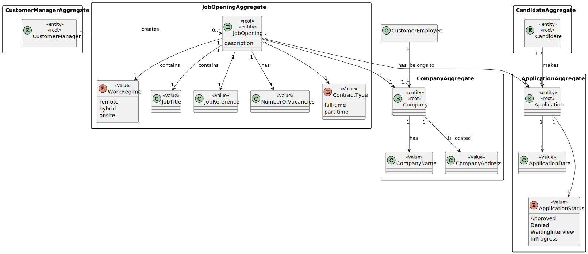
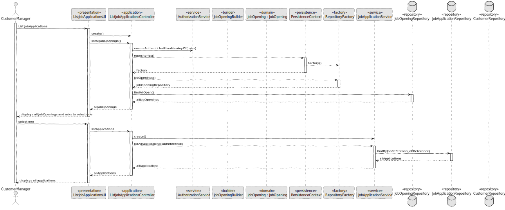
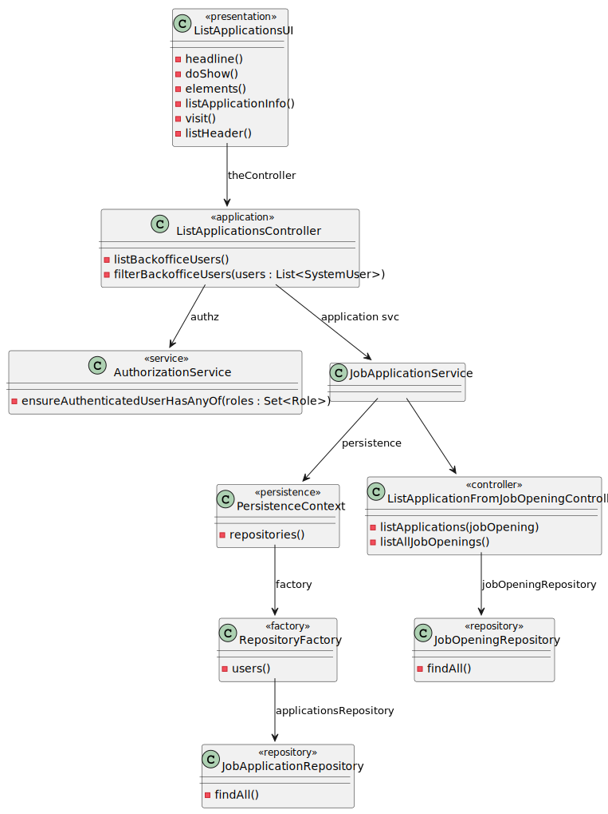

# US List all applications for a job opening. #

## 1. Context

This Us consist into the Customer Manager to be capable of listing the applications from a certain  Job Opening. 

## 2. Requirements

**US 1005** As Customer Manager, I want to list all applications for a job opening.

**Acceptance Criteria:**

- 1005.1. The system should list every application at a certain job opening.
- 1005.2. The listed application must include its state.
- 1005.3. The used key for searching is the job reference. 


**Dependencies/References:**

> Question : Relativamente aos critérios para a listagem das candidaturas: Devem aparecer candidaturas que estão a decorrer ou podem aparecer candidaturas feitas no passado? Podem aparecer quaisquer candidaturas ou apenas as que tenham sido aceites? Que informação deverá ser mostrada em cada candidatura?

> Answer : Tal como refere a descrição da US, devem ser listadas todas as candidaturas para um job opening. Faz sentido mostrar todas as candidaturas, independentemente do seu estado. Assim, para cada cada candidatura deve ser identificado o candidato e o estado da sua candidatura.

## 3. Analysis



## 4. Design

### 4.1. Realization


### 4.2. Class Diagram



### 4.3. Applied Patterns

- 4.3.1 Service
> Services are operations with the responsibility of an entity or value object. They are used to model operations that involve multiple objects or complex behaviour.

- 4.3.2. Factory
> Our PersistenceContext will create a RepositoryFactory then the RepositoryFactory will create the repository that we need in order to persist our domain entity, in this case the Job Opening

- 4.3.3 Tell, Don't Ask
> Ensure that objects do not expose their internal state or behaviour to the outside world. On the contrary, objects should receive commands telling them what they should do, rather than being asked for information about their current state.


## 5. Implementation

**ListApplicationsController**
````
package eapli.jobs4u.jobOpeningsManagement.application;

import eapli.framework.infrastructure.authz.application.AuthorizationService;
import eapli.framework.infrastructure.authz.application.AuthzRegistry;
import eapli.framework.infrastructure.authz.domain.model.SystemUser;
import eapli.jobs4u.Application;
import eapli.jobs4u.applicationsmanagement.application.JobApplicationService;
import eapli.jobs4u.applicationsmanagement.domain.JobApplication;
import eapli.jobs4u.applicationsmanagement.repositories.JobApplicationRepository;
import eapli.jobs4u.infrastructure.persistence.PersistenceContext;
import eapli.jobs4u.jobOpeningsManagement.domain.JobOpening;
import eapli.jobs4u.jobOpeningsManagement.domain.JobReference;
import eapli.jobs4u.jobOpeningsManagement.repositories.JobOpeningRepository;
import eapli.jobs4u.usermanagement.domain.Jobs4uRoles;

import java.util.Optional;


public class ListApplicationFromJobOpeningController {

    private final AuthorizationService authz = AuthzRegistry.authorizationService();
    private final JobApplicationRepository jobApplicationRepository = PersistenceContext.repositories().applications();
    public Iterable<JobOpening> listAllJobOpenings(){
        authz.ensureAuthenticatedUserHasAnyOf(Jobs4uRoles.POWER_USER,Jobs4uRoles.ADMIN,Jobs4uRoles.CUSTOMER_MANAGER);
        JobOpeningRepository jobOpeningRepository = PersistenceContext.repositories().jobOpenings();
        return jobOpeningRepository.findAllOpen();
    }
    public Iterable<JobApplication> listApplications(JobOpening jobOpening) {
        String jobReference = jobOpening.identity().toString();
        JobApplicationService jobApplicationService = new JobApplicationService(jobApplicationRepository);
        return jobApplicationService.listAllApplications(jobReference);
    }
}

````

**ListApplicationsUI**
````
package eapli.jobs4u.app.backoffice.console.presentation.jobOpening;

import eapli.framework.io.util.Console;
import eapli.framework.presentation.console.AbstractListUI;

import eapli.framework.presentation.console.AbstractUI;
import eapli.framework.visitor.Visitor;
import eapli.jobs4u.Application;
import eapli.jobs4u.applicationsmanagement.domain.JobApplication;
import eapli.jobs4u.jobOpeningsManagement.application.ListApplicationFromJobOpeningController;
import eapli.jobs4u.jobOpeningsManagement.domain.JobOpening;

import java.util.ArrayList;
import java.util.List;

public class ListJobApplicationsUI extends AbstractUI {

    private ListApplicationFromJobOpeningController theController = new ListApplicationFromJobOpeningController();
    private List<JobApplication> jobApplications = new ArrayList<>();

    @Override
    public String headline() {
        return "List Job Applications from a Job Opening";
    }

    @Override
    protected boolean doShow() {
        List<JobOpening> jobOpenings = (List<JobOpening>) theController.listAllJobOpenings();
        JobOpening jobOpening = showMenuAndGetSelection(jobOpenings);
        jobApplications = (List<JobApplication>) theController.listApplications(jobOpening);

        System.out.println("=== Job Applications ===");
        System.out.println(listApplicationInfo());

        for (JobApplication jobApplication : jobApplications) {
            visit(jobApplication);
        }

        return true;
    }

    public JobOpening showMenuAndGetSelection(List<JobOpening> jobOpenings) {

        System.out.println("=== Select a JobOpening ===");
        System.out.printf(" %-30s%-20s%-20s%-30s%-20s%n","JOB_REFERENCE","JOB_TITLE","NUMBER_VACANCIES","CUSTOMER","STATUS");
        for (int i = 0; i < jobOpenings.size(); i++) {
            JobOpening jobOpening = jobOpenings.get(i);
            System.out.print((i + 1)+ ".");
            System.out.printf(" %-30s%-20s%-20s%-30s%-20s%n", jobOpening.identity().toString(), jobOpening.jobTitle().toString(), jobOpening.numberOfVacancies().toString(), jobOpening.customer().name().toString(), jobOpening.jobOpeningStatus().toString());
        }
        System.out.println("0. Exit");

        int choice;
        do {
            choice = Console.readInteger("Select a jobOpening");

        } while (choice < 0 || choice > jobOpenings.size());

        if (choice == 0) {
            return null;
        } else {
            return jobOpenings.get(choice - 1);
        }
    }

    protected String listApplicationInfo() {
        return String.format("%-30s%-20s%-20s%-20s%-20s%-20s%n", "EMAIL", "F. NAME", "L. NAME","JOB_REFERENCE","APPLICATION_STATUS", "APPLICATION_DATE");
    }

    protected void visit(final JobApplication visitee) {
        System.out.printf("%-30s%-20s%-20s%-20s%-20s%-20s%n",
                visitee.candidate().user().email(),
                visitee.candidate().user().name().firstName(),
                visitee.candidate().user().name().lastName(),
                visitee.jobOpening().identity().toString(),
                visitee.applicationStatus(),
                visitee.applicationDate().getTime());
    }
}

````

## 6. Integration/Demonstration

````
+= Jobs4u [ @poweruser ] ======================================================+

| 1. My account > | 2. Backoffice Users > | 3. Candidates > | 4. Customers > | 5. Job Openings > | 6. Plugins > | 7. Settings > | 0. Exit |
Please choose an option
5

>> Job Openings >
1. Register Job Opening
2. List Applications from a Job Opening
3. Setup Phases for Job Opening
0. Return

Please choose an option
2

+= List Job Applications from a Job Opening ===================================+

=== Select a JobOpening ===
JOB_REFERENCE                 JOB_TITLE           NUMBER_VACANCIES    CUSTOMER                      STATUS
1. BLIP-1                        Full stack developer for BLIP5                   BLIP                          OPEN
0. Exit
   Select a jobOpening
   1
   === Job Applications ===
   EMAIL                         F. NAME             L. NAME             JOB_REFERENCE       APPLICATION_STATUS  APPLICATION_DATE

+==============================================================================+
````