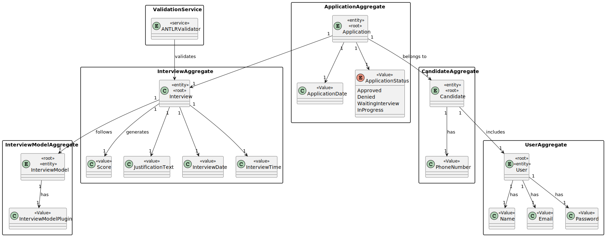
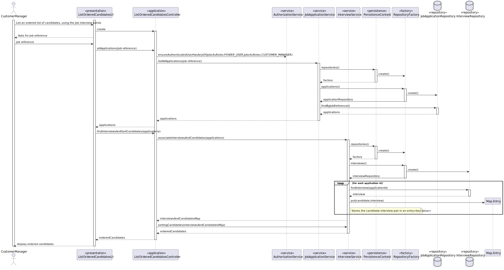
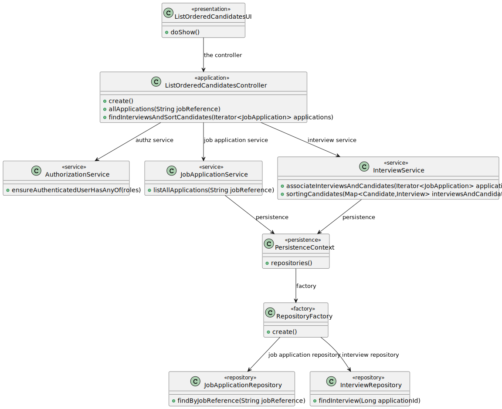

# US 1019

## 1. Context

*In this task we are asked to sort the candidates and present a list of them according to their grades*

## 2. Requirements

*In this section you should present the functionality that is being developed, how do you understand it, as well as possible correlations to other requirements (i.e., dependencies). You should also add acceptance criteria.*

*Example*

**US 1019** As Customer Manager, I want to get an ordered list of candidates, using the job interview points (grades), to help me analyze the candidates.

**Acceptance Criteria:**

- 1019.1. The system should ordered list of candidates, using the job interview points (grades), to help analyze the candidates.
- 1019.2. The system should present the data in descendent order.
- 1019.3. The system should also present the justifications for the grades.

**Dependencies/References:**

>Q169 : Relativamente a esta user story, "US 1019 - As Customer Manager, I want to get an ordered list of candidates, using the job interview points (grades), to help me analyze the candidates.", a lista que pretende é relacionada a uma job opening correto? A maneira de ordenação é ascendente ou quer uma opção que inclua ascendente e descendente?

>A169 : Sim, a ordenação é relativa a candidaturas para um job opening. A ordenação deve ser descendente, do que tem maior pontuação para o que tem menor pontuação.

>Q177 : Na US 1019: As Customer Manager, I want to get an ordered list of candidates, using the job interview points (grades), to help me analyze the candidates. Pretende que para uma determinada Job Opening de um cliente meu, retorno uma lista ordenada de candidatos e suas notas da entrevista. Penso implementar essa funcionalidade da seguinte forma:
        Job Opening : XXX
        Nome | Email | Grade
        Jane Doe| jane@doe.pt | 85
        John Doe | john@doe.pt | 70
        Ou seja com ordenação descendente.
        Conforme refere Q153 consegue ver numa instancia esta lista, e noutra instancia faz o ranking que achar pertinente.
        Acha bem?

>A177 : Penso que queira fazer referência a Q163. Relativamente ao exemplo que apresenta parece-me que satisfaz o que pretendo.

>Q197 : Na questao Q169 é mencionado para a listagem ser ordenada descendentemente da nota da entrevista (como mencionado tambem na própria US), no entanto, a questão é, como idealiza a ordenação caso a job opening não possua entrevista?

>A197 : Esta US não faz sentido para processos que não tenham entrevista.

>Q204 : Segundo a resposta A197, devemos então apenas permitir a listagem de job openings que tenham entrevista?

>A204 : Penso que não percebi bem a referência à listagem de job openings. Esta US não faz sentido para job openings que não tenham entrevista, uma vez que assenta na listagem dos candidatos e dos seus pontos nas entrevista.

>Q226 : Na descrição da user story : " As Customer Manager, I want to get an ordered list of candidates, using the job interview points (grades), to help me analyze the candidates". A intenção "analyze the candidates" impõe alguma mudança/remoção de candidatos no sistema?

>A226 : A referência a “analize the candidates” é apenas para passar a ideia que se pretende nesta US que o sistema disponibilize uma forma do Customer Manager conseguir consultar o resultado das entrevistas de forma a ajudar a decidir o ranking dos candidatos. Nada mais. O ranking dos candidatos é registado no sistema através da US 1013.

>Q235 : Justificação de Notas Entrevista - Nesta user story , as notas da entrevista têm que ter obrigatoriamente uma justificação ?

>A235 : Na secção 2.3.4: “The system should provide a justification, such as "A minimum Bachelor degree is required for the job position”. A similar approach is used for job interviews, but in this case, the goal is not to approve or reject a candidate but to evaluate the answers and calculate a grade for the interview in the range 1-100”. Sim, seria importante apresentar uma listagem ordenada pelas notas. Devia ainda ser possivel, para cada entrevista, saber a justfificação para a nota. Pode ser considerada justificação saber para cada pergunta a nota obtida e qual foi a resposta data pelo candidato (por exemplo).

>Q236 : Dúvida Fase analysis - Nesta user story , a expressão "to help me analyze candidates" ,na descrição da user story , impõe que a job Opening esteja na fase de análise ?

>A236 : Não vejo isso como uma obrigação, mas penso que faz mais sentido nessa fase admitindo que apenas nessa fase seja garantido que todas as entrevistas foram efetuadas e todos os candidatos “avaliados” pelas entrevistas.

## 3. Analysis

*In this section, the team should report the study/analysis/comparison that was done in order to take the best design decisions for the requirement. This section should also include supporting diagrams/artifacts (such as domain model; use case diagrams, etc.),*

## 4. Design

*In this sections, the team should present the solution design that was adopted to solve the requirement. This should include, at least, a diagram of the realization of the functionality (e.g., sequence diagram), a class diagram (presenting the classes that support the functionality), the identification and rational behind the applied design patterns and the specification of the main tests used to validade the functionality.*

### 4.1. Realization

### 4.2. Class Diagram

### 4.3. Tests

# Test 1 - Test Invalid Job Reference
    - Select to get an ordered list of candidates.
    - Asks to insert jobReference
    - inserts a invalid job reference
    - Throws an exception saying that the job reference does not exist

# Test 2 - Test List Of Candidates Not Found
    - Select to get an ordered list of candidates.
    - Asks to insert jobReference
    - Inserts a valid job reference
    - Throwns an exception saying that the list of candidates is empty

# Test 3 - Test Interviews Not Found
    - Select to get an ordered list of candidates.
    - Asks to insert jobReference
    - Inserts a valid job reference
    - verify the candidate interviews
    - Throwns an exception saying that interviews not found

# Test 4 - Test Grades Justifications Not Found
    - Select to get an ordered list of candidates.
    - Asks to insert jobReference
    - Inserts a valid job reference
    - verify the candidate interviews
    - verify the grades justifications
    - Throwns an exception saying that grades not found, the list is empty

## 5. Integration/Demonstration

*In this section the team should describe the efforts realized in order to integrate this functionality with the other parts/components of the system*

*It is also important to explain any scripts or instructions required to execute an demonstrate this functionality*

