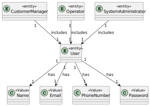
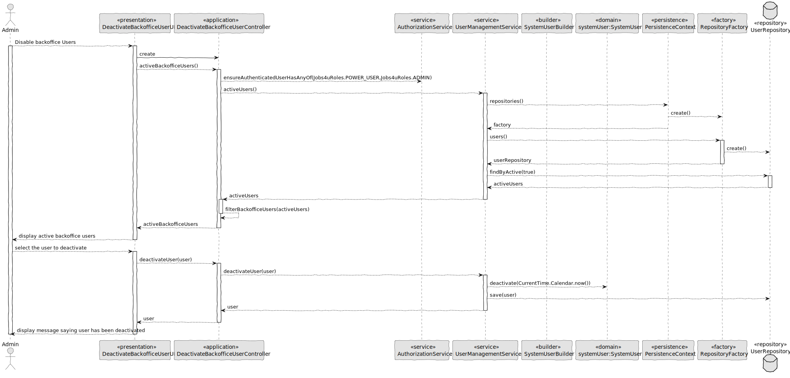
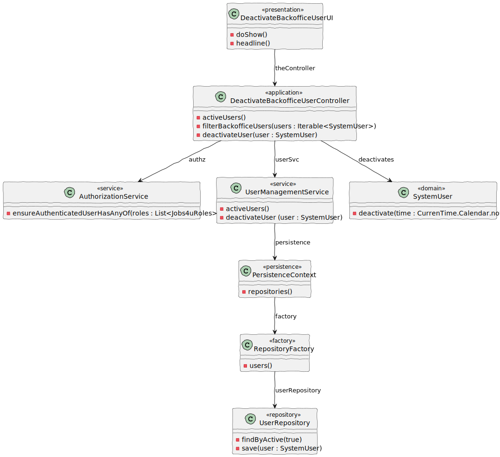

# US 1000

## 1. Context

*US 1000 - As an administrator, I want to be able to register, disable/enable, and list users of the backoffice.*

## 2. Requirements

In this file, we are going to regard the part of disabling users of the backoffice

*Example*

**US 1000** As an administrator, I want to be able to disable users of the backoffice.

**Acceptance Criteria:**

- 1000.1. The system should list only the active backoffice users.
- 1000.2. A user can be enabled/disabled more than one time.

**Dependencies/References:**
>Question : Multiple enable/disable (US1000) – Can a user (from the backoffice, for example) be enabled/disabled multiple times?

>Answer : Yes.
> 
## 3. Analysis



## 4. Design

*In this sections, we present the solution design that was adopted to solve the requirement

### 4.1. Realization



### 4.2. Class Diagram



### 4.3. Applied Patterns
- 4.3.1. Factory
> Our PersistenceContext will create a RepositoryFactory then the RepositoryFactory will create the repository that we need in order to persist our domain entity, in this case the User

- 4.3.2 Service
> Services are operations with the responsibility of an entity or value object. They are used to model operations that involve multiple objects or complex behaviour.

- 4.3.3 Tell, Don't Ask
> Ensure that objects do not expose their internal state or behaviour to the outside world. On the contrary, objects should receive commands telling them what they should do, rather than being asked for information about their current state.

- 4.3.6 Model-View-Controller (MVC)
> Model is responsible for managing the data and business logic of the application. (UserManagementService, AuthorizationService)
> View is responsible for presenting the data to the user in a human-readable format. (DeactivateBackofficeUserUI)
> Controller is responsible for handling the user input and updating the model and the view accordingly. (DeactivateBackofficeUserController)

### 4.4. Tests

## 5. Implementation
**DeactivateBackofficeUserController**

````
/*
 * Copyright (c) 2013-2024 the original author or authors.
 *
 * MIT License
 *
 * Permission is hereby granted, free of charge, to any person obtaining a copy
 * of this software and associated documentation files (the "Software"), to deal
 * in the Software without restriction, including without limitation the rights
 * to use, copy, modify, merge, publish, distribute, sublicense, and/or sell
 * copies of the Software, and to permit persons to whom the Software is
 * furnished to do so, subject to the following conditions:
 *
 * The above copyright notice and this permission notice shall be included in
 * all copies or substantial portions of the Software.
 *
 * THE SOFTWARE IS PROVIDED "AS IS", WITHOUT WARRANTY OF ANY KIND, EXPRESS OR
 * IMPLIED, INCLUDING BUT NOT LIMITED TO THE WARRANTIES OF MERCHANTABILITY,
 * FITNESS FOR A PARTICULAR PURPOSE AND NONINFRINGEMENT. IN NO EVENT SHALL THE
 * AUTHORS OR COPYRIGHT HOLDERS BE LIABLE FOR ANY CLAIM, DAMAGES OR OTHER
 * LIABILITY, WHETHER IN AN ACTION OF CONTRACT, TORT OR OTHERWISE, ARISING FROM,
 * OUT OF OR IN CONNECTION WITH THE SOFTWARE OR THE USE OR OTHER DEALINGS IN THE
 * SOFTWARE.
 */
package eapli.jobs4u.usermanagement.application;

import eapli.jobs4u.usermanagement.domain.Jobs4uRoles;
import eapli.framework.application.UseCaseController;
import eapli.framework.infrastructure.authz.application.AuthorizationService;
import eapli.framework.infrastructure.authz.application.AuthzRegistry;
import eapli.framework.infrastructure.authz.application.UserManagementService;
import eapli.framework.infrastructure.authz.domain.model.SystemUser;

import java.util.ArrayList;
import java.util.List;

@UseCaseController
public class DeactivateBackofficeUserController {

    private final AuthorizationService authz = AuthzRegistry.authorizationService();
    private final UserManagementService userSvc = AuthzRegistry.userService();

    public Iterable<SystemUser> activeBackofficeUsers() {
        authz.ensureAuthenticatedUserHasAnyOf(Jobs4uRoles.POWER_USER, Jobs4uRoles.ADMIN);
        Iterable<SystemUser> allActiveUsers = userSvc.activeUsers();
        return filterBackofficeUsers(allActiveUsers);
    }

    private Iterable<SystemUser> filterBackofficeUsers(Iterable<SystemUser> allUsers) {
        List<SystemUser> backofficeUsers = new ArrayList<>();
        for (SystemUser user : allUsers) {
            if (user.hasAny(Jobs4uRoles.ADMIN,Jobs4uRoles.OPERATOR,Jobs4uRoles.CUSTOMER_MANAGER,Jobs4uRoles.LANG_ENGINEER)) {
                backofficeUsers.add(user);
            }
        }
        return backofficeUsers;
    }

    public SystemUser deactivateUser(final SystemUser user) {
        authz.ensureAuthenticatedUserHasAnyOf(Jobs4uRoles.POWER_USER, Jobs4uRoles.ADMIN);
        return userSvc.deactivateUser(user);
    }
}

````

**DeactivateBackofficeUserUI**

````
/*
 * Copyright (c) 2013-2024 the original author or authors.
 *
 * MIT License
 *
 * Permission is hereby granted, free of charge, to any person obtaining a copy of this software and
 * associated documentation files (the "Software"), to deal in the Software without restriction,
 * including without limitation the rights to use, copy, modify, merge, publish, distribute,
 * sublicense, and/or sell copies of the Software, and to permit persons to whom the Software is
 * furnished to do so, subject to the following conditions:
 *
 * The above copyright notice and this permission notice shall be included in all copies or
 * substantial portions of the Software.
 *
 * THE SOFTWARE IS PROVIDED "AS IS", WITHOUT WARRANTY OF ANY KIND, EXPRESS OR IMPLIED, INCLUDING BUT
 * NOT LIMITED TO THE WARRANTIES OF MERCHANTABILITY, FITNESS FOR A PARTICULAR PURPOSE AND
 * NONINFRINGEMENT. IN NO EVENT SHALL THE AUTHORS OR COPYRIGHT HOLDERS BE LIABLE FOR ANY CLAIM,
 * DAMAGES OR OTHER LIABILITY, WHETHER IN AN ACTION OF CONTRACT, TORT OR OTHERWISE, ARISING FROM,
 * OUT OF OR IN CONNECTION WITH THE SOFTWARE OR THE USE OR OTHER DEALINGS IN THE SOFTWARE.
 */
package eapli.jobs4u.app.backoffice.console.presentation.authz;

import java.util.ArrayList;
import java.util.List;

import org.slf4j.Logger;
import org.slf4j.LoggerFactory;

import eapli.jobs4u.usermanagement.application.DeactivateBackofficeUserController;
import eapli.framework.domain.repositories.ConcurrencyException;
import eapli.framework.domain.repositories.IntegrityViolationException;
import eapli.framework.infrastructure.authz.domain.model.SystemUser;
import eapli.framework.io.util.Console;
import eapli.framework.presentation.console.AbstractUI;

/**
 *
 * @author Fernando
 */
@SuppressWarnings("squid:S106")
public class DeactivateBackofficeUserUI extends AbstractUI {
    private static final Logger LOGGER = LoggerFactory.getLogger(DeactivateBackofficeUserUI.class);

    private final DeactivateBackofficeUserController theController = new DeactivateBackofficeUserController();

    @Override
    protected boolean doShow() {
        final List<SystemUser> list = new ArrayList<>();
        final Iterable<SystemUser> iterable = this.theController.activeBackofficeUsers();
        if (!iterable.iterator().hasNext()) {
            System.out.println("There are no activated backoffice users at the moment!");
        } else {
            int cont = 1;
            System.out.println("SELECT User to deactivate\n");
            System.out.printf("%-6s%-30s%-30s%-30s%-30s%n", "Nº:", "Email", "Firstname", "Lastname", "Roles");
            for (final SystemUser user : iterable) {
                list.add(user);
                System.out.printf("%-6d%-30s%-30s%-30s%-30s%n", cont, user.email(), user.name().firstName(),
                        user.name().lastName(),user.roleTypes());
                cont++;
            }
            final int option = Console.readInteger("Enter user nº to deactivate or 0 to finish ");
            if (option == 0) {
                System.out.println("No user selected");
            } else {
                try {
                    this.theController.deactivateUser(list.get(option - 1));
                } catch (IntegrityViolationException | ConcurrencyException ex) {
                    LOGGER.error("Error performing the operation", ex);
                    System.out.println(
                            "Unfortunatelly there was an unexpected error in the application. Please try again and if the problem persists, contact your system admnistrator.");
                }
                System.out.println("Backoffice User successfully deactivated.");
            }
        }
        return true;
    }

    @Override
    public String headline() {
        return "Deactivate User";
    }
}
````
## 6. Integration/Demonstration

````
>> Backoffice Users >
1. Register Backoffice User
2. List all Backoffice Users
3. Deactivate Backoffice User
4. Activate Backoffice User
5. Accept/Refuse Signup Request
0. Return 

Please choose an option
3

+= Deactivate User ============================================================+

SELECT User to deactivate

Nº:   Email                         Firstname                     Lastname                      Roles                         
1     jane.doe@email.local          Jane                          Doe Admin                     [ADMIN]                       
2     bruno@gmail.com               Bruno                         Ribeiro                       [ADMIN]                       
3     tiagosilva@gmail.com          Tiago                         Silva                         [OPERATOR]                    
4     rogerio@gmail.com             Rogério                       Gomes                         [LANG_ENGINEER]               
5     conceicao@gmail.com           Sergio                        Conceicao                     [CUSTOMER_MANAGER, ADMIN]     
6     bruno123@gmail.com            Bruno                         Ribeiro                       [OPERATOR]                    
Enter user nº to deactivate or 0 to finish 
3
Backoffice User successfully deactivated.
+==============================================================================+
````

