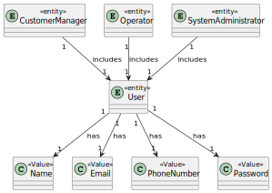
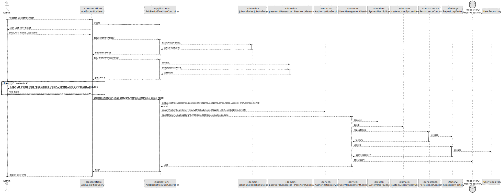
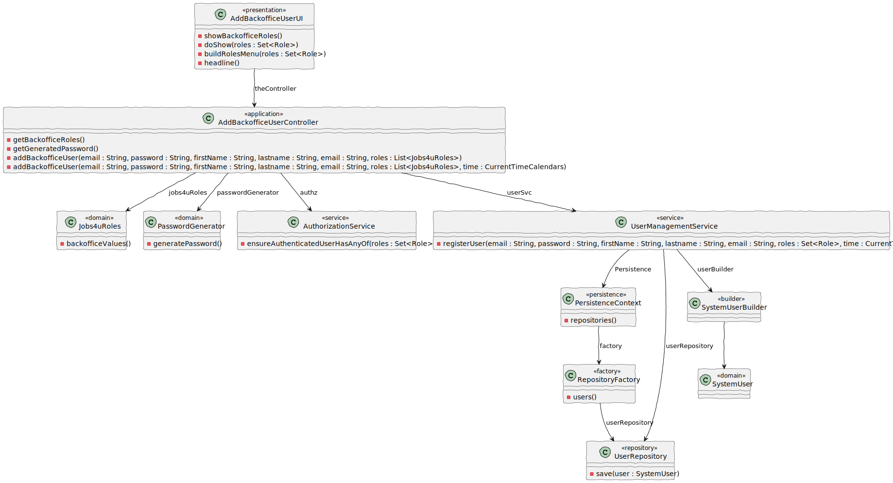

# US 1000

## 1. Context

*US 1000 - As an administrator, I want to be able to register, disable/enable, and list users of the backoffice.*

## 2. Requirements

In this file, we are going to regard the part of registering a user of the backoffice

*Example*

**US 1000** As an administrator, I want to be able to register users of the backoffice

**Acceptance Criteria:**

- 1000.1. The system should generate the password.
- 1000.2. The system should only register the user if a name and an email are provided.

**Dependencies/References:**

>Question : Na criação de um utilizador no sistema o nome é definido pelo utilizador ou é o nome da pessoa (primeiro e último) e se a password é definida pelo utilizador ou gerada pelo sistema?

>Answer : No âmbito da US 2000a o Operator cria utilizadores do sistema para candidatos que ainda não estejam no sistema. Tem de fazer isso com base nos dados recebidos na candidatura (que incluem email e nome). O email servirá para identificar a pessoa. Neste contexto é necessário ter uma password para esse novo utilizador. Uma vez que essa informação não é transmitida pelo candidato, suponho que a solução mais “aconselhada” será o sistema gerar uma password para esse utilizador. Como o utilizador/candidato irá receber essa informação (a forma de autenticação na app) está out of scope, no sentido em que não existe nenhuma US que remete para isso. As US 1000 e 1001 também remetem para criação de utilizadores. Aqui, eventualmente poderia-se pensar em introduzir manualmente as passwords, mas pode ser pelo mesmo mecanismo de definição automática de password, descrito anteriormente.

----------------------------------------------------------------------------
>Question : Em relação ao registro de utilizadores, todos estes devem ser considerados por padrão "enable" ou deve haver a opção de "enable/disable" os utilizadores durante o processo de registro?

>Answer : No contexto da US1000 deve ser possível ativar e desativar utilizadores. Suponho que por omissão devem estar ativos.


## 3. Analysis



## 4. Design

*In this sections, we present the solution design that was adopted to solve the requirement

### 4.1. Realization



### 4.2. Class Diagram



### 4.3. Applied Patterns
- 4.3.1. Factory
> Our PersistenceContext will create a RepositoryFactory then the RepositoryFactory will create the repository that we need in order to persist our domain entity, in this case the User

- 4.3.2 Service
> Services are operations with the responsibility of an entity or value object. They are used to model operations that involve multiple objects or complex behaviour.

- 4.3.3 Tell, Don't Ask
> Ensure that objects do not expose their internal state or behaviour to the outside world. On the contrary, objects should receive commands telling them what they should do, rather than being asked for information about their current state.

- 4.3.6 Model-View-Controller (MVC)
> Model is responsible for managing the data and business logic of the application. (UserManagementService, AuthorizationService)
> View is responsible for presenting the data to the user in a human-readable format. (AddBackofficeUserUI)
> Controller is responsible for handling the user input and updating the model and the view accordingly. (AddBackofficeUserController)

### 4.4. Tests

Include here the main tests used to validate the functionality. Focus on how they relate to the acceptance criteria.

**Test 1:** *The password must be generated by the system*
````

public class PasswordGeneratorTest {

    PasswordGenerator passwordGenerator = new PasswordGenerator();

    @Test
    public void testGeneratedPasswordLength() {
        String password = passwordGenerator.generatePassword();
        assertTrue(password.length() >= 8, "Password must at least have 8 characters");
    }

    @Test
    public void testGeneratedPasswordContainsDigit() {
        String password = passwordGenerator.generatePassword();
        assertTrue(password.matches(".*\\d.*"), "Password must at least have a digit");
    }

    @Test
    public void testGeneratedPasswordContainsUpperCase() {
        String password = passwordGenerator.generatePassword();
        assertTrue(password.matches(".*[A-Z].*"), "Password must at least have an upper case letter");
    }

    @Test
    public void testGeneratedPasswordContainsSpecialCharacter() {
        String password = passwordGenerator.generatePassword();
        assertTrue(password.matches(".*[!@#$%^&*()-_=+].*"), "Password must at least have a non-alpha numeric character");
    }
}


````

## 5. Implementation

**AddBackofficeUserController**

````
/*
 * Copyright (c) 2013-2024 the original author or authors.
 *
 * MIT License
 *
 * Permission is hereby granted, free of charge, to any person obtaining a copy of this software and
 * associated documentation files (the "Software"), to deal in the Software without restriction,
 * including without limitation the rights to use, copy, modify, merge, publish, distribute,
 * sublicense, and/or sell copies of the Software, and to permit persons to whom the Software is
 * furnished to do so, subject to the following conditions:
 *
 * The above copyright notice and this permission notice shall be included in all copies or
 * substantial portions of the Software.
 *
 * THE SOFTWARE IS PROVIDED "AS IS", WITHOUT WARRANTY OF ANY KIND, EXPRESS OR IMPLIED, INCLUDING BUT
 * NOT LIMITED TO THE WARRANTIES OF MERCHANTABILITY, FITNESS FOR A PARTICULAR PURPOSE AND
 * NONINFRINGEMENT. IN NO EVENT SHALL THE AUTHORS OR COPYRIGHT HOLDERS BE LIABLE FOR ANY CLAIM,
 * DAMAGES OR OTHER LIABILITY, WHETHER IN AN ACTION OF CONTRACT, TORT OR OTHERWISE, ARISING FROM,
 * OUT OF OR IN CONNECTION WITH THE SOFTWARE OR THE USE OR OTHER DEALINGS IN THE SOFTWARE.
 */
package eapli.jobs4u.usermanagement.application;

import java.util.Calendar;
import java.util.Set;

import eapli.jobs4u.usermanagement.domain.Jobs4uRoles;
import eapli.framework.application.UseCaseController;
import eapli.framework.infrastructure.authz.application.AuthorizationService;
import eapli.framework.infrastructure.authz.application.AuthzRegistry;
import eapli.framework.infrastructure.authz.application.UserManagementService;
import eapli.framework.infrastructure.authz.domain.model.Role;
import eapli.framework.infrastructure.authz.domain.model.SystemUser;
import eapli.framework.time.util.CurrentTimeCalendars;
import eapli.jobs4u.usermanagement.domain.PasswordGenerator;

@UseCaseController
public class AddBackofficeUserController {

    private final AuthorizationService authz = AuthzRegistry.authorizationService();
    private final UserManagementService userSvc = AuthzRegistry.userService();

    /**
     * Get existing backoffice roles available to the user.
     *
     * @return a list of backoffice Roles
     */
    public Role[] getBackofficeRoles() {
        return Jobs4uRoles.backofficeValues();
    }

    /**
     * This method returns the password generated
     * @return password
     */
    public String getGeneratedPassword(){
        PasswordGenerator passwordGenerator = new PasswordGenerator();
        return passwordGenerator.generatePassword();
    }

    /**
     * This method adds a backoffice user to the system
     * @param username of the user
     * @param password of the user
     * @param firstName of the user
     * @param lastName of the user
     * @param email of the user
     * @param roles of the user
     * @param createdOn time of the creation
     * @return systemUser
     */
    public SystemUser addBackofficeUser(final String username, final String password, final String firstName,
            final String lastName,
            final String email, final Set<Role> roles, final Calendar createdOn) {
        authz.ensureAuthenticatedUserHasAnyOf(Jobs4uRoles.POWER_USER, Jobs4uRoles.ADMIN);

        return userSvc.registerNewUser(username, password, firstName, lastName, email, roles,
                createdOn);
    }

    public SystemUser addBackofficeUser(final String username, final String password, final String firstName,
            final String lastName,
            final String email, final Set<Role> roles) {
        return addBackofficeUser(username, password, firstName, lastName, email, roles, CurrentTimeCalendars.now());
    }
}

````

**AddBackofficeUserUI**

````
/*
 * Copyright (c) 2013-2024 the original author or authors.
 *
 * MIT License
 *
 * Permission is hereby granted, free of charge, to any person obtaining a copy
 * of this software and associated documentation files (the "Software"), to deal
 * in the Software without restriction, including without limitation the rights
 * to use, copy, modify, merge, publish, distribute, sublicense, and/or sell
 * copies of the Software, and to permit persons to whom the Software is
 * furnished to do so, subject to the following conditions:
 *
 * The above copyright notice and this permission notice shall be included in
 * all copies or substantial portions of the Software.
 *
 * THE SOFTWARE IS PROVIDED "AS IS", WITHOUT WARRANTY OF ANY KIND, EXPRESS OR
 * IMPLIED, INCLUDING BUT NOT LIMITED TO THE WARRANTIES OF MERCHANTABILITY,
 * FITNESS FOR A PARTICULAR PURPOSE AND NONINFRINGEMENT. IN NO EVENT SHALL THE
 * AUTHORS OR COPYRIGHT HOLDERS BE LIABLE FOR ANY CLAIM, DAMAGES OR OTHER
 * LIABILITY, WHETHER IN AN ACTION OF CONTRACT, TORT OR OTHERWISE, ARISING FROM,
 * OUT OF OR IN CONNECTION WITH THE SOFTWARE OR THE USE OR OTHER DEALINGS IN THE
 * SOFTWARE.
 */
package eapli.jobs4u.app.backoffice.console.presentation.authz;

import java.util.HashSet;
import java.util.Set;

import eapli.jobs4u.usermanagement.application.AddBackofficeUserController;
import eapli.framework.actions.Actions;
import eapli.framework.actions.menu.Menu;
import eapli.framework.actions.menu.MenuItem;
import eapli.framework.domain.repositories.ConcurrencyException;
import eapli.framework.domain.repositories.IntegrityViolationException;
import eapli.framework.infrastructure.authz.domain.model.Role;
import eapli.framework.io.util.Console;
import eapli.framework.presentation.console.AbstractUI;
import eapli.framework.presentation.console.menu.MenuItemRenderer;
import eapli.framework.presentation.console.menu.MenuRenderer;
import eapli.framework.presentation.console.menu.VerticalMenuRenderer;
import eapli.jobs4u.usermanagement.domain.PasswordGenerator;

/**
 * UI for adding a backoffice user to the application.
 *
 * Created by Bruno 1221352
 */
public class AddBackofficeUserUI extends AbstractUI {

    private final AddBackofficeUserController theController = new AddBackofficeUserController();

    @Override
    protected boolean doShow() {
        final String firstName = Console.readLine("First Name");
        final String lastName = Console.readLine("Last Name");
        final String email = Console.readLine("E-Mail");
        final String password = theController.getGeneratedPassword();
        final String username = email;

        final Set<Role> roleTypes = new HashSet<>();
        boolean show;
        do {
            show = showBackofficeRoles(roleTypes);
        } while (!show);

        try {
            this.theController.addBackofficeUser(username, password, firstName, lastName, email, roleTypes);
            System.out.println("The password has been sent to the email of the user!");
        } catch (final IntegrityViolationException | ConcurrencyException e) {
            System.out.println("That username is already in use.");
        }

        return false;
    }

    private boolean showBackofficeRoles(final Set<Role> roleTypes) {
        final Menu rolesMenu = buildRolesMenu(roleTypes);
        final MenuRenderer renderer = new VerticalMenuRenderer(rolesMenu, MenuItemRenderer.DEFAULT);
        return renderer.render();
    }

    private Menu buildRolesMenu(final Set<Role> roleTypes) {
        final Menu rolesMenu = new Menu();
        int counter = 0;
        rolesMenu.addItem(MenuItem.of(counter++, "Finish Selection", Actions.SUCCESS));
        for (final Role roleType : theController.getBackofficeRoles()) {
            rolesMenu.addItem(MenuItem.of(counter++, roleType.toString(), () -> {
                if (roleTypes.contains(roleType)) {
                    roleTypes.remove(roleType);
                } else {
                    roleTypes.add(roleType);
                }
                return false;
            }));
        }
        return rolesMenu;
    }

    @Override
    public String headline() {
        return "Add Backoffice User";
    }
}

````
## 6. Integration/Demonstration

````
+= Base [ @poweruser ] ========================================================+

| 1. My account > | 2. Backoffice Users > | 4. Settings > | 0. Exit | 
Please choose an option
2

>> Backoffice Users >
1. Register Backoffice User
2. List all Backoffice Users
3. Deactivate Backoffice User
4. Activate Backoffice User
5. Accept/Refuse Signup Request
0. Return 

Please choose an option
1

+= Add Backoffice User ========================================================+

First Name
Bruno
Last Name
Ribeiro
E-Mail
bruno123@gmail.com
0. Finish Selection
1. ADMIN
2. OPERATOR
3. CUSTOMER_MANAGER
4. LANG_ENGINEER

Please choose an option
2
0. Finish Selection
1. ADMIN
2. OPERATOR
3. CUSTOMER_MANAGER
4. LANG_ENGINEER

Please choose an option
0
08:25:46.409 [main] DEBUG e.f.i.a.d.m.SystemUserBuilder - Creating new user [eapli.framework.infrastructure.authz.domain.model.SystemUser@5926c173] bruno123@gmail.com (Bruno Ribeiro bruno123@gmail.com) with roles [OPERATOR]
The password has been sent to the email of the user!
+==============================================================================+
````