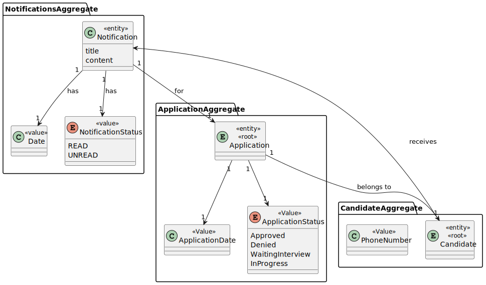
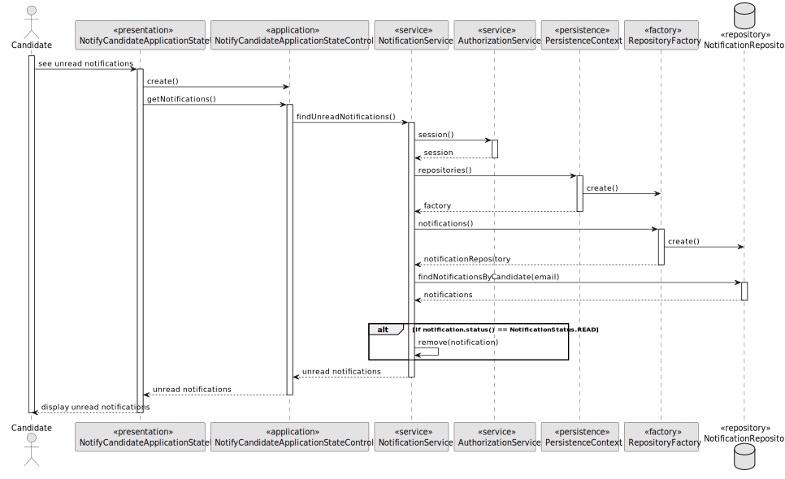
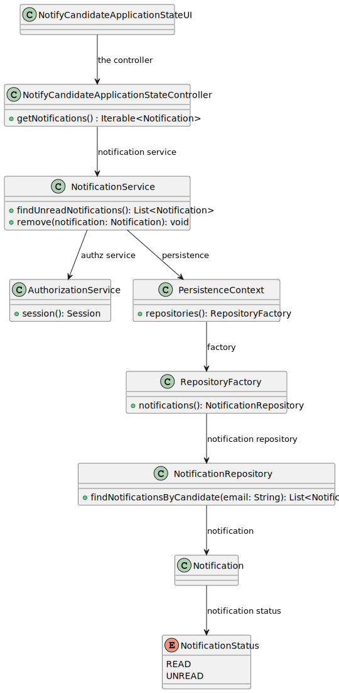

# US 3001

## 1. Context

*The purpose of this feature is to notify candidates when the status of one of their applications changes*

## 2. Requirements

*In this section you should present the functionality that is being developed, how do you understand it, as well as possible correlations to other requirements (i.e., dependencies). You should also add acceptance criteria.*

*Example*

**US 3001** As Candidate, I want to be notified in my application when the state of one of my application changes

**Acceptance Criteria:**

- 3001.1. The system must notify the candidate when the state of one of their application changes.

- 3001.2. The system must allow the candidate to access all their unread notifications.

**Dependencies/References:**

>Q174 : Na US 3001 pretende que o candidato seja notificado na sua aplicação quando o estado de uma aplicação mudar. De que forma pretende que o candidato seja notificado? E caso o candidato não esteja a correr a aplicação, essa notificação é perdida?

>A174 : O candidato deve ser notificado quando a sua “app” está em execução. Relativamente a notificações que “acontecem” quando não está a correr a aplicação, seria interessante que as recebesse da próxima vez que executasse a aplicação.

>Q175 : US3001 - Questão âmbito notificações - O candidato será notificado, quando a sua candidatura mudar de estado. O que se entende por notificado, é receber um email, quando entra na aplicação tem uma fila de 'inbox' ? Quando a aplicação está ligada recebo email? É o candidato que faz o pedido(cliente) (Pop) inicia assim a comunicação, e recebe a resposta/notificação (servidor). E como encaixo o cenário de notificação(push)?

>A175 : Ver Q174. Neste caso as notificações são na aplicação do candidato, não são por email.

>Q189 : US3001 – Application State – I'd like some clarifications regarding the state that US3001 mentions. Is it the "accepted/not accepted" state, or a state regarding the phases of the recruitment process of which the application is associated to?

>A189 : This US is focused on the Candidate perspective. He/she may not be aware of the internal phases of the recruitment process. But he/she is interested in knowing the “external” state of his/her applications. For instance, as a candidate I would like to know if my application was received. Then I would like to know if my application was accepted or not and, finally, if I was selected or not.

>Q229 : US 3001 - Segundo a nossa perspetiva sobre esta funcionalidade, achámos melhor o utilizador ter na sua aplicação uma espécie de inbox de notificações. Quando o utilizador está na funcionalidade das notificações este recebe as notificações que tinha e que não foram enviadas porque não estava na aplicação e depois fica á espera de novas notificações que apareçam entretanto, até o utilizador pedir para sair da funcionalidade. Esta abordagem está alinhada com suas expectativas?

>A229 : Pode ser. Mas não seria possível receber as notificação mesmo não estando nessa “opção de menu”? Sendo uma aplicação “console” limita um pouco a UI, mas não seria possível receber as notificações desde que tenha a aplicação em execução mas só mostrar essas notificações quando o utilizador seleciona a opção? Em termos de UI a diferença é mínima, em termos de implementação pode ser significativa. Talvez esta seja até mais uma questão para RCOMP.

>Q233 : US 3001 – Notifications - Em questões anteriores sobre esta funcionalidade menciona que como candidate gostaria de saber se a sua candidatura foi recebida, aceite e escolhida. Pedimos que descreva a que se refere quando diz que uma candidatura foi aceite, e quando foi escolhida.

>A233 : É aceite se passa o processo de verificação de requisitos. É escolhida se após o ranking está dentro dos lugares das vagas para o job opening.

## 3. Analysis

*In this section, the team should report the study/analysis/comparison that was done in order to take the best design decisions for the requirement. This section should also include supporting diagrams/artifacts (such as domain model; use case diagrams, etc.),*

## 4. Design

*In this sections, the team should present the solution design that was adopted to solve the requirement. This should include, at least, a diagram of the realization of the functionality (e.g., sequence diagram), a class diagram (presenting the classes that support the functionality), the identification and rational behind the applied design patterns and the specification of the main tests used to validade the functionality.*

### 4.1. Realization

### 4.2. Class Diagram

### 4.3. Tests

# Test 1 - Test Try to obtain the authentication session
    - Select to see unread notifications
    - Verify candidate session
    - Throws exception saying that´s not exist session for that candidate

# Test 2 - Test To Obtain Notifications for the candidate
    - Select to see unread notifications
    - Verify candidate session
    - Verify the notifications list
    - Throws exception saying that the list is empty, that there are no notifications for the candidate.

## 5. Implementation

*In this section the team should present, if necessary, some evidencies that the implementation is according to the design. It should also describe and explain other important artifacts necessary to fully understand the implementation like, for instance, configuration files.*

*It is also a best practice to include a listing (with a brief summary) of the major commits regarding this requirement.*

## 6. Integration/Demonstration

*In this section the team should describe the efforts realized in order to integrate this functionality with the other parts/components of the system*

*It is also important to explain any scripts or instructions required to execute an demonstrate this functionality*