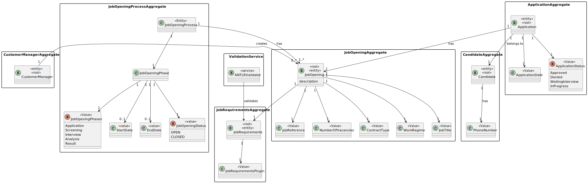
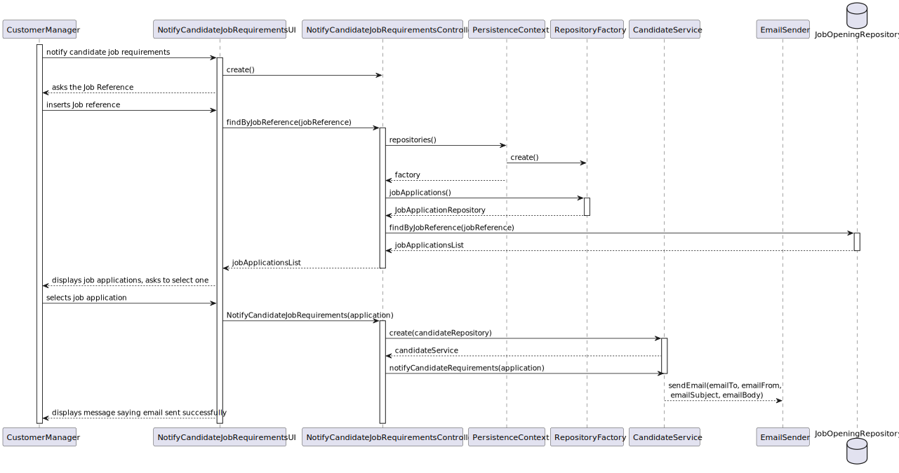
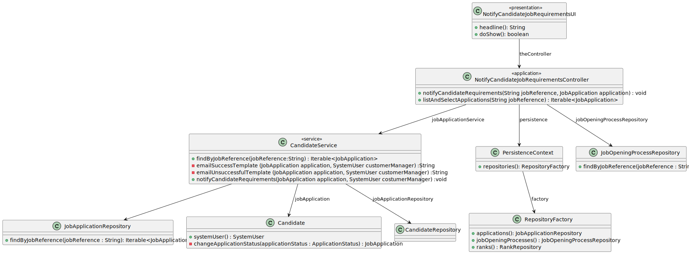

# US 1016

## 1. Context

1016-As Customer Manager, I want the system to notify candidates, by email, of the result of the verification process

## 2. Requirements

*Example*

**1016**-As Customer Manager, I want the system to notify candidates, by email, of the result of the verication process

**Acceptance Criteria:**

- 1020.1. The system should send an Email saying  the job requirements were approved as the Customer Manager chooses to.

- 1020.2. The system should change the state of an application into denied in case not all the requirements were met.

- 1020.3. The system should change the state of an application into waiting interview in case all requirements were met.

**Dependencies/References:**

## 3. Analysis

## 4. Design

### 4.1. Sequence Diagram

### 4.2. Class Diagram

### 4.4. Tests

# Test 1.1 - Test Requirement Approval Notified
    - Select Notify Job Requirements results
    - Selects a Job Opening with avaiable Applications in Waiting Interview or Denied
    - Sends email if in any of those states. 
    - Verify email received

