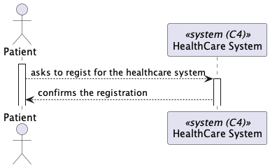

# US 5.1.3

As a Patient, I want to register for the healthcare application, so that I can create a user profile and book appointments online.

## 2. Requirements

**US 5.1.3** As a Patient, I want to register for the healthcare application, so that I can create a user profile and book appointments online.

**Acceptance Criteria:**

- 5.1.3.1 - Patients can self-register using the external IAM system.

- 5.1.3.2 - During registration, patients provide personal details (e.g., name, email, phone) and create a profile.

- 5.1.3.3 - The system validates the email address by sending a verification email with a confirmation link.

- 5.1.3.4 - Patients cannot list their appointments without completing the registration process.

## 3. Views

The global views are available in the views folder. 

### LEVEL 1

### LEVEL 2

### LEVEL 3

