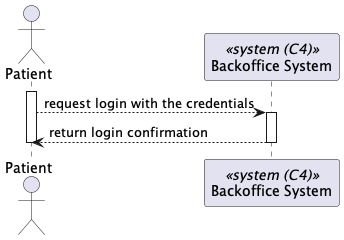
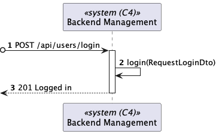
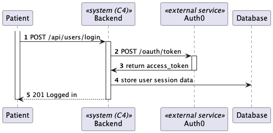
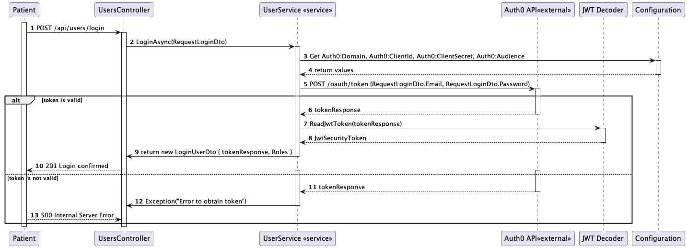

# US 5.1.7

As a Patient, I want to log in to the healthcare system using my external IAM credentials, so that I can access my appointments, medical records, and other features securely.

## 2. Requirements

**US 5.1.7**As a Patient, I want to log in to the healthcare system using my external IAM credentials, so that I can access my appointments, medical records, and other features securely.

**Acceptance Criteria:**

5.1.7.1- Patients log in via an external Identity and Access Management (IAM) provider (e.g., Google,
Facebook, or hospital SSO).

5.1.7.2- After successful authentication via the IAM, patients are redirected to the healthcare system
with a valid session.

5.1.7.3- Patients have access to their appointment history, medical records, and other features relevant
to their profile.

5.1.7.4- Sessions expire after a defined period of inactivity, requiring reauthentication.

## 3. Views

The global views are available in the views folder. 

### LEVEL 1

### LEVEL 2

### LEVEL 3

