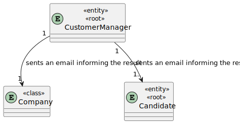
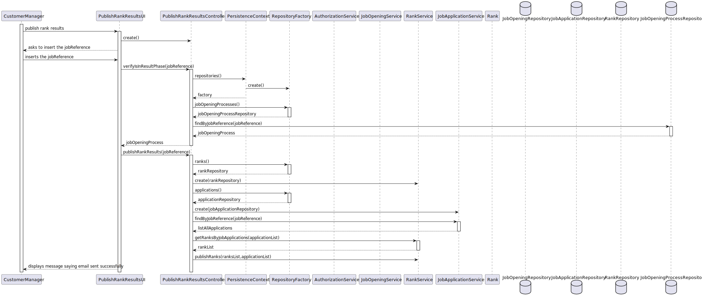

# US 1020

## 1. Context

US 1020 - As Customer Manager, I want to publish the results of the selection of candidates for a job opening, so that candidates and customer are notied by email of the result.

## 2. Requirements

*Example*

**US 1020** As Customer Manager, I want to publish the results of the selection of candidates for a job opening, so that candidates and customer are notied by email of the result.

**Acceptance Criteria:**

- 1020.1. The system should sent an Email saying it was approved only when theirs ranks are above the number of vacancies

- 1020.2. The system should mark as published the rank and mark as APPROVED OR DISAPPROVED when the email is sent.

- 1020.3. The system should not allow to rank unless is in Result phase.

**Dependencies/References:**

## 3. Analysis

## 4. Design

### 4.1. Sequence Diagram

### 4.2. Class Diagram

### 4.4. Tests

# Test 1.1 - Test Try to publish in a phase different than Result
    - Select to rank candidates
    - Asks to insert jobReference
    - Verify if is in result 
    - Throws exception saying it´s not in result phase

# Test 1.2 - Test only send email saying approved to people that position is above number of vacancies and test mark as published and change application status
        - Select publish rank results
        - Asks to insert jobReference
        - Verify if is in result
        - Sents Email 
        - Change rank isPublish=true
        - Change applicationStaus to approved or denied (according to the rank)
