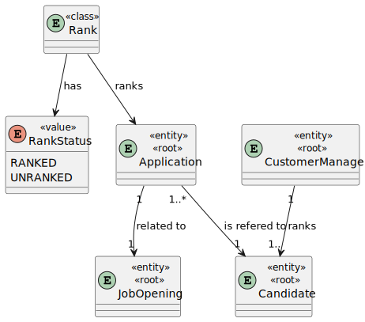
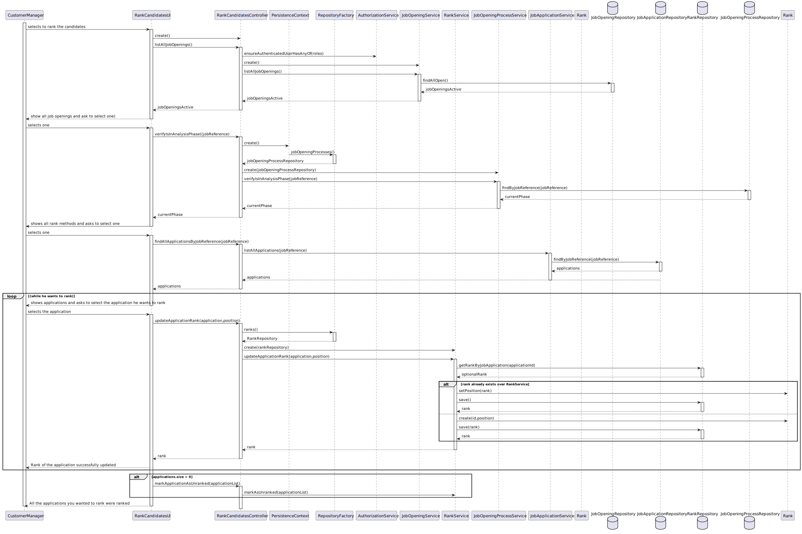
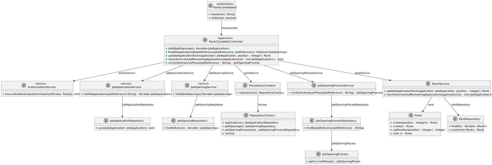

# US 1013

*This is an example template*

## 1. Context

US 1013 - As Customer Manager, I want to rank the candidates for a job opening.

## 2. Requirements

*Example*

**US 1013** As Customer Manager, I want to rank the candidates for a job opening.

**Acceptance Criteria:**

- 1013.1. The system should display the list of the candidates for a job opening.

- 1013.2. The system should mark as unranked the rest of the job applications.

- 1013.3. The system should not allow to rank unless is in Analysis phase.

**Dependencies/References:**

>Question : Relativamente à secção 2.2.1, é na fase de Analysis que as entrevistas são avaliadas e é esse resultado que define o ranking dos candidatos? Além disso, para que serve o CV nesta fase? Visto que as entrevistas não são obrigatórias, o que acontece quando estas não se realizam?

>Answer : A pontuação das entrevistas é efetuada/calculada na fase das entrevistas. O CV e outros dados (como o resultado das entrevistas) é usado pelo Customer manager na fase de analise para ordenar os candidatos. Mas a ordenação é da responsabilidade do Customer Manager (por exemplo, não tem de seguir a ordem da pontuação nas entrevistas). A US 1013 corresponde à ordenação manual dos candidatos feita pelo Customer Manager. O facto de não haver entrevistas não tem implicações na ordenação dos candidatos pois esta não depende explicitamente das entrevistas.

--------------------------------------------------------------------

>Question : Quem é responsável por analisar as candidaturas (applications)?

>Answer : Será o Customer Manager. Este analisa as candidaturas e decide o ranking dos candidatos.

## 3. Analysis

## 4. Design

### 4.1. Sequence Diagram

### 4.2. Class Diagram

### 4.4. Tests

# Test 1.1 - Test Try to rank in a phase different than Analysis
    - Select to rank candidates
    - Asks to insert jobReference
    - Verify if is in analysis 
    - Throws exception saying it´s not in analysis phase

# Test 1.2 - Test ranking vacancies more than applicants
        - Select to rank candidates
        - Asks to insert jobReference
        - Verify if is in analysis
        - Asks to select the number of vacancies he wants
        - Throws an exception saying doesn´t have enough applicants

# Test 1.3 - Test system should mark as unranked the rest of application not ranked
        - Select to rank candidates
        - Asks to insert jobReference
        - Verify if is in analysis
        - Asks to select the number of vacancies he wants
        - Loop asking to selct each place
        - After that, the applicationList if is not null shoudl all application be marked as unranked

# Test 1.4 - Test system should update the rank in case it already is assigned to a position, the positions above should decrement one place
        - Select to rank candidates
        - Asks to insert jobReference
        - Verify if is in analysis
        - Asks to select the number of vacancies he wants
        - Loop asking to select each place
        - if place already exists update the ranks according to what is defined
        - After that, the applicationList if is not null shoudl all application be marked as unranked
