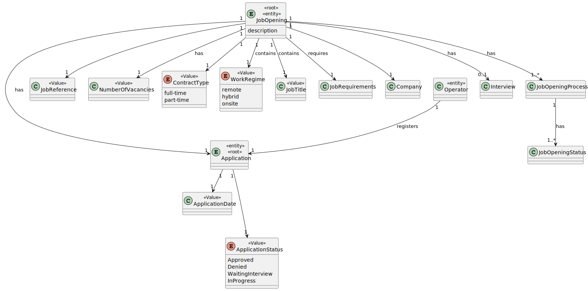
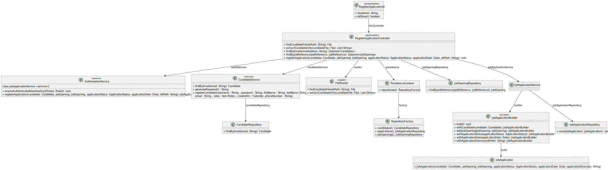

# US 2002 - As Operator, I want to register an application of a candidate for a job opening and import all files received. #

## 1. Context

This task involves the development of functionality for the Operator to register job applications and import associated files.

## 2. Requirements

**US 2002:**
As an Operator, I want to register an application for a job opening and import all files received.

**Acceptance Criteria:**

- The system should create a job application with the information provided by the candidate.
- The system should in case the candidate is not registered should regist the candidate.

**Dependencies/References:**

This requirement relates to the following user stories:
- US2000a: Operator manually registers a candidate.
- US2002: Import of applications from files generated by the Application File Bot.

## 3. Analysis


## 4. Design

### 4.1. Sequence Diagram


### 4.2. Class Diagram



### 4.3. Applied Patterns

- 4.3.1. Factory
> Our PersistenceContext will create a RepositoryFactory then the RepositoryFactory will create the repository that we need in order to persist our domain entity, in this case the Application

- 4.3.2 Service
> Services are operations with the responsibility of an entity or value object. They are used to model operations that involve multiple objects or complex behaviour.

- 4.3.3 Tell, Don't Ask
> Ensure that objects do not expose their internal state or behaviour to the outside world. On the contrary, objects should receive commands telling them what they should do, rather than being asked for information about their current state.

- 4.3.6 Model-View-Controller (MVC)
> Model is responsible for managing the data and business logic of the application. (CandidateService,JobApplicationService, AuthorizationService)
> View is responsible for presenting the data to the user in a human-readable format. (RegisterApplicationUI)
> Controller is responsible for handling the user input and updating the model and the view accordingly. (RegisterApplicationController)

### 4.4. Tests

**ApplicationBuilderTest**
````
package eapli.jobs4u.applicationsmanagement.domain;

import eapli.framework.infrastructure.authz.domain.model.*;
import eapli.jobs4u.candidatemanagement.domain.Candidate;
import eapli.jobs4u.candidatemanagement.domain.PhoneNumber;
import eapli.jobs4u.customersmanagement.domain.Address;
import eapli.jobs4u.customersmanagement.domain.Customer;
import eapli.jobs4u.customersmanagement.domain.CustomerCode;
import eapli.jobs4u.customersmanagement.domain.Designation;
import eapli.jobs4u.jobOpeningsManagement.domain.*;
import eapli.jobs4u.usermanagement.domain.Jobs4uRoles;
import org.junit.Assert;
import org.junit.Test;

import java.util.Calendar;

public class JobApplicationBuilderTest {
        private static final JobTitle JOB_TITLE = new JobTitle("Developer");
        private static final NumberVacancies NUMBER_VACANCIES = new NumberVacancies(10);

        private static final ContractType CONTRACT_TYPE = new ContractType("Full-Time");

        private static final WorkRegime WORK_REGIME = new WorkRegime("hybrid");

        private static final JobOpeningStatus JOB_OPENING_STATUS = JobOpeningStatus.OPEN;

        private static final Calendar jobOpeningCreationDate = Calendar.getInstance();

        private static final JobOpening JOB_OPENING = new JobOpening(JOB_TITLE,new JobReference("NKE-1", new CustomerCode("NKE"), 1),"description",NUMBER_VACANCIES,
                CONTRACT_TYPE,WORK_REGIME,jobOpeningCreationDate,JOB_OPENING_STATUS,new Customer(new Address("address"),new Designation("name"),new CustomerCode("NKE"),dummyUser("user", Jobs4uRoles.CUSTOMER),dummyUser("manager",Jobs4uRoles.CUSTOMER_MANAGER)));

        private static final Candidate CANDIDATE = new Candidate(new PhoneNumber("935432123"),dummyUser("username",Jobs4uRoles.CANDIDATE));

        private static final ApplicationStatus APPLICATION_STATUS = ApplicationStatus.IN_PROGRESS;
        private static final Calendar APPLICATION_DATE = Calendar.getInstance();
        private static final String directoryPath = "applicationFiles";

        private static final JobApplication JOB_APPLICATION = new JobApplication(JOB_OPENING,CANDIDATE,APPLICATION_STATUS,APPLICATION_DATE,directoryPath);
        public static SystemUser dummyUser(final String username, final Role... roles) {
            final SystemUserBuilder userBuilder = new SystemUserBuilder(new NilPasswordPolicy(), new PlainTextEncoder());
            return userBuilder.with(username, "duMMy1!21", "dummy", "dummy", "dummy@gmail.com").withRoles(roles).build();
        }

    @Test(expected = IllegalArgumentException.class)
        public void ensureCannotBuildWithoutCandidate() {
            new JobApplicationBuilder().withApplicationDate(APPLICATION_DATE)
                    .withApplicationDirectory(directoryPath)
                    .withApplicationStatus(APPLICATION_STATUS)
                    .withJobOpening(JOB_OPENING)
                    .build();
        }

        @Test(expected = IllegalArgumentException.class)
        public void ensureCannotBuildWithoutApplicationDate() {
            new JobApplicationBuilder().withCandidate(CANDIDATE)
                    .withApplicationDirectory(directoryPath)
                    .withApplicationStatus(APPLICATION_STATUS)
                    .withJobOpening(JOB_OPENING)
                    .build();
        }

        @Test(expected = IllegalArgumentException.class)
        public void ensureCannotBuildWithoutApplicationStatus() {
            new JobApplicationBuilder().withApplicationDate(APPLICATION_DATE)
                    .withApplicationDirectory(directoryPath)
                    .withCandidate(CANDIDATE)
                    .withJobOpening(JOB_OPENING)
                    .build();
        }

        @Test(expected = IllegalArgumentException.class)
        public void ensureCannotBuildWithoutJobOpening() {
            new JobApplicationBuilder().withApplicationDate(APPLICATION_DATE)
                    .withApplicationDirectory(directoryPath)
                    .withApplicationStatus(APPLICATION_STATUS)
                    .withCandidate(CANDIDATE)
                    .build();
        }

        @Test(expected = IllegalArgumentException.class)
        public void ensureCannotBuildWithoutDirPath() {
            new JobApplicationBuilder().withApplicationDate(APPLICATION_DATE)
                    .withCandidate(CANDIDATE)
                    .withApplicationStatus(APPLICATION_STATUS)
                    .withJobOpening(JOB_OPENING)
                    .build();
        }

        @Test
        public void ensureCanBuildWithAllParameters(){
            JobApplication jobApplication1 = new JobApplicationBuilder().withCandidate(CANDIDATE)
                    .withJobOpening(JOB_OPENING)
                    .withApplicationStatus(APPLICATION_STATUS)
                    .withApplicationDirectory(directoryPath)
                    .withApplicationDate(APPLICATION_DATE)
                    .build();
            Assert.assertEquals(jobApplication1,JOB_APPLICATION);
        }
}

````
**JobApplicationTest**

````
package eapli.jobs4u.applicationsmanagement.domain;

import eapli.framework.infrastructure.authz.domain.model.*;
import eapli.jobs4u.candidatemanagement.domain.Candidate;
import eapli.jobs4u.candidatemanagement.domain.PhoneNumber;
import eapli.jobs4u.customersmanagement.domain.Address;
import eapli.jobs4u.customersmanagement.domain.Customer;
import eapli.jobs4u.customersmanagement.domain.CustomerCode;
import eapli.jobs4u.customersmanagement.domain.Designation;
import eapli.jobs4u.jobOpeningsManagement.domain.*;
import eapli.jobs4u.usermanagement.domain.Jobs4uRoles;
import org.junit.Assert;
import org.junit.Test;

import java.util.Calendar;

import static org.junit.Assert.assertEquals;

public class JobApplicationTest {

        private static final JobTitle JOB_TITLE = new JobTitle("Developer");
        private static final NumberVacancies NUMBER_VACANCIES = new NumberVacancies(10);

        private static final ContractType CONTRACT_TYPE = new ContractType("Full-Time");

        private static final WorkRegime WORK_REGIME = new WorkRegime("hybrid");

        private static final JobOpeningStatus JOB_OPENING_STATUS = JobOpeningStatus.OPEN;

        private static final Calendar jobOpeningCreationDate = Calendar.getInstance();

        private static final JobOpening JOB_OPENING = new JobOpening(JOB_TITLE,new JobReference("NKE-1", new CustomerCode("NKE"), 1),"description",NUMBER_VACANCIES,
                CONTRACT_TYPE,WORK_REGIME,jobOpeningCreationDate,JOB_OPENING_STATUS,new Customer(new Address("address"),new Designation("name"),new CustomerCode("NKE"),dummyUser("user", Jobs4uRoles.CUSTOMER),dummyUser("manager",Jobs4uRoles.CUSTOMER_MANAGER)));

        private static final JobOpening JOB_OPENING2 = new JobOpening(JOB_TITLE,new JobReference("NKE-3", new CustomerCode("NKE"), 3),"description",NUMBER_VACANCIES,
            CONTRACT_TYPE,WORK_REGIME,jobOpeningCreationDate,JOB_OPENING_STATUS,new Customer(new Address("address"),new Designation("name"),new CustomerCode("NKE"),dummyUser("user", Jobs4uRoles.CUSTOMER),dummyUser("manager",Jobs4uRoles.CUSTOMER_MANAGER)));

    private static final Candidate CANDIDATE = new Candidate(new PhoneNumber("935432123"),dummyUser("username",Jobs4uRoles.CANDIDATE));

        private static final ApplicationStatus APPLICATION_STATUS = ApplicationStatus.IN_PROGRESS;
        private static final Calendar APPLICATION_DATE = Calendar.getInstance();
        private static final String directoryPath = "applicationFiles";

        private static final JobApplication JOB_APPLICATION1 = new JobApplication(JOB_OPENING,CANDIDATE,APPLICATION_STATUS,APPLICATION_DATE,directoryPath);

        private static final JobApplication JOB_APPLICATION2 = new JobApplication(JOB_OPENING2,CANDIDATE,ApplicationStatus.APPROVED,Calendar.getInstance(),"dir");
        public static SystemUser dummyUser(final String username, final Role... roles) {
            final SystemUserBuilder userBuilder = new SystemUserBuilder(new NilPasswordPolicy(), new PlainTextEncoder());
            return userBuilder.with(username, "duMMy1!21", "dummy", "dummy", "dummy@gmail.com").withRoles(roles).build();
        }

        @Test
        public void ensureJobAplicationIsBuilt() {
            JobApplication jobApplicationTest = new JobApplication(JOB_OPENING,CANDIDATE,APPLICATION_STATUS,APPLICATION_DATE,directoryPath);
            assertEquals(jobApplicationTest,JOB_APPLICATION1);
        }

        @Test
        public void ensureTestEqualsWorksForSameJobApplications() {
            JobApplication jobApplicationTest = new JobApplication(JOB_OPENING,CANDIDATE,APPLICATION_STATUS,APPLICATION_DATE,directoryPath);
            Assert.assertTrue(jobApplicationTest.equals(JOB_APPLICATION1));
        }

        @Test
        public void ensureTestEqualsFailsForDifferentJobApplications(){
            Assert.assertFalse(JOB_APPLICATION1.equals(JOB_APPLICATION2));
        }

        @Test
        public void testSameAsWorksForSameJobApplications(){
            JobApplication jobApplicationTest = new JobApplication(JOB_OPENING,CANDIDATE,APPLICATION_STATUS,APPLICATION_DATE,directoryPath);
            Assert.assertTrue(jobApplicationTest.sameAs(JOB_APPLICATION1));
        }

        @Test
        public void testSameAsWorksForDifferentJobApplications() {
            Assert.assertFalse(JOB_APPLICATION1.sameAs(JOB_APPLICATION2));
        }

    @Test
    public void testJobOpening() {
        assertEquals(JOB_OPENING, JOB_APPLICATION1.jobOpening());
    }

    @Test
    public void testCandidate() {
        assertEquals(CANDIDATE, JOB_APPLICATION1.candidate());
    }

    @Test
    public void testApplicationStatus() {
        assertEquals(APPLICATION_STATUS, JOB_APPLICATION1.applicationStatus());
    }

    @Test
    public void testApplicationDate() {
        assertEquals(APPLICATION_DATE, JOB_APPLICATION1.applicationDate());
    }

    @Test
    public void testApplicationDirectory() {
        assertEquals(directoryPath, JOB_APPLICATION1.applicationDirectory());
    }
}


````
## 5. Implementation

**RegisterApplicationController**

````
package eapli.jobs4u.applicationsmanagement.application;

import eapli.framework.application.UseCaseController;
import eapli.framework.general.domain.model.EmailAddress;
import eapli.framework.infrastructure.authz.application.AuthorizationService;
import eapli.framework.infrastructure.authz.application.AuthzRegistry;
import eapli.framework.infrastructure.authz.application.UserManagementService;
import eapli.framework.infrastructure.authz.domain.model.Role;
import eapli.framework.infrastructure.authz.domain.model.SystemUser;
import eapli.framework.time.util.CurrentTimeCalendars;
import eapli.jobs4u.Application;
import eapli.jobs4u.applicationsmanagement.domain.ApplicationStatus;
import eapli.jobs4u.applicationsmanagement.domain.JobApplication;
import eapli.jobs4u.applicationsmanagement.domain.JobApplicationBuilder;
import eapli.jobs4u.applicationsmanagement.repositories.JobApplicationRepository;
import eapli.jobs4u.applicationsmanagement.utils.FileReader;
import eapli.jobs4u.candidatemanagement.application.CandidateService;
import eapli.jobs4u.candidatemanagement.domain.Candidate;
import eapli.jobs4u.candidatemanagement.domain.PhoneNumber;
import eapli.jobs4u.candidatemanagement.repositories.CandidateRepository;
import eapli.jobs4u.infrastructure.persistence.PersistenceContext;
import eapli.jobs4u.jobOpeningsManagement.domain.JobOpening;
import eapli.jobs4u.jobOpeningsManagement.domain.JobOpeningBuilder;
import eapli.jobs4u.jobOpeningsManagement.domain.JobReference;
import eapli.jobs4u.jobOpeningsManagement.repositories.JobOpeningRepository;
import eapli.jobs4u.usermanagement.domain.Jobs4uRoles;
import eapli.jobs4u.usermanagement.domain.PasswordGenerator;

import java.io.File;
import java.io.FileNotFoundException;
import java.util.*;

@UseCaseController
public class RegisterApplicationController {

    private final AuthorizationService authz = AuthzRegistry.authorizationService();
    private JobApplicationRepository applicationRepository = PersistenceContext.repositories().applications();
    private UserManagementService userManagementService = AuthzRegistry.userService();
    private CandidateRepository candidateRepository = PersistenceContext.repositories().candidates();
    private CandidateService candidateService = new CandidateService(candidateRepository);
    private JobApplicationService jobApplicationService = new JobApplicationService(applicationRepository);
    public File findCandidateFile(String directory) {
        authz.ensureAuthenticatedUserHasAnyOf(Jobs4uRoles.POWER_USER,Jobs4uRoles.ADMIN,Jobs4uRoles.OPERATOR);
        return FileReader.findCandidateFile(directory);
    }

    public List<String> extractCandidateInfo(File file) throws FileNotFoundException {
        return FileReader.extractCandidateInfo(file);
    }

    public Optional<Candidate> findByEmail(String emailAddress){
        EmailAddress email = EmailAddress.valueOf(emailAddress);
        return candidateService.findByEmail(email);
    }

    public String generatePassword(){
        PasswordGenerator passwordGenerator = new PasswordGenerator();
        return passwordGenerator.generatePassword();
    }

    public Candidate registerCandidate(final String username, final String password, final String firstName,
                                       final String lastName,
                                       final String email, Set<Role> roles, final Calendar createdOn,final String phoneNumber){
        authz.ensureAuthenticatedUserHasAnyOf(Jobs4uRoles.POWER_USER,Jobs4uRoles.ADMIN,Jobs4uRoles.OPERATOR);
        SystemUser systemUser = userManagementService.registerNewUser(username,password,firstName,lastName,email,roles,CurrentTimeCalendars.now());
        return candidateService.registerCandidate(systemUser,phoneNumber);
    }

    public Optional<JobOpening> findByJobReference(String jobReference){
        JobOpeningRepository jobOpeningRepository = PersistenceContext.repositories().jobOpenings();
        return jobOpeningRepository.findByJobReference(jobReference);
    }

    public JobApplication registerApplication(final Candidate candidate, final JobOpening jobOpening, final ApplicationStatus applicationStatus, final String directory){
        return jobApplicationService.registerApplication(candidate,jobOpening,applicationStatus,directory);
    }
}
````
**RegisterApplicationUI**
````
package eapli.jobs4u.app.backoffice.console.presentation.jobOpening;

import eapli.framework.actions.Actions;
import eapli.framework.actions.menu.Menu;
import eapli.framework.actions.menu.MenuItem;
import eapli.framework.domain.repositories.ConcurrencyException;
import eapli.framework.domain.repositories.IntegrityViolationException;
import eapli.framework.infrastructure.authz.domain.model.Password;
import eapli.framework.infrastructure.authz.domain.model.Role;
import eapli.framework.io.util.Console;
import eapli.framework.presentation.console.AbstractUI;
import eapli.framework.presentation.console.menu.MenuItemRenderer;
import eapli.framework.presentation.console.menu.MenuRenderer;
import eapli.framework.presentation.console.menu.VerticalMenuRenderer;
import eapli.framework.time.util.CurrentTimeCalendars;
import eapli.jobs4u.applicationsmanagement.application.RegisterApplicationController;
import eapli.jobs4u.applicationsmanagement.domain.ApplicationStatus;
import eapli.jobs4u.candidatemanagement.domain.Candidate;
import eapli.jobs4u.customersmanagement.domain.Customer;
import eapli.jobs4u.jobOpeningsManagement.domain.JobOpening;
import eapli.jobs4u.jobOpeningsManagement.domain.JobOpeningStatus;
import eapli.jobs4u.usermanagement.domain.Jobs4uRoles;

import java.io.File;
import java.io.FileNotFoundException;
import java.util.*;

public class RegisterApplicationUI extends AbstractUI {
    private final RegisterApplicationController theController = new RegisterApplicationController();

    @Override
    protected boolean doShow() {

        String directory = Console.readLine("Enter the directory where is the candidate application");
        File applicationFile = theController.findCandidateFile(directory);
        if(applicationFile == null){
            throw new IllegalArgumentException("File not found!");
        }

        List<String> candidateInfo = new ArrayList<>();
        try {
            candidateInfo = theController.extractCandidateInfo(applicationFile);
        } catch (FileNotFoundException e) {
            throw new RuntimeException(e);
        }

        Optional<Candidate> candidateOptional = theController.findByEmail(candidateInfo.get(1));

        if(candidateOptional.isEmpty()){
            String password =theController.generatePassword();
            Set<Role> roles = new HashSet<>();
            roles.add(Jobs4uRoles.CANDIDATE);
            candidateOptional = Optional.ofNullable(theController.registerCandidate(candidateInfo.get(1), password, candidateInfo.get(2), candidateInfo.get(3), candidateInfo.get(1), roles, CurrentTimeCalendars.now(), candidateInfo.get(4)));
        }

        Optional<JobOpening> jobOpening = theController.findByJobReference(candidateInfo.get(0));
        if(jobOpening.isEmpty()){
            throw new IllegalArgumentException("The job opening doesn´t exist.");
        } else {

            try {
                theController.registerApplication(candidateOptional.orElse(null), jobOpening.orElse(null), ApplicationStatus.IN_PROGRESS, directory );
                System.out.println("The application has been registered!");
            } catch (final IntegrityViolationException | ConcurrencyException e) {
                System.out.println("Integrity violation.");
            }
        }
        return false;
    }


        @Override
    public String headline() {
        return "Register Application";
    }
}

````
## 6. Integration/Demonstration

````
+= Jobs4u [ @poweruser ] ======================================================+

| 1. My account > | 2. Backoffice Users > | 3. Candidates > | 4. Customers > | 5. Job Openings > | 6. Settings > | 0. Exit |
Please choose an option
3

>> Candidates >
1. Register Candidate
2. Display Candidate Info
3. Register Job Application
0. Return

Please choose an option
3

+= Register Application =======================================================+

Enter the directory where is the candidate application
applicationFiles/NKE-1
23:14:21.932 [main] DEBUG e.f.i.a.d.m.SystemUserBuilder - Creating new user [eapli.framework.infrastructure.authz.domain.model.SystemUser@3f9282ec] pintodacosta@email.com (Pinto Costa pintodacosta@email.com) with roles [CANDIDATE]
The application has been registered!
+==============================================================================+
````