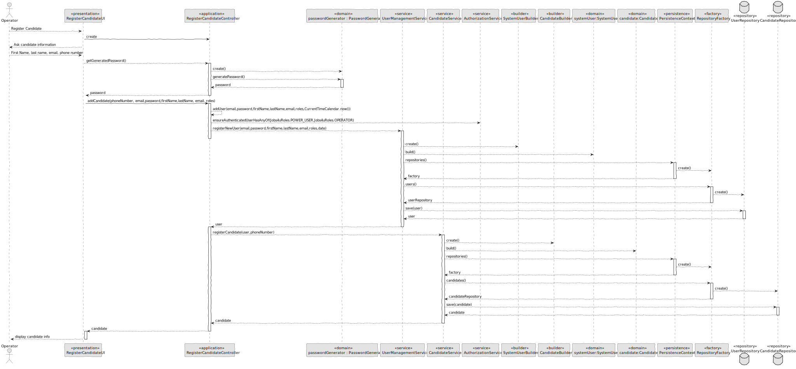
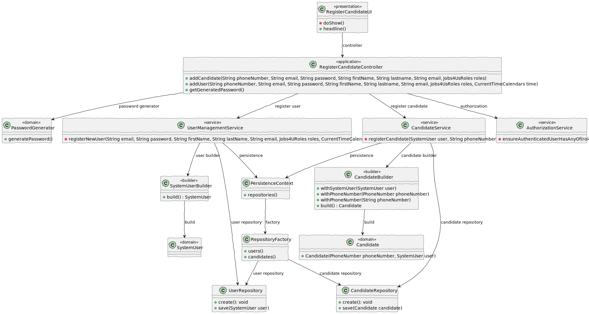

 # US 2000a

## 1. Context

*As Operator, I want to register a candidate (who is not yet in the system) and the corresponding user*

## 2. Requirements

*In this section you should present the functionality that is being developed, how do you understand it, as well as possible correlations to other requirements (i.e., dependencies). You should also add acceptance criteria.*


**US 2000a** As Operator, I want to register a candidate and create a corresponding user

**Acceptance Criteria:**

- 2000a.1. The system should register a candidate.

- 2000a.2. The system should register a corresponding user.

- 2000a.3. The candidate password should be generated automatically.

- 2000a.4. The candidate phone number must be portuguese.

**Dependencies/References:**

>Q33 : O candidato tem um código identificativo ou é o email que o identifica?

>A33 : A identificação do candidato é por email. Não haverá necessidade de um código.


>Q43 : Para os candidato e para os utilizadores do sistema que informações são necessárias?

>A43 : Alguma informação anterior é referida na Q11. Para além disso a secção 2.2.3 refere que relativamente aos candidatos temos a seguinte informação: email of the candidate, name of the candidate, phone number of the candidate.


>Q54 : Regarding the US2000a requirement which states "As an Operator, I want to register a candidate and create a corresponding user," I would like to know how a candidate will be registered in the system, i.e., understand the processes for registering a candidate. 
Since the candidate has their name, email, and phone number, how should their username be formatted to avoid conflicts with other candidates' names? Additionally, how should the candidate be notified of their username and password?

>A54 : There is no need for a user name (See Q11). Regarding the password, I think the system can generate a unique password. You may assume the candidate will be informed of his/her password by means that are outside of the scope of what is to be developed for this version of the system.


>Q56 : No número de telémovel e no código postal as verificações são feitas apenas para domínios portugueses, ou temos de programar consuante o país referente?

>A56 : Basta para o caso português.


>Q57 : Quais às politicas de negócio para registar um candidato, quais as caracteristicas da password, email, telemóvel?

>A57 : Sobre o telemóvel, seguir o Q56. Sobre email, seria qualquer email válido. Sobre a password, podemos seguir algo como: ter no mínimo 8 caracteres, letras maiúsculas e minúsculas, dígitos e pelo menos, um caracter não alfanumérico.


>Q78 : US2000a - The operator can register a candidate: does he put the info manually or has to be read of the file generated by the bot? This user will appear then in the backoffice...enable as default I think. 
Then the admin, can also register manually a candidate as the operator did it? I don't understand at all the different between a registration of the candidate made by the admin or made by the operator.

>A78 : See Q74. US2000a is for the Operator to manually register a candidate and his/her user in the system. US2002 is for import of the applications from the data iin the files produced by the application file bot. If the candidate does not exist, it should be created. I think there is no registration of a candidate by the admin.


>Q106 : US2000a - I was thinking about if the candidate could change his/her email. In older questions you said the email was the identificator of the candidate, isn't it? Should we put another id made by sequence numbers or by his NIF, for example, to identificate him/her in the system? Could we say the same for the user who is managing the app of the customer?

>A106 : The field/data that identifies the user in the system is always the email (it must be unique). For the moment there is no need for supporting the possibility of changing the email or add any other identification possibility.


>Q134 : Apart of the registration of the candidate that the operator do, could a candidate register in the system in his/her console by himself/herself????

>A134 : I do not think there is such a US.

## 3. Analysis

*In this section, the team should report the study/analysis/comparison that was done in order to take the best design decisions for the requirement. This section should also include supporting diagrams/artifacts (such as domain model; use case diagrams, etc.),*


## 4. Design

*In this sections, the team should present the solution design that was adopted to solve the requirement. This should include, at least, a diagram of the realization of the functionality (e.g., sequence diagram), a class diagram (presenting the classes that support the functionality), the identification and rational behind the applied design patterns and the specification of the main tests used to validade the functionality.*

### 4.1. Realization



### 4.2. Class Diagram



### 4.3. Applied Patterns

- 4.3.1. Factory
> Our PersistenceContext will create a RepositoryFactory then the RepositoryFactory will create the repository that we need in order to persist our domain entity, in this case the Candidate

- 4.3.2 Service
> Services are operations with the responsibility of an entity or value object. They are used to model operations that involve multiple objects or complex behaviour.

- 4.3.3 Tell, Don't Ask
> Ensure that objects do not expose their internal state or behaviour to the outside world. On the contrary, objects should receive commands telling them what they should do, rather than being asked for information about their current state.

- 4.3.6 Model-View-Controller (MVC)
> Model is responsible for managing the data and business logic of the application. (UserManagementService, AuthorizationService)
> View is responsible for presenting the data to the user in a human-readable format. (AddBackofficeUserUI)
> Controller is responsible for handling the user input and updating the model and the view accordingly. (AddBackofficeUserController)

### 4.4. Tests

Include here the main tests used to validate the functionality. Focus on how they relate to the acceptance criteria.

**Refers to methods for validate a Candidate:**

```
    @Test
    public void testConstructor() {
        assertNotNull(candidate);
    }

    @Test
    public void testGetUser() {
        assertEquals(systemUser, candidate.user());
    }

    @Test
    public void testEqualsAndHashCode() {
        Candidate candidate1 = new Candidate(phoneNumber, systemUser);
        Candidate candidate2 = new Candidate(phoneNumber, systemUser);

        assertEquals(candidate1, candidate2);
        assertEquals(candidate1.hashCode(), candidate2.hashCode());
    }

    @Test
    public void testGetPhoneNumber() {
        assertEquals(phoneNumber, candidate.phoneNumber());
    }

    @Test
    public void testEqualsWithDifferentObject() {
        Candidate candidate1 = new Candidate();
        assertFalse(candidate.equals(candidate1));
    }

    @Test
    public void testSameAs() {
        Candidate candidate1 = new Candidate(phoneNumber, systemUser);
        assertTrue(candidate.sameAs(candidate1));
    }

    @Test
    public void testNotSameAs() {
        PhoneNumber phoneNumber2 = new PhoneNumber("919965231");
        String username2 = "jorgenuno@email.com";
        SystemUser systemUser2 = dummyUser(username2,Jobs4uRoles.CANDIDATE);
        candidate = new Candidate(phoneNumber, systemUser);
        Candidate differentCandidate = new Candidate(phoneNumber2, systemUser2);
        assertFalse(candidate.sameAs(differentCandidate));
    }
}
````


**Refers to methods for build a Candidate with the corresponding attributes:**


````
@Test
public void testBuildWithSystemUserAndPhoneNumber() {
PhoneNumber phoneNumber = new PhoneNumber("918564231");
String username2 = "candidate@email.com";
SystemUser systemUser = dummyUser(username2,Jobs4uRoles.CANDIDATE);
CandidateBuilder candidateBuilder = new CandidateBuilder();

        // Act
        Candidate candidate = candidateBuilder
                .withSystemUser(systemUser)
                .withPhoneNumber(phoneNumber)
                .build();

        // Assert
        assertNotNull(candidate);
        assertEquals(systemUser, candidate.user());
        assertEquals(phoneNumber, candidate.phoneNumber());
    }

    @Test(expected = IllegalArgumentException.class)
    public void testBuildWithoutSystemUser() {
        String phoneNumber = "918765432";
        CandidateBuilder candidateBuilder = new CandidateBuilder();

        // Act
        candidateBuilder.withPhoneNumber(phoneNumber).build();

        // Assert
        // Expecting IllegalStateException
    }

    @Test(expected = IllegalArgumentException.class)
    public void testBuildWithoutPhoneNumber() {
        String username2 = "candidate@email.com";
        SystemUser systemUser = dummyUser(username2,Jobs4uRoles.CANDIDATE);
        CandidateBuilder candidateBuilder = new CandidateBuilder();

        // Act
        candidateBuilder.withSystemUser(systemUser).build();

        // Assert
        // Expecting IllegalStateException
    }
````


**Refers to methods for validate candidate phone number:**

````
    @Test
    public void testValidPhoneNumber() {
        // Arrange
        String validNumber = "912345678";

        // Act
        PhoneNumber phoneNumber = PhoneNumber.valueOf(validNumber);

        // Assert
        assertNotNull(phoneNumber);
        assertEquals(validNumber, phoneNumber.toString());
    }

    @Test(expected = IllegalArgumentException.class)
    public void testNullPhoneNumber() {
        // Arrange
        String nullNumber = null;

        // Act
        PhoneNumber phoneNumber = PhoneNumber.valueOf(nullNumber);

        // Assert
        // Expecting IllegalArgumentException
    }

    @Test(expected = IllegalArgumentException.class)
    public void testEmptyPhoneNumber() {
        // Arrange
        String emptyNumber = "";

        // Act
        PhoneNumber phoneNumber = PhoneNumber.valueOf(emptyNumber);

        // Assert
        // Expecting IllegalArgumentException
    }

    @Test(expected = IllegalArgumentException.class)
    public void testInvalidPhoneNumber() {
        // Arrange
        String invalidNumber = "123456789";

        // Act
        PhoneNumber phoneNumber = PhoneNumber.valueOf(invalidNumber);

        // Assert
        // Expecting IllegalArgumentException
    }

    @Test
    public void testCompareTo(){
        PhoneNumber phoneNumber1 = new PhoneNumber("928987654");
        PhoneNumber phoneNumber2 = new PhoneNumber("963215672");

        assertTrue(phoneNumber1.compareTo(phoneNumber2)<0);
    }
````


## 5. Implementation

*In this section the team should present, if necessary, some evidencies that the implementation is according to the design. It should also describe and explain other important artifacts necessary to fully understand the implementation like, for instance, configuration files.*
*It is also a best practice to include a listing (with a brief summary) of the major commits regarding this requirement.*


**RegisterCandidateController**

    public class RegisterCandidateController {

        private final AuthorizationService authz = AuthzRegistry.authorizationService();
        private final UserManagementService userSvc = AuthzRegistry.userService();
        private CandidateRepository candidateRepository = PersistenceContext.repositories().candidates();
        private CandidateService candidateService = new CandidateService(candidateRepository);

        /**
         * This method returns the password generated
         * @return password
         */
        public String getGeneratedPassword(){
            PasswordGenerator passwordGenerator = new PasswordGenerator();
            return passwordGenerator.generatePassword();
        }

        /**
         * This method adds a backoffice user to the system
         * @param username of the user
         * @param password of the user
         * @param firstName of the user
         * @param lastName of the user
         * @param email of the user
         * @param roles of the user
         * @param createdOn time of the creation
         * @return systemUser
         */
        public SystemUser addUser(final String username, final String password, final String firstName,
                                            final String lastName,
                                            final String email, Set<Role> roles, final Calendar createdOn) {
            authz.ensureAuthenticatedUserHasAnyOf(Jobs4uRoles.POWER_USER, Jobs4uRoles.OPERATOR);

            roles.add(Jobs4uRoles.CANDIDATE);

            return userSvc.registerNewUser(username, password, firstName, lastName, email, roles,
                    createdOn);

        }


        public Candidate addCandidate(final String phoneNumber, final String username, final String password, final String firstName,
                                      final String lastName,
                                      final String email, final Set<Role> roles) {
            SystemUser systemUser = addUser(username,password,firstName,lastName,email,roles,CurrentTimeCalendars.now());
            Candidate candidate = candidateService.registerCandidate(systemUser,phoneNumber);
            return candidateRepository.save(candidate);
        }
    }

## 6. Integration/Demonstration

*In this section the team should describe the efforts realized in order to integrate this functionality with the other parts/components of the system*
*It is also important to explain any scripts or instructions required to execute an demonstrate this functionality*


````
+= Jobs4u [ @poweruser ] ======================================================+

| 1. My account > | 2. Backoffice Users > | 3. Candidates > | 4. Customers > | 5. Job Openings > | 6. Settings > | 0. Exit | 
Please choose an option
3

>> Candidates >
1. Register Candidate
2. Display Candidate Info
0. Return 

Please choose an option
1
First Name
Vasco
Last Name
Teixeira
E-Mail
vasco@gmail.com
Phone Number
918000000
17:27:12.288 [main] DEBUG e.f.i.a.d.m.SystemUserBuilder - Creating new user [eapli.framework.infrastructure.authz.domain.model.SystemUser@671b733b] vasco@gmail.com (Vasco Teixeira vasco@gmail.com) with roles [CANDIDATE]
The password has been sent to the email of the user!
````