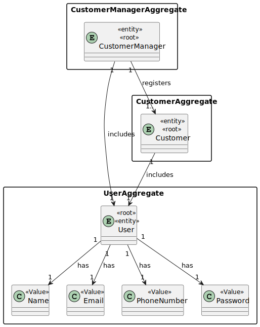
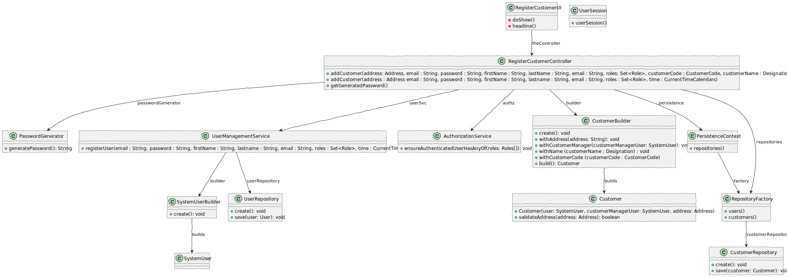

# US 1001 - As Customer Manager I want to register a customer and that the system automatically creates a user for that customer.

## 1. Context

This user story involves enabling Customer Managers to register new customers in the system and automatically create user accounts for them. It aims to streamline the process of onboarding new customers by automating the account creation process.

## 2. Requirements

**US 1001:** As a Customer Manager, I want to register a customer and have the system automatically create a user/account for that customer.

**Acceptance Criteria:**

- 1001.1. The system should create a corresponding user.
- 1001.2. The customer´s password is going to be generated by the system.
- 1001.3. The system should ask for the name,email and the address of the customer.

**Dependencies/References:**

> Q: Na criação de um utilizador no sistema o nome é definido pelo utilizador ou é o nome da pessoa (primeiro e último) e se a password é definida pelo utilizador ou gerada pelo sistema?

> A : No âmbito da US 2000a o Operator cria utilizadores do sistema para candidatos que ainda não estejam no sistema. Tem de fazer isso com base nos dados recebidos na candidatura (que incluem email e nome). O email servirá para identificar a pessoa. Neste contexto é necessário ter uma password para esse novo utilizador. Uma vez que essa informação não é transmitida pelo candidato, suponho que a solução mais “aconselhada” será o sistema gerar uma password para esse utilizador. Como o utilizador/candidato irá receber essa informação (a forma de autenticação na app) está out of scope, no sentido em que não existe nenhuma US que remete para isso. As US 1000 e 1001 também remetem para criação de utilizadores. Aqui, eventualmente poderia-se pensar em introduzir manualmente as passwords, mas pode ser pelo mesmo mecanismo de definição automática de password, descrito anteriormente.
-----------------------------------------------------------------------

## 3. Analysis


## 4. Design

### 4.1. Realization


### 4.2. Class Diagram



### 4.3. Applied Patterns
- 4.3.1. Factory
> Our PersistenceContext will create a RepositoryFactory then the RepositoryFactory will create the repository that we need in order to persist our domain entity, in this case the Candidate

- 4.3.2 Service
> Services are operations with the responsibility of an entity or value object. They are used to model operations that involve multiple objects or complex behaviour.

- 4.3.3 Tell, Don't Ask
> Ensure that objects do not expose their internal state or behaviour to the outside world. On the contrary, objects should receive commands telling them what they should do, rather than being asked for information about their current state.

- 4.3.6 Model-View-Controller (MVC)
> Model is responsible for managing the data and business logic of the application. (UserManagementService, AuthorizationService)
> View is responsible for presenting the data to the user in a human-readable format. (RegisterCustomerUI)
> Controller is responsible for handling the user input and updating the model and the view accordingly. (RegisterCustomerController)

No specific design patterns are applied for this user story.

### 4.4. Tests

**CustomerTest**
````
package eapli.jobs4u.customersmanagement.domain;

import eapli.framework.infrastructure.authz.application.AuthzRegistry;
import eapli.framework.infrastructure.authz.application.UserManagementService;
import eapli.framework.infrastructure.authz.domain.model.*;
import eapli.framework.infrastructure.authz.domain.repositories.UserRepository;
import eapli.jobs4u.customersmanagement.domain.Address;
import eapli.jobs4u.customersmanagement.domain.Customer;
import eapli.jobs4u.usermanagement.domain.Jobs4uRoles;
import org.junit.Test;

import java.util.HashSet;
import java.util.Set;

import static org.junit.Assert.*;

public class CustomerTest {

        public static SystemUser dummyUser(final String username,final Role... roles) {
            final SystemUserBuilder userBuilder = new SystemUserBuilder(new NilPasswordPolicy(), new PlainTextEncoder());
            return userBuilder.with(username, "duMMy1!21", "dummy", "dummy", "dummy@gmail.com").withRoles(roles).build();
        }
    @Test
        public void testConstructorAndGets() {
            Address address = new Address("ISEP Porto");
            Set<Role> roles1 = new HashSet<>();
            Set<Role> roles2 = new HashSet<>();
            roles1.add(Jobs4uRoles.CUSTOMER);
            roles2.add(Jobs4uRoles.CUSTOMER_MANAGER);
            SystemUser user = dummyUser("user1",Jobs4uRoles.CUSTOMER);
            SystemUser customerManager = dummyUser("customerManager1",Jobs4uRoles.CUSTOMER_MANAGER);
            Designation name = new Designation("Nike");
            CustomerCode code = new CustomerCode("NK");
            Customer customer = new Customer(address,name,code,user, customerManager);

            assertNotNull(customer);
            assertEquals(address, customer.address());
            assertEquals(user, customer.customerEmployee());
            assertEquals(customerManager, customer.customerManager());
            assertEquals(name,customer.name());
        }

        @Test
        public void ensureCustomerEqualsWorkForSameCustomers() {
            Address address1 = new Address("ISEP Porto");
            Set<Role> rolesC1 = new HashSet<>();
            Set<Role> rolesCM1 = new HashSet<>();
            rolesC1.add(Jobs4uRoles.CUSTOMER);
            rolesCM1.add(Jobs4uRoles.CUSTOMER_MANAGER);
            Designation name1 = new Designation("Nike");
            SystemUser user1 = dummyUser("user1",Jobs4uRoles.CUSTOMER);
            SystemUser manager1 = dummyUser("manager1",Jobs4uRoles.CUSTOMER_MANAGER);
            CustomerCode code = new CustomerCode("NK");
            Customer customer1 = new Customer(address1,name1,code,user1, manager1);
            Customer customer2 = new Customer(address1,name1,code,user1, manager1);

            assertTrue(customer1.equals(customer2));
        }

        @Test
        public void ensureCustomerEqualsFailsForDifferentCustomer(){
            Address address1 = new Address("ISEP Porto");
            Address address2 = new Address("Estadio Dragao");
            Set<Role> rolesC1 = new HashSet<>();
            Set<Role> rolesCM1 = new HashSet<>();
            rolesC1.add(Jobs4uRoles.CUSTOMER);
            rolesCM1.add(Jobs4uRoles.CUSTOMER_MANAGER);
            Designation name1 = new Designation("Nike");
            SystemUser user1 = dummyUser("user1",Jobs4uRoles.CUSTOMER);
            SystemUser user2 = dummyUser("user2",Jobs4uRoles.CUSTOMER);
            SystemUser manager1 = dummyUser("manager1",Jobs4uRoles.CUSTOMER_MANAGER);
            SystemUser manager2 = dummyUser("manager2",Jobs4uRoles.CUSTOMER_MANAGER);
            CustomerCode code = new CustomerCode("NK");
            Customer customer1 = new Customer(address1, name1,code,user1, manager1);
            Customer customer2 = new Customer(address2, name1,code,user2, manager2);

            assertFalse(customer1.equals(customer2));
        }

        @Test
        public void ensureCustomerHashCodeIsSameForSameCustomers(){
            Address address1 = new Address("ISEP Porto");
            Set<Role> rolesC1 = new HashSet<>();
            Set<Role> rolesCM1 = new HashSet<>();
            rolesC1.add(Jobs4uRoles.CUSTOMER);
            rolesCM1.add(Jobs4uRoles.CUSTOMER_MANAGER);
            Designation name1 = new Designation("Nike");

            SystemUser user1 = dummyUser("user1",Jobs4uRoles.CUSTOMER);
            SystemUser manager1 = dummyUser("manager1",Jobs4uRoles.CUSTOMER_MANAGER);
            CustomerCode code = new CustomerCode("NK");
            Customer customer1 = new Customer(address1,name1,code, user1, manager1);
            Customer customer2 = new Customer(address1,name1,code, user1, manager1);

            assertTrue(customer1.hashCode()==customer2.hashCode());
        }

        @Test
        public void ensureCustomerHashCodeIsDifferentForDifferentCustomers(){
            Address address1 = new Address("ISEP Porto");
            Set<Role> rolesC1 = new HashSet<>();
            Set<Role> rolesCM1 = new HashSet<>();
            rolesC1.add(Jobs4uRoles.CUSTOMER);
            rolesCM1.add(Jobs4uRoles.CUSTOMER_MANAGER);

            SystemUser user1 = dummyUser("user1",Jobs4uRoles.CUSTOMER);
            SystemUser manager1 = dummyUser("manager1",Jobs4uRoles.CUSTOMER_MANAGER);
            SystemUser manager2 = dummyUser("manager2",Jobs4uRoles.CUSTOMER_MANAGER);
            SystemUser user2 = dummyUser("user2",Jobs4uRoles.CUSTOMER);
            Designation name1 = new Designation("Nike");
            CustomerCode code = new CustomerCode("NK");
            Customer customer1 = new Customer(address1,name1,code, user1, manager1);
            Customer customer2 = new Customer(address1, name1,code,user2, manager2);

            assertNotEquals(customer1.hashCode(),customer2.hashCode());
        }
    }

````

**AddressTest**

````
package eapli.jobs4u.customersmanagement.domain;

import eapli.jobs4u.customersmanagement.domain.Address;
import org.junit.Test;

import static org.junit.Assert.*;

public class AddressTest {

    @Test
    public void testConstructor() {
        String addressString = "ISEP Porto";
        Address address = new Address(addressString);

        assertNotNull(address);
    }

    @Test
    public void testToString() {
        String addressString = "ISEP Porto";
        Address address = new Address(addressString);

        assertEquals(addressString,address.toString());
    }

    @Test(expected = IllegalArgumentException.class)
    public void testConstructorWithNullAddress() {
        new Address(null);
    }

    @Test(expected = IllegalArgumentException.class)
    public void testConstructorWithEmptyAddress() {
        new Address("");
    }

    @Test
    public void testValueOf() {
        String addressString = "ISEP Porto";
        Address address = Address.valueOf(addressString);
        assertEquals(addressString, address.toString());
    }
}
````

**CustomerBuilderTest**

````
package eapli.jobs4u.customersmanagement.domain;
import eapli.framework.infrastructure.authz.domain.model.NilPasswordPolicy;
import eapli.framework.infrastructure.authz.domain.model.PlainTextEncoder;
import eapli.framework.infrastructure.authz.domain.model.SystemUser;
import eapli.framework.infrastructure.authz.domain.model.SystemUserBuilder;
import eapli.jobs4u.usermanagement.domain.Jobs4uRoles;
import org.junit.Test;

import static org.junit.Assert.*;

public class CustomerBuilderTest {

    @Test
    public void testBuild() {
        Address address = new Address("ISEP Porto");
        final SystemUserBuilder userBuilder = new SystemUserBuilder(new NilPasswordPolicy(), new PlainTextEncoder());
        SystemUser user = userBuilder.with("user1","dsadsa!dsaA32","User", "user","user@gmail.com").withRoles(Jobs4uRoles.CUSTOMER).build();
        SystemUser customerManager = userBuilder.with("manager1", "Managerpassword1!", "manager", "manager", "manager@gmail.com").withRoles(Jobs4uRoles.CUSTOMER_MANAGER).build();
        CustomerBuilder builder = new CustomerBuilder();
        Designation name1 = new Designation("Nike");
        CustomerCode code = new CustomerCode("NK");
        builder.withAddress(address)
                .withUser(user)
                .withName(name1)
                .withCode(code)
                .withCustomerManager(customerManager);

        Customer customer = builder.build();

        assertNotNull(customer);
        assertEquals(address, customer.address());
        assertEquals(user, customer.customerEmployee());
        assertEquals(customerManager, customer.customerManager());
        assertEquals(name1,customer.name());
        assertEquals(code,customer.identity());
    }

    @Test(expected = IllegalArgumentException.class)
    public void testBuildWithoutAddress() {
        final SystemUserBuilder userBuilder = new SystemUserBuilder(new NilPasswordPolicy(), new PlainTextEncoder());
        SystemUser user = userBuilder.with("user1","dsadsa!dsaA32","User", "user","user@gmail.com").withRoles(Jobs4uRoles.CUSTOMER).build();
        SystemUser customerManager = userBuilder.with("manager1", "Managerpassword1!", "manager", "manager", "manager@gmail.com").withRoles(Jobs4uRoles.CUSTOMER_MANAGER).build();
        Designation name1 = new Designation("Nike");
        CustomerCode code = new CustomerCode("NK");
        CustomerBuilder builder = new CustomerBuilder();
        builder.withUser(user)
                .withCustomerManager(customerManager)
                .withName(name1)
                .withCode(code)
                .build();
    }

    @Test(expected = IllegalArgumentException.class)
    public void testBuildWithoutUser() {
        Address address = new Address("ISEP Porto");
        final SystemUserBuilder userBuilder = new SystemUserBuilder(new NilPasswordPolicy(), new PlainTextEncoder());
        SystemUser customerManager = userBuilder.with("manager1", "Managerpassword1!", "manager", "manager", "manager@gmail.com").withRoles(Jobs4uRoles.CUSTOMER_MANAGER).build();
        Designation name1 = new Designation("Nike");
        CustomerCode code = new CustomerCode("NK");
        CustomerBuilder builder = new CustomerBuilder();
        builder.withAddress(address)
                .withName(name1)
                .withCode(code)
                .withCustomerManager(customerManager)
                .build();
    }

    @Test(expected = IllegalArgumentException.class)
    public void testBuildWithoutCustomerManager() {
        Address address = new Address("ISEP Porto");
        final SystemUserBuilder userBuilder = new SystemUserBuilder(new NilPasswordPolicy(), new PlainTextEncoder());
        SystemUser user = userBuilder.with("user1","dsadsa!dsaA32","User", "user","user@gmail.com").withRoles(Jobs4uRoles.CUSTOMER).build();
        Designation name1 = new Designation("Nike");
        CustomerCode code = new CustomerCode("NK");
        CustomerBuilder builder = new CustomerBuilder();
        builder.withAddress(address)
                .withUser(user)
                .withCode(code)
                .withName(name1)
                .build();
    }

    @Test(expected = IllegalArgumentException.class)
    public void testBuildWithoutName() {
        Address address = new Address("ISEP Porto");
        final SystemUserBuilder userBuilder = new SystemUserBuilder(new NilPasswordPolicy(), new PlainTextEncoder());
        SystemUser user = userBuilder.with("user1","dsadsa!dsaA32","User", "user","user@gmail.com").withRoles(Jobs4uRoles.CUSTOMER).build();
        CustomerCode code = new CustomerCode("NK");
        SystemUser customerManager = userBuilder.with("manager1", "Managerpassword1!", "manager", "manager", "manager@gmail.com").withRoles(Jobs4uRoles.CUSTOMER_MANAGER).build();
        CustomerBuilder builder = new CustomerBuilder();
        builder.withAddress(address)
                .withUser(user)
                .withCode(code)
                .withCustomerManager(customerManager)
                .build();
    }

    @Test(expected = IllegalArgumentException.class)
    public void testBuildWithoutCode() {
        Address address = new Address("ISEP Porto");
        final SystemUserBuilder userBuilder = new SystemUserBuilder(new NilPasswordPolicy(), new PlainTextEncoder());
        SystemUser user = userBuilder.with("user1","dsadsa!dsaA32","User", "user","user@gmail.com").withRoles(Jobs4uRoles.CUSTOMER).build();
        Designation name1 = new Designation("Nike");
        SystemUser customerManager = userBuilder.with("manager1", "Managerpassword1!", "manager", "manager", "manager@gmail.com").withRoles(Jobs4uRoles.CUSTOMER_MANAGER).build();
        CustomerBuilder builder = new CustomerBuilder();
        builder.withAddress(address)
                .withUser(user)
                .withCustomerManager(customerManager)
                .withName(name1)
                .build();
    }
}
````

**CustomerCodeTest**
````
package eapli.jobs4u.customersmanagement.domain;

import org.junit.Test;

import static org.junit.Assert.assertEquals;
import static org.junit.Assert.assertNotNull;

public class CustomerCodeTest {
    @Test
    public void testConstructor() {
        String codeString = "Google";
        CustomerCode code = new CustomerCode(codeString);

        assertNotNull(code);
    }

    @Test
    public void testToString() {
        String codeString = "Google";
        CustomerCode code = new CustomerCode(codeString);

        assertEquals(codeString,code.toString());
    }

    @Test(expected = IllegalArgumentException.class)
    public void testConstructorWithNullName() {
        new CustomerCode(null);
    }

    @Test(expected = IllegalArgumentException.class)
    public void testConstructorWithEmptyName() {
        new CustomerCode("");
    }

    @Test
    public void testValueOf() {
        String code = "NIKE";
        CustomerCode customerCode = CustomerCode.valueOf(code);
        assertNotNull(customerCode);
        assertEquals(code, customerCode.toString());
    }
}

````

**DesignationTest**

````
package eapli.jobs4u.customersmanagement.domain;

import org.junit.Test;

import static org.junit.Assert.assertEquals;
import static org.junit.Assert.assertNotNull;

public class DesignationTest {
    @Test
    public void testConstructor() {
        String name = "Nike";
        Designation designation = new Designation(name);

        assertNotNull(designation);
    }

    @Test
    public void testToString() {
        String name = "Nike";
        Designation designation = new Designation(name);

        assertEquals(name,designation.toString());
    }

    @Test(expected = IllegalArgumentException.class)
    public void testConstructorWithNullName() {
        new Designation(null);
    }

    @Test(expected = IllegalArgumentException.class)
    public void testConstructorWithEmptyName() {
        new Designation("");
    }

    @Test
    public void testValueOf(){
        String name = "Name";
        Designation designation = Designation.valueOf(name);

        assertNotNull(designation);
        assertEquals(name,designation.toString());
    }
}
````
## 5. Implementation

**RegisterCustomerController**

````
package eapli.jobs4u.customersmanagement.application;

import eapli.framework.application.UseCaseController;
import eapli.framework.infrastructure.authz.application.AuthorizationService;
import eapli.framework.infrastructure.authz.application.AuthzRegistry;
import eapli.framework.infrastructure.authz.application.UserManagementService;
import eapli.framework.infrastructure.authz.application.UserSession;
import eapli.framework.infrastructure.authz.domain.model.Role;
import eapli.framework.infrastructure.authz.domain.model.SystemUser;
import eapli.framework.time.util.CurrentTimeCalendars;
import eapli.jobs4u.customersmanagement.domain.*;
import eapli.jobs4u.customersmanagement.repositories.CustomerRepository;
import eapli.jobs4u.infrastructure.persistence.PersistenceContext;
import eapli.jobs4u.infrastructure.persistence.RepositoryFactory;
import eapli.jobs4u.usermanagement.domain.Jobs4uRoles;
import eapli.jobs4u.usermanagement.domain.PasswordGenerator;

import java.util.Calendar;
import java.util.Optional;
import java.util.Set;


@UseCaseController
public class RegisterCustomerController {

    private final AuthorizationService authz = AuthzRegistry.authorizationService();
    private final UserManagementService userSvc = AuthzRegistry.userService();

    /**
    * This method returns the password generated
    * @return password
    */
    public String getGeneratedPassword(){
        PasswordGenerator passwordGenerator = new PasswordGenerator();
        return passwordGenerator.generatePassword();
    }

    /**
         * This method adds a backoffice user to the system
         * @param username of the user
         * @param password of the user
         * @param firstName of the user
         * @param lastName of the user
         * @param email of the user
         * @param roles of the user
         * @param createdOn time of the creation
         * @return systemUser
         */
        public Customer addCustomer(final String address, final String name, final String code, final String username, final String password, final String firstName,
                                    final String lastName,
                                    final String email, final Set<Role> roles, final Calendar createdOn) {
            authz.ensureAuthenticatedUserHasAnyOf(Jobs4uRoles.POWER_USER,Jobs4uRoles.CUSTOMER_MANAGER);
            SystemUser customerManager = null ;
            AuthorizationService authorizationService = AuthzRegistry.authorizationService();
            if(authorizationService.isAuthenticatedUserAuthorizedTo(Jobs4uRoles.POWER_USER,Jobs4uRoles.CUSTOMER_MANAGER)){
                customerManager = authorizationService.session().get().authenticatedUser();
            }
            SystemUser user = userSvc.registerNewUser(username, password, firstName, lastName, email, roles, createdOn);
            Address address1 = new Address(address);
            Designation name1 = new Designation(name);
            CustomerCode customerCode = new CustomerCode(code);
            CustomerBuilder customerBuilder = new CustomerBuilder();
            Customer costumer = customerBuilder.withUser(user).withCustomerManager(customerManager).withAddress(address1).withName(name1).withCode(customerCode).build();
            CustomerRepository customerRepository = PersistenceContext.repositories().customers();
            return customerRepository.save(costumer);
        }

        public Customer addCustomer(final String address, final String name,final String code,final SystemUser customerManager, final String username, final String password, final String firstName,
                                      final String lastName,
                                      final String email, final Set<Role> roles) {
            return addCustomer(address,name,code,username, password, firstName, lastName, email, roles, CurrentTimeCalendars.now());
        }
    }
````

**RegisterCustomerUI**

````
package eapli.jobs4u.app.backoffice.console.presentation.customer;

import eapli.framework.actions.Actions;
import eapli.framework.actions.menu.Menu;
import eapli.framework.actions.menu.MenuItem;
import eapli.framework.domain.repositories.ConcurrencyException;
import eapli.framework.domain.repositories.IntegrityViolationException;
import eapli.framework.infrastructure.authz.application.AuthorizationService;
import eapli.framework.infrastructure.authz.application.AuthzRegistry;
import eapli.framework.infrastructure.authz.domain.model.Role;
import eapli.framework.infrastructure.authz.domain.model.SystemUser;
import eapli.framework.io.util.Console;
import eapli.framework.presentation.console.AbstractUI;
import eapli.framework.presentation.console.menu.MenuItemRenderer;
import eapli.framework.presentation.console.menu.MenuRenderer;
import eapli.framework.presentation.console.menu.VerticalMenuRenderer;
import eapli.jobs4u.app.backoffice.console.presentation.authz.DeactivateBackofficeUserUI;
import eapli.jobs4u.customersmanagement.application.RegisterCustomerController;
import eapli.jobs4u.customersmanagement.domain.Address;
import eapli.jobs4u.customersmanagement.domain.CustomerCode;
import eapli.jobs4u.customersmanagement.domain.Designation;
import eapli.jobs4u.usermanagement.application.ActivateBackofficeUserController;
import eapli.jobs4u.usermanagement.application.AddBackofficeUserController;
import eapli.jobs4u.usermanagement.domain.Jobs4uRoles;
import org.slf4j.Logger;
import org.slf4j.LoggerFactory;
import org.springframework.security.core.Authentication;
import org.springframework.security.core.context.SecurityContextHolder;

import java.util.ArrayList;
import java.util.HashSet;
import java.util.List;
import java.util.Set;

public class RegisterCustomerUI extends AbstractUI{
    private final RegisterCustomerController theController = new RegisterCustomerController();

    @Override
    protected boolean doShow() {
        final String name = Console.readLine("Customer name");
        final String address= Console.readLine("Address");
        final String code = Console.readLine("Customer code");
        final String firstName = Console.readLine("First Name");
        final String lastName = Console.readLine("Last Name");
        final String email = Console.readLine("E-Mail");
        final String password = theController.getGeneratedPassword();
        final String username = email;
        SystemUser customerManager = null ;
        AuthorizationService authorizationService = AuthzRegistry.authorizationService();
        if(authorizationService.isAuthenticatedUserAuthorizedTo(Jobs4uRoles.POWER_USER,Jobs4uRoles.CUSTOMER_MANAGER)){
            customerManager = authorizationService.session().get().authenticatedUser();
        }
        final Set<Role> roleTypes = new HashSet<>();
        roleTypes.add(Jobs4uRoles.CUSTOMER);
        try {

            this.theController.addCustomer(address,name,code,customerManager,username, password, firstName, lastName, email, roleTypes);
            System.out.println("The password has been sent to the email of the user!");
        } catch (final IntegrityViolationException | ConcurrencyException e) {
            System.out.println("That username is already in use.");
        }

        return false;
    }

    @Override
    public String headline() {
        return "Add Customer";
    }
}
````

## 6. Integration/Demonstration

````
+= Jobs4u [ @poweruser ] ======================================================+

| 1. My account > | 2. Backoffice Users > | 3. Candidates > | 4. Customers > | 5. Job Openings > | 6. Plugins > | 7. Settings > | 0. Exit | 
Please choose an option
4

>> Customers >
1. Register Customer
0. Return 

Please choose an option
1
Customer name
Nike
Address
Rua da Nike
Customer code
NKE
First Name
Nike
Last Name
Employee
E-Mail
nike@gmail.com
23:19:10.731 [main] DEBUG e.f.i.a.d.m.SystemUserBuilder - Creating new user [eapli.framework.infrastructure.authz.domain.model.SystemUser@8fbba4bc] nike@gmail.com (Nike Employee nike@gmail.com) with roles [CUSTOMER]
The password has been sent to the email of the user!

+= Jobs4u [ @poweruser ] ======================================================+
````