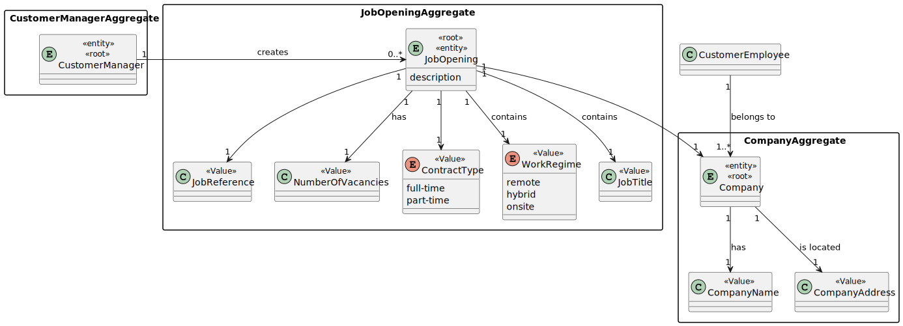

# US 1002 - As Customer Manager, I want to register a job opening.

## 1. Context

This Use Case consists in being possible to a Costumer Manager to create a Job Opening, this job opening will then persist in the system and further be used for candidates to apply into.
## 2. Requirements


**US 1002** As a Costumer Manager, i want to register a job opening, that will further be able to receive candidates applications.

**Acceptance Criteria:**

- 1002.1. The number of Vacancies cannot be zero.

- 1002.2. The Job reference must be a unique reference, there cant be equal job references in different job openings.

- 1002.3. The End Date cannot be earlier than the Job opening process start date.

- 1002.4. There can only be one entity per job opening.

**Dependencies/References:**

> Question : Relativamente à US1002 - "As Customer Manager, I want to register a job opening", existe algum critério de aceitação ainda não mencionado, relacionado com os atributos? Ou fica ao critério da equipa de desenvolvimento consoante boas práticas e senso comum? 

> Answer:  Sobre se existem critérios de aceitação não mencionados não me vou pronunciar, faz parte do processo descobrirem. Eu sugeria usarem algo mais que o senso comum.

## 3. Analysis



## 4. Design
### 4.1. Realization


### 4.2. Class Diagram


### 4.3. Applied Patterns

- 4.3.1 Service
> Services are operations with the responsibility of an entity or value object. They are used to model operations that involve multiple objects or complex behaviour.

- 4.3.2. Factory
> Our PersistenceContext will create a RepositoryFactory then the RepositoryFactory will create the repository that we need in order to persist our domain entity, in this case the Job Opening

- 4.3.3 Tell, Don't Ask
> Ensure that objects do not expose their internal state or behaviour to the outside world. On the contrary, objects should receive commands telling them what they should do, rather than being asked for information about their current state.


### 4.4. Tests

Include here the main tests used to validate the functionality. Focus on how they relate to the acceptance criteria.

**ContractTypeTest**

```
package eapli.jobs4u.jobOpeningsManagement;

import eapli.jobs4u.jobOpeningsManagement.domain.ContractType;
import eapli.jobs4u.jobOpeningsManagement.domain.NumberVacancies;
import org.junit.Test;

import static org.junit.jupiter.api.Assertions.*;


public class ContractTypeTest {
    @Test(expected = IllegalArgumentException.class)
    public void testConstructorWithNullParameters() {
        new ContractType(null);
    }

    @Test
    public void testEquals() {
        String contractTypeString = "FULL-TIME";
        ContractType contractType = new ContractType("FULL-TIME");
        ContractType contractType1 = new ContractType("PART-TIME");

        assertTrue(contractType.toString().equals(contractTypeString));
        assertFalse(contractType1.toString().equals(contractTypeString));
    }

    @Test
    public void testHashCode(){
        ContractType contractType = new ContractType("FULL-TIME");
        ContractType contractType1 = new ContractType("PART-TIME");

        assertNotEquals(contractType1.hashCode(),contractType.hashCode());
    }

    @Test
    public void testValueOf(){
        ContractType contractType = new ContractType("FULL-TIME");
        String contractTypeString = "FULL-TIME";
        assertEquals(contractType,ContractType.valueOf(contractTypeString));
    }
}
````

**JobReferenceTest**
````
public class JobReferenceTest {
        @Test
        public void testConstructor_ValidInputs_ShouldCreateObject() {
            CustomerCode customerCode = new CustomerCode("C001");
            JobReference jobReference = new JobReference("C001-123", customerCode, 123);

            assertEquals("C001-123", jobReference.toString());
            assertEquals("C001", jobReference.code().toString());
            assertTrue(123==jobReference.serialNumber());
        }

        @Test(expected = IllegalArgumentException.class)
        public void testConstructor_InvalidSerialNumber_ShouldThrowException() {
            CustomerCode customerCode = new CustomerCode("C001");
            Integer serialNumber = 0;
            String jobReference = "C001-0";
            new JobReference(jobReference,customerCode,serialNumber);
        }

        @Test
        public void testValueOf_ValidString_ShouldCreateObject() {
            JobReference jobReference = JobReference.valueOf("C001-123");

            assertEquals("C001-123", jobReference.toString());
            assertEquals("C001", jobReference.code().toString());
            assertTrue(123 == jobReference.serialNumber());
        }

        @Test
        public void testCompareTo_EqualReferences_ShouldReturnZero() {
            JobReference jobReference1 = JobReference.valueOf("C001-123");
            JobReference jobReference2 = JobReference.valueOf("C001-123");

            assertEquals(0, jobReference1.compareTo(jobReference2));
        }

        @Test
        public void testCompareTo_LessThanOther_ShouldReturnNegative() {
            JobReference jobReference1 = JobReference.valueOf("C001-122");
            JobReference jobReference2 = JobReference.valueOf("C001-123");

            assertTrue(jobReference1.compareTo(jobReference2) < 0);
        }

        @Test
        public void testCompareTo_GreaterThanOther_ShouldReturnPositive() {
            JobReference jobReference1 = JobReference.valueOf("C001-124");
            JobReference jobReference2 = JobReference.valueOf("C001-123");

            assertTrue(jobReference1.compareTo(jobReference2) > 0);
        }
}
````

**JobTitleTest**
````
public class JobTitleTest {
    @Test
    public void testConstructorSuccessfully(){
        String jobTitleString = "JOB_TITLE";
        JobTitle jobTitle = new JobTitle(jobTitleString);
        assertTrue(jobTitleString.equals(jobTitle.toString()));
    }

    @Test(expected = IllegalArgumentException.class)
    public void testConstructorWithNullParameters() {
        new JobTitle(null);
    }
    @Test
    public void testEquals() {
        String jobTitleString = "TITLE1";
        JobTitle jobTitle = new JobTitle("TITLE1");
        JobTitle jobTitle1 = new JobTitle("TITLE2");

        assertTrue(jobTitle.toString().equals(jobTitleString));
        assertFalse(jobTitle1.toString().equals(jobTitleString));
    }

    @Test
    public void testHashCode(){
        JobTitle jobTitle = new JobTitle("TITLE1");
        JobTitle jobTitle1 = new JobTitle("TITLE2");

        assertNotEquals(jobTitle1.hashCode(),jobTitle.hashCode());
    }
}

````

**NumberOfVacanciesTest**
```
package eapli.jobs4u.jobOpeningsManagement;

import eapli.jobs4u.jobOpeningsManagement.domain.NumberVacancies;
import org.junit.Test;

import static org.junit.jupiter.api.Assertions.*;

public class NumberOfVacanciesTest {

    @Test
    public void testConstructorValidNumberOfVacancies() {
        NumberVacancies vacancies = new NumberVacancies(5);
        assertEquals(5, vacancies.AvaiableNumberVacancies());
    }

    @Test(expected = IllegalArgumentException.class)
    public void testConstructorInvalidNumberOfVacancies() {
        new NumberVacancies(-1);
    }

    @Test
    public void testEquals() {
        NumberVacancies vacancies1 = new NumberVacancies(5);
        NumberVacancies vacancies2 = new NumberVacancies(5);
        NumberVacancies vacancies3 = new NumberVacancies(10);

        assertTrue(vacancies1.equals(vacancies2));
        assertFalse(vacancies1.equals(vacancies3));
    }

    @Test
    public void testHashCode(){
        NumberVacancies vacancies1 = new NumberVacancies(5);
        NumberVacancies vacancies2 = new NumberVacancies(5);
        NumberVacancies vacancies3 = new NumberVacancies(10);

        assertEquals(vacancies1.hashCode(),vacancies2.hashCode());
        assertNotEquals(vacancies1.hashCode(),vacancies3.hashCode());
    }
}
```

**WorkRegimeTest**
```
public class WorkRegimeTest {


    @Test
    public void testConstructorSuccessfully(){
        String workRegimeString = "HYBRID";
        WorkRegime workRegime = new WorkRegime(workRegimeString);
        assertEquals(workRegimeString,workRegime.toString());
    }

    @Test(expected = IllegalArgumentException.class)
    public void testConstructorWithNullParameters() {
        new WorkRegime(null);
    }

    @Test
    public void testEquals() {
        String workRegimeString = "HYBRID";
        WorkRegime workRegime = new WorkRegime("HYBRID");
        WorkRegime workRegime1 = new WorkRegime("REMOTE");

        assertTrue(workRegime.toString().equals(workRegimeString));
        assertFalse(workRegime1.toString().equals(workRegimeString));
    }

    @Test
    public void testHashCode(){
        WorkRegime workRegime = new WorkRegime("HYBRID");
        WorkRegime workRegime1 = new WorkRegime("REMOTE");

        assertNotEquals(workRegime.hashCode(),workRegime1.hashCode());
    }

    @Test
    public void testValueOf(){
        WorkRegime workRegime = new WorkRegime("HYBRID");
        String workRegimeString = "HYBRID";
        assertEquals(workRegime.toString(),WorkRegime.valueOf(workRegimeString).toString());
    }
}
```

**JobOpeningBuilderTest**
```
{

    private static final String DESCRIPTION = "description";
    private static final JobReference JOB_REFERENCE = new JobReference("ISEP", new CustomerCode("ISEP"), 2);
    private static final JobTitle JOB_TITLE = new JobTitle("Developer");
    private static final NumberVacancies NUMBER_VACANCIES = new NumberVacancies(10);

    private static final ContractType CONTRACT_TYPE = new ContractType("Full-Time");

    private static final WorkRegime WORK_REGIME = new WorkRegime("hybrid");

    private static final JobOpeningStatus JOB_OPENING_STATUS = JobOpeningStatus.OPEN;

    private static final Calendar jobOpeningCreationDate = Calendar.getInstance();


    @Test(expected = IllegalArgumentException.class)
    public void ensureCannotBuildWithMissingField() {
        new JobOpeningBuilder().titled(JOB_TITLE)
                .withDescription(DESCRIPTION)
                .withJobReference(JOB_REFERENCE)
                .withNumberOfVacancies(NUMBER_VACANCIES)
                .withContractType(CONTRACT_TYPE)
                .withJobOpeningStatus(JOB_OPENING_STATUS)
                .build();
    }

    @Test(expected = IllegalArgumentException.class)
    public void ensureCannotBuildWithNullTitle() {
        new JobOpeningBuilder().titled(null)
                .withDescription(DESCRIPTION)
                .withContractType(CONTRACT_TYPE)
                .withNumberOfVacancies(NUMBER_VACANCIES)
                .withJobReference(JOB_REFERENCE)
                .withWorkRegime(WORK_REGIME)
                .build();
    }

    @Test(expected = IllegalArgumentException.class)
    public void ensureCannotBuildWithNullDescription() {
        new JobOpeningBuilder().titled(JOB_TITLE)
                .withDescription(null)
                .withContractType(CONTRACT_TYPE)
                .withNumberOfVacancies(NUMBER_VACANCIES)
                .withJobReference(JOB_REFERENCE)
                .withWorkRegime(WORK_REGIME)
                .build();
    }

    @Test(expected = IllegalArgumentException.class)
    public void ensureCannotBuildWithNullContractType() {
        new JobOpeningBuilder().titled(JOB_TITLE)
                .withDescription(DESCRIPTION)
                .withContractType(null)
                .withNumberOfVacancies(NUMBER_VACANCIES)
                .withJobReference(JOB_REFERENCE)
                .withWorkRegime(WORK_REGIME)
                .build();
    }

    @Test(expected = IllegalArgumentException.class)
    public void ensureCannotBuildWithNullNumberOfVacancies() {
        new JobOpeningBuilder().titled(null)
                .withDescription(DESCRIPTION)
                .withContractType(CONTRACT_TYPE)
                .withNumberOfVacancies(null)
                .withJobReference(JOB_REFERENCE)
                .withWorkRegime(WORK_REGIME)
                .build();
    }


    @Test(expected = IllegalArgumentException.class)
    public void ensureCannotBuildWithLessZeroVacancies() {
        new JobOpeningBuilder().titled(JOB_TITLE)
                .withContractType(CONTRACT_TYPE)
                .withDescription(DESCRIPTION)
                .withWorkRegime(WORK_REGIME)
                .withNumberOfVacancies(new NumberVacancies(0))
                .withJobReference(JOB_REFERENCE)
                .build();
    }

    @Test(expected = IllegalArgumentException.class)
    public void ensureCannotBuildWithNullJobReference() {
        new JobOpeningBuilder().titled(JOB_TITLE)
                .withDescription(DESCRIPTION)
                .withContractType(CONTRACT_TYPE)
                .withNumberOfVacancies(NUMBER_VACANCIES)
                .withJobReference(null)
                .withWorkRegime(WORK_REGIME)
                .build();
    }

    @Test(expected = IllegalArgumentException.class)
    public void ensureCannotBuildWithNullWorkRegime() {
        new JobOpeningBuilder().titled(JOB_TITLE)
                .withDescription(DESCRIPTION)
                .withContractType(CONTRACT_TYPE)
                .withNumberOfVacancies(NUMBER_VACANCIES)
                .withJobReference(JOB_REFERENCE)
                .withWorkRegime(null)
                .build();
    }


    @Test(expected = IllegalArgumentException.class)
    public void ensureCannotBuildWithNullJobOpeningStatus() {
        new JobOpeningBuilder().titled(JOB_TITLE)
                .withDescription(DESCRIPTION)
                .withContractType(CONTRACT_TYPE)
                .withNumberOfVacancies(NUMBER_VACANCIES)
                .withJobReference(JOB_REFERENCE)
                .withWorkRegime(WORK_REGIME)
                .withJobOpeningStatus(null)
                .build();
    }


    @Test(expected = IllegalArgumentException.class)
    public void ensureCannotBuildWithNullCostumer() {
        new JobOpeningBuilder().titled(JOB_TITLE)
                .withDescription(DESCRIPTION)
                .withContractType(CONTRACT_TYPE)
                .withNumberOfVacancies(NUMBER_VACANCIES)
                .withJobReference(JOB_REFERENCE)
                .withWorkRegime(WORK_REGIME)
                .withJobOpeningStatus(JobOpeningStatus.OPEN)
                .withCustomer(null)
                .build();
    }


}
```
## 5. Implementation

RegisterJobOpeningUI
```
package eapli.jobs4u.app.backoffice.console.presentation.jobOpening;

import eapli.framework.actions.Actions;
import eapli.framework.actions.menu.Menu;
import eapli.framework.actions.menu.MenuItem;
import eapli.framework.domain.repositories.ConcurrencyException;
import eapli.framework.domain.repositories.IntegrityViolationException;
import eapli.framework.infrastructure.authz.domain.model.Password;
import eapli.framework.infrastructure.authz.domain.model.Role;
import eapli.framework.io.util.Console;
import eapli.framework.presentation.console.AbstractUI;
import eapli.framework.presentation.console.menu.MenuItemRenderer;
import eapli.framework.presentation.console.menu.MenuRenderer;
import eapli.framework.presentation.console.menu.VerticalMenuRenderer;
import eapli.framework.time.util.CurrentTimeCalendars;
import eapli.jobs4u.applicationsmanagement.application.RegisterApplicationController;
import eapli.jobs4u.applicationsmanagement.domain.ApplicationStatus;
import eapli.jobs4u.candidatemanagement.domain.Candidate;
import eapli.jobs4u.customersmanagement.domain.Customer;
import eapli.jobs4u.jobOpeningsManagement.domain.JobOpening;
import eapli.jobs4u.jobOpeningsManagement.domain.JobOpeningStatus;
import eapli.jobs4u.usermanagement.domain.Jobs4uRoles;

import java.io.File;
import java.io.FileNotFoundException;
import java.util.*;

public class RegisterApplicationUI extends AbstractUI {
    private final RegisterApplicationController theController = new RegisterApplicationController();

    @Override
    protected boolean doShow() {

        String directory = Console.readLine("Enter the directory where is the candidate application");
        File applicationFile = theController.findCandidateFile(directory);
        if(applicationFile == null){
            throw new IllegalArgumentException("File not found!");
        }

        List<String> candidateInfo = new ArrayList<>();
        try {
            candidateInfo = theController.extractCandidateInfo(applicationFile);
        } catch (FileNotFoundException e) {
            throw new RuntimeException(e);
        }

        Optional<Candidate> candidateOptional = theController.findByEmail(candidateInfo.get(1));

        if(candidateOptional.isEmpty()){
            String password =theController.generatePassword();
            Set<Role> roles = new HashSet<>();
            roles.add(Jobs4uRoles.CANDIDATE);
            candidateOptional = Optional.ofNullable(theController.registerCandidate(candidateInfo.get(1), password, candidateInfo.get(2), candidateInfo.get(3), candidateInfo.get(1), roles, CurrentTimeCalendars.now(), candidateInfo.get(4)));
        }

        Optional<JobOpening> jobOpening = theController.findByJobReference(candidateInfo.get(0));
        if(jobOpening.isEmpty()){
            throw new IllegalArgumentException("The job opening doesn´t exist.");
        } else {

            try {
                theController.registerApplication(candidateOptional.orElse(null), jobOpening.orElse(null), ApplicationStatus.IN_PROGRESS, directory );
                System.out.println("The application has been registered!");
            } catch (final IntegrityViolationException | ConcurrencyException e) {
                System.out.println("Integrity violation.");
            }
        }
        return false;
    }


        @Override
    public String headline() {
        return "Register Application";
    }
}

````
5.2 RegisterJobOpeningController
```
package eapli.jobs4u.jobOpeningsManagement.application;


import eapli.framework.infrastructure.authz.application.AuthorizationService;
import eapli.framework.infrastructure.authz.application.AuthzRegistry;
import eapli.framework.time.util.CurrentTimeCalendars;
import eapli.jobs4u.customersmanagement.domain.Customer;
import eapli.jobs4u.customersmanagement.domain.CustomerCode;
import eapli.jobs4u.customersmanagement.repositories.CustomerRepository;
import eapli.jobs4u.infrastructure.persistence.PersistenceContext;
import eapli.jobs4u.jobOpeningsManagement.domain.*;
import eapli.jobs4u.jobOpeningsManagement.repositories.JobOpeningRepository;
import eapli.jobs4u.usermanagement.domain.Jobs4uRoles;

import java.util.Calendar;


public class RegisterJobOpeningController {

    private final AuthorizationService authz = AuthzRegistry.authorizationService();

    public Iterable<Customer> findAllCustomers() {
        CustomerRepository customerRepository = PersistenceContext.repositories().customers();
        return customerRepository.findAll();
    }

    public JobOpening addJobOpening(final String jobTitle, final String description,
                                    final String numberOfVacancies, final String contractType,
                                    final String workRegime, final Calendar jobOpeningCreationDate
            , JobOpeningStatus jobOpeningStatus, final Customer customer, final String jobReference) {

        authz.ensureAuthenticatedUserHasAnyOf(Jobs4uRoles.POWER_USER,Jobs4uRoles.ADMIN,Jobs4uRoles.CUSTOMER_MANAGER);
        JobTitle jobTitle1 = new JobTitle(jobTitle);
        CustomerCode code = customer.identity();
        String parts[] = jobReference.split("-");
        JobReference jobReference1 = new JobReference(jobReference,code,Integer.parseInt(parts[1]));
        NumberVacancies numberOfVacancies1 = new NumberVacancies(Integer.parseInt(numberOfVacancies));
        WorkRegime workRegime1 = new WorkRegime(workRegime);
        ContractType contractType1 = new ContractType(contractType);
        JobOpeningBuilder jobOpeningBuilder = new JobOpeningBuilder();
        JobOpening jobOpening = jobOpeningBuilder.titled(jobTitle1).withJobReference(jobReference1).withDescription(description).withNumberOfVacancies(numberOfVacancies1).withContractType(contractType1).withWorkRegime(workRegime1).withJobOpeningCreationDate(jobOpeningCreationDate).withJobOpeningStatus(jobOpeningStatus).withCustomer(customer).build();

        JobOpeningRepository jobOpeningRepository = PersistenceContext.repositories().jobOpenings();
        return jobOpeningRepository.save(jobOpening);
    }

    public JobOpening registerJobOpening(final String jobTitle, String description,
                                         String numberOfVacancies, final String contractType,
                                         final String workRegime,
                                         JobOpeningStatus jobOpeningStatus, Customer customer,String jobReference) {

        return addJobOpening(jobTitle, description, numberOfVacancies, contractType, workRegime, CurrentTimeCalendars.now(), jobOpeningStatus, customer, jobReference);
    }

    public String findLastJobReference(CustomerCode code){
        JobOpeningRepository jobOpeningRepository = PersistenceContext.repositories().jobOpenings();
        String jobReference = jobOpeningRepository.findLastJobReference(code);
        if(jobReference==null){
            return String.format(code+"-"+1);
        } else {
            return jobReference;
        }
    }
}
````

## 6. Integration/Demonstration
````
+= Jobs4u [ @poweruser ] ======================================================+

| 1. My account > | 2. Backoffice Users > | 3. Candidates > | 4. Customers > | 5. Job Openings > | 6. Plugins > | 7. Settings > | 0. Exit |
Please choose an option
5

>> Job Openings >
1. Register Job Opening
2. List Applications from a Job Opening
3. Setup Phases for Job Opening
0. Return

Please choose an option
1
Job Title
Full stack developer for BLIP
Job Description
A job opening for a main Java degree, with fullstack capabilites
Number of Vacancies
5
Contract Type
Hybrid
Work Regime
Hubrid
=== Select a Customer ===
1. BLIP
0. Exit
   Select a jobOpening
   1
   The job opening has been created!

````