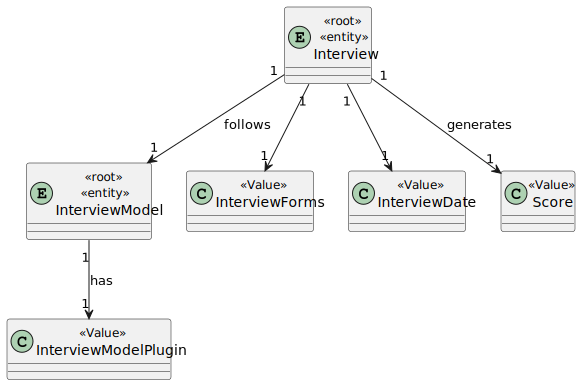
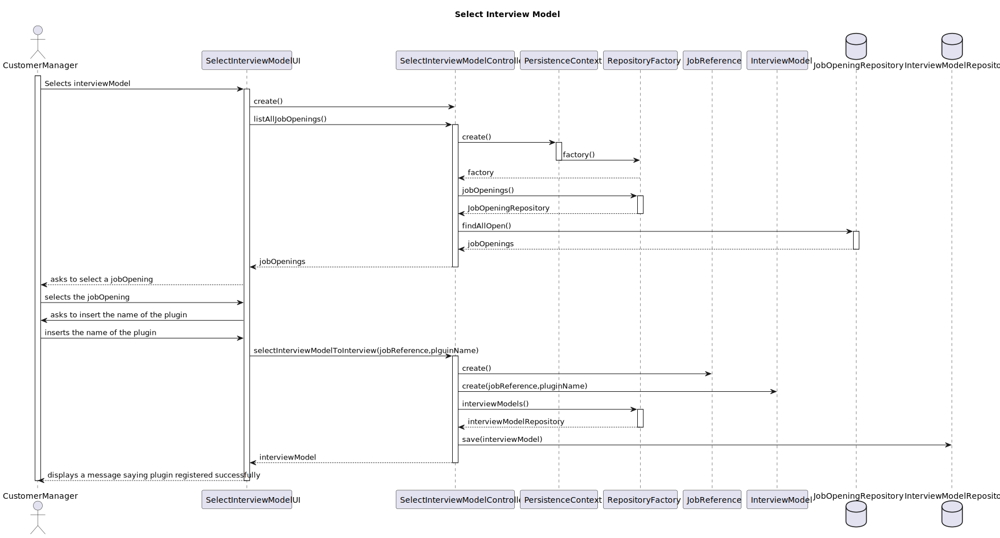
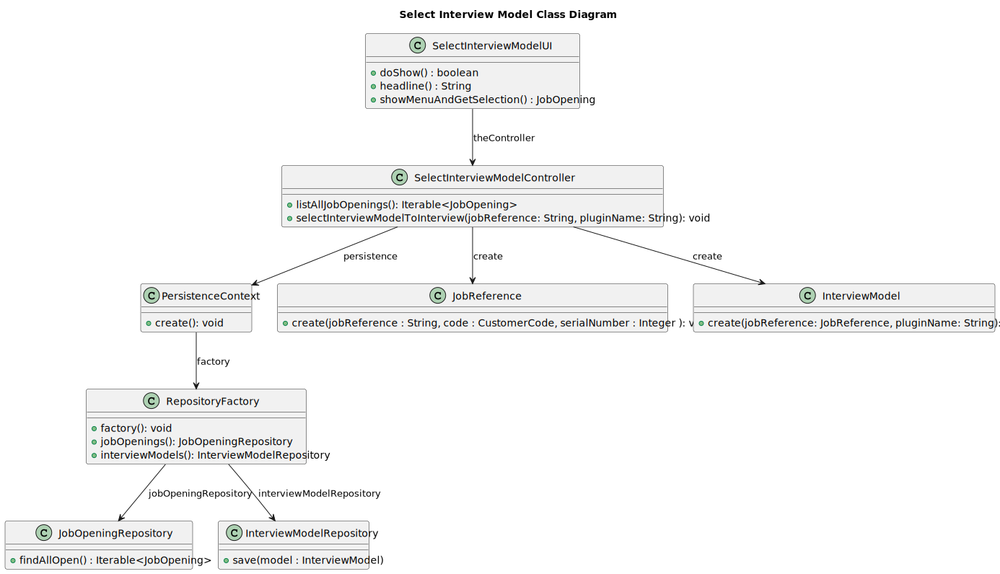

# US 1011 - As Customer Manager, I want to select the interview model to use for the interviews of a job opening

## 1. Context

This task is assigned to enable Customer Managers to select an interview model for the interviews associated with a specific job opening. It involves providing functionality for choosing from available interview models to facilitate evaluation and grading during the interview process.

## 2. Requirements

**US 1011:** As a Customer Manager, I want to select the interview model to use for the interviews of a job opening for evaluation and grading purposes.

**Acceptance Criteria:**

- The system should allow Customer Managers to choose from a list of available interview models.
- The system should ask for the name of the plugin in the system.

## 3. Analysis



## 4. Design

### 4.1. Sequence Diagram



### 4.2. Class Diagram




### 4.3. Applied Patterns

- 4.3.2. Factory
> Our PersistenceContext will create a RepositoryFactory then the RepositoryFactory will create the repository that we need in order to persist our domain entity, in this case the Job Opening and InterviewModel

- 4.3.3 Tell, Don't Ask
> Ensure that objects do not expose their internal state or behaviour to the outside world. On the contrary, objects should receive commands telling them what they should do, rather than being asked for information about their current state.


## Tests

````
package eapli.jobs4u.interviewmodelmanagement.domain;

import eapli.jobs4u.customersmanagement.domain.CustomerCode;
import eapli.jobs4u.jobOpeningsManagement.domain.JobReference;
import org.junit.Test;
import static org.junit.jupiter.api.Assertions.*;

public class InterviewModelTest {

    @Test
    public void createInterviewModel_ValidArguments_Success() {
        // Arrange
        JobReference jobReference = new JobReference("ISEP-1", new CustomerCode("ISEP"), 1);
        String pluginName = "BackendEngineer";

        // Act
        InterviewModel interviewModel = new InterviewModel(jobReference, pluginName);

        // Assert
        assertNotNull(interviewModel);
        assertEquals(jobReference, interviewModel.identity());
        assertEquals(pluginName, interviewModel.pluginName());
    }

    @Test(expected = IllegalArgumentException.class)
    public void createInterviewModel_InvalidArguments_Fails(){
        new InterviewModel(null,null);
    }
    @Test
    public void sameAs_IdenticalInterviewModels_ReturnsTrue() {
        JobReference jobReference = new JobReference("ISEP-1", new CustomerCode("ISEP"), 1);
        String pluginName = "BackendEngineer";
        InterviewModel interviewModel1 = new InterviewModel(jobReference, pluginName);
        InterviewModel interviewModel2 = new InterviewModel(jobReference, pluginName);

        boolean result = interviewModel1.sameAs(interviewModel2);

        assertTrue(result);
    }

    @Test
    public void sameAs_DifferentInterviewModels_ReturnsFalse() {
        // Arrange
        JobReference jobReference1 = new JobReference("ISEP-1", new CustomerCode("ISEP"), 1);
        JobReference jobReference2 = new JobReference("ISEP-2", new CustomerCode("ISEP"), 2);
        String pluginName1 = "BackendEngineer";
        String pluginName2 = "FrontendEngineer";
        InterviewModel interviewModel1 = new InterviewModel(jobReference1, pluginName1);
        InterviewModel interviewModel2 = new InterviewModel(jobReference2, pluginName2);

        boolean result = interviewModel1.sameAs(interviewModel2);

        assertFalse(result);
    }
}
````


## 5. Implementation
**SelectInterviewModelPluginUI**

````
package eapli.jobs4u.app.backoffice.console.presentation.eapli.jobs4u.plugins.interviewmodel;

import eapli.framework.io.util.Console;
import eapli.framework.presentation.console.AbstractUI;
import eapli.jobs4u.applicationsmanagement.domain.JobApplication;
import eapli.jobs4u.interviewmodelmanagement.application.SelectInterviewModelController;
import eapli.jobs4u.jobOpeningsManagement.domain.JobOpening;

import java.lang.reflect.InvocationTargetException;
import java.util.List;

public class SelectInterviewModelPluginUI extends AbstractUI {

    SelectInterviewModelController theController = new SelectInterviewModelController();
    @Override
    public boolean doShow(){
        List<JobOpening> jobOpenings = (List<JobOpening>) theController.listAllJobOpenings();
        JobOpening jobOpening = showMenuAndGetSelection(jobOpenings);
        String pluginName = Console.readLine("Insert the plugin name");
        try {
            this.theController.selectInterviewModelToInterview(jobOpening.identity().toString(), pluginName);
            System.out.println("Plugin associated with the job opening");
        } catch (Exception e) {
            throw new RuntimeException(e);
        }
        return false;
        }

    @Override
    public String headline(){
        return "Select Interview plugin";
    }

    public JobOpening showMenuAndGetSelection(List<JobOpening> jobOpenings) {

        System.out.println("=== Select a JobOpening ===");
        System.out.printf(" %-30s%-20s%-20s%-30s%-20s%n","JOB_REFERENCE","JOB_TITLE","NUMBER_VACANCIES","CUSTOMER","STATUS");
        for (int i = 0; i < jobOpenings.size(); i++) {
            JobOpening jobOpening = jobOpenings.get(i);
            System.out.print((i + 1)+ ".");
            System.out.printf(" %-30s%-20s%-20s%-30s%-20s%n", jobOpening.identity().toString(), jobOpening.jobTitle().toString(), jobOpening.numberOfVacancies().toString(), jobOpening.customer().name().toString(), jobOpening.jobOpeningStatus().toString());
        }
        System.out.println("0. Exit");

        int choice;
        do {
            choice = Console.readInteger("Select a jobOpening");

        } while (choice < 0 || choice > jobOpenings.size());

        if (choice == 0) {
            return null;
        } else {
            return jobOpenings.get(choice - 1);
        }
    }

}
````

**SelectInterviewModelController**

````
package eapli.jobs4u.interviewmodelmanagement.application;

import eapli.jobs4u.customersmanagement.domain.CustomerCode;
import eapli.jobs4u.infrastructure.persistence.PersistenceContext;
import eapli.jobs4u.interviewmodelmanagement.domain.InterviewModel;
import eapli.jobs4u.interviewmodelmanagement.repositories.InterviewModelRepository;
import eapli.jobs4u.jobOpeningsManagement.domain.JobOpening;
import eapli.jobs4u.jobOpeningsManagement.domain.JobReference;
import eapli.jobs4u.jobOpeningsManagement.repositories.JobOpeningRepository;
import eapli.jobs4u.pluginsmanagement.InterviewModelPlugin;
import jakarta.persistence.Persistence;

import java.lang.reflect.InvocationTargetException;
import java.util.List;

public class SelectInterviewModelController {

    public Iterable<JobOpening> listAllJobOpenings() {
        JobOpeningRepository jobOpeningRepository = PersistenceContext.repositories().jobOpenings();
        return jobOpeningRepository.findAllOpen();
    }
    public void selectInterviewModelToInterview(String jobReference, String pluginName){
        String[] parts = jobReference.split("-");
        JobReference jobReference1 = new JobReference(jobReference,new CustomerCode(parts[0]),Integer.parseInt(parts[1]));
        InterviewModel interviewModel = new InterviewModel(jobReference1,pluginName);
        InterviewModelRepository interviewModelRepository = PersistenceContext.repositories().interviewModels();
        interviewModelRepository.save(interviewModel);
    }
}
````

## 6. Integration/Demonstration


````
+= Jobs4u [ @poweruser ] ======================================================+

| 1. My account > | 2. Backoffice Users > | 3. Candidates > | 4. Customers > | 5. Job Openings > | 6. Plugins > | 7. Settings > | 0. Exit | 
Please choose an option
6

>> Plugins >
1. Select Interview Model Plugin
2. Register Interview Model Plugin
0. Return 

Please choose an option
1
=== Select a JobOpening ===
 JOB_REFERENCE                 JOB_TITLE           NUMBER_VACANCIES    CUSTOMER                      STATUS              
1. IBM-1                         JobTitle            10                  IBM                           OPEN                
0. Exit
Select a jobOpening
1
Insert the plugin name
BackendEngineer
Plugin associated with the job opening

+= Jobs4u [ @poweruser ] ======================================================+
````