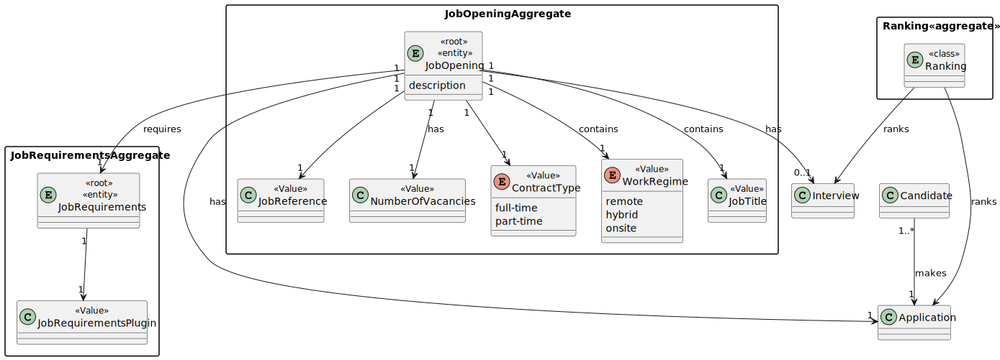
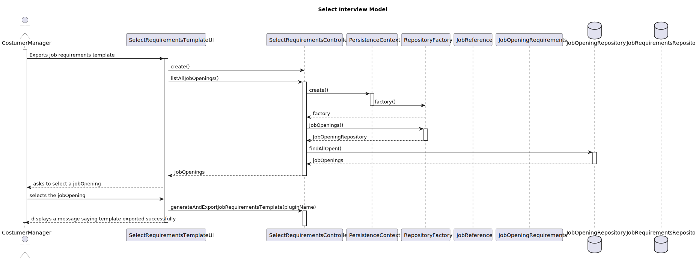
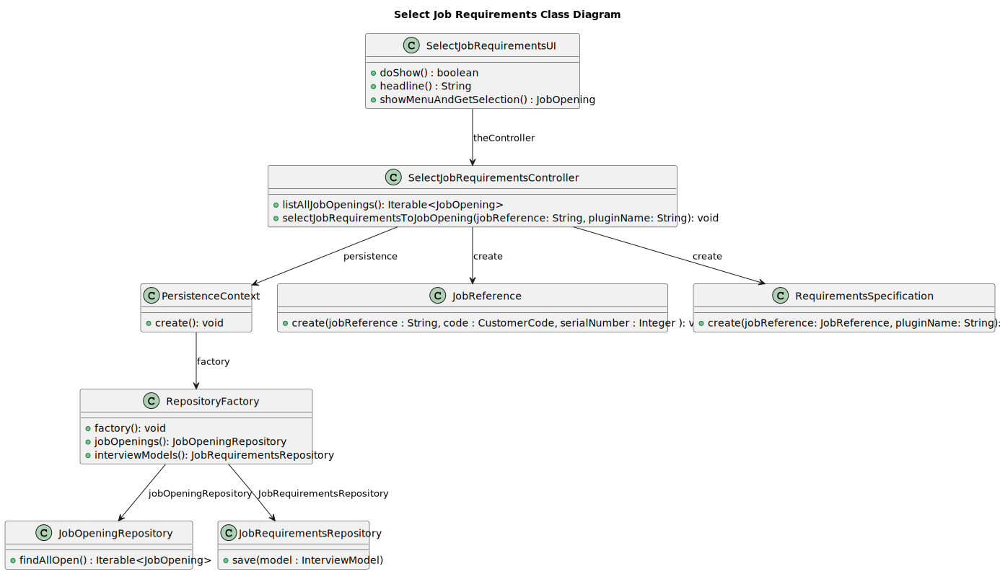

# US 1009 - As Customer Manager, I want to select the requirements specification to be used for a job opening. #

## 1. Context

This task is created to enable a Costumer Manager to select a Job Requirements Specification for gathering data from a candidate. it involves the possibility of creating different questions and questionnaires.
## 2. Requirements

 **US 1009** - As Customer Manager, I want to select the requirements specification to be used for a job opening. 

**Acceptance Criteria:**

- The system should allow Customer Managers to choose from a list of available interview models.
- The system should ask for the name of the plugin in the system.

## 3. Analysis



## 4. Design

### 4.1. Sequence Diagram



### 4.2. Class Diagram



### 4.3. Applied Patterns

- 4.3.2. Factory
> Our PersistenceContext will create a RepositoryFactory then the RepositoryFactory will create the repository that we need in order to persist our domain entity, in this case the Job Opening and InterviewModel

- 4.3.3 Tell, Don't Ask
> Ensure that objects do not expose their internal state or behaviour to the outside world. On the contrary, objects should receive commands telling them what they should do, rather than being asked for information about their current state.


### 4.4. Tests

Include here the main tests used to validate the functionality. Focus on how they relate to the acceptance criteria.

**Test 1:** *Verifies that it is not possible to ...*

**Refers to Acceptance Criteria:** G002.1


```
@Test(expected = IllegalArgumentException.class)
public void ensureXxxxYyyy() {
	...
}
````

## 5. Implementation

**SelectJobRequirementsController**

````
package eapli.jobs4u.jobrequirementsmanagement.application;

import eapli.jobs4u.customersmanagement.domain.CustomerCode;
import eapli.jobs4u.infrastructure.persistence.PersistenceContext;
import eapli.jobs4u.interviewmodelmanagement.domain.InterviewModel;
import eapli.jobs4u.interviewmodelmanagement.repositories.InterviewModelRepository;
import eapli.jobs4u.jobOpeningsManagement.domain.JobOpening;
import eapli.jobs4u.jobOpeningsManagement.domain.JobReference;
import eapli.jobs4u.jobOpeningsManagement.repositories.JobOpeningRepository;
import eapli.jobs4u.jobrequirementsmanagement.domain.JobRequirements;
import eapli.jobs4u.jobrequirementsmanagement.repositories.JobRequirementsRepository;

public class SelectJobRequirementsController {

 public Iterable<JobOpening> listAllJobOpenings() {
     JobOpeningRepository jobOpeningRepository = PersistenceContext.repositories().jobOpenings();
     return jobOpeningRepository.findAllOpen();
 }
 public void selectJobRequirementsByJobReference(String jobReference, String pluginName){
     String[] parts = jobReference.split("-");
     JobReference jobReference1 = new JobReference(jobReference,new CustomerCode(parts[0]),Integer.parseInt(parts[1]));
     JobRequirements jobRequirements = new JobRequirements(jobReference1,pluginName);
     JobRequirementsRepository jobRequirementsRepository = PersistenceContext.repositories().jobRequirements();
     jobRequirementsRepository.save(jobRequirements);
 }
}
````

**SelectJobRequirementsUI**
````
package eapli.jobs4u.app.backoffice.console.presentation.jobOpening;

import eapli.framework.io.util.Console;
import eapli.framework.presentation.console.AbstractUI;
import eapli.jobs4u.interviewmodelmanagement.application.SelectInterviewModelController;
import eapli.jobs4u.jobOpeningsManagement.domain.JobOpening;
import eapli.jobs4u.jobrequirementsmanagement.application.SelectJobRequirementsController;

import java.util.List;

public class SelectRequirementsUI extends AbstractUI {

    SelectJobRequirementsController theController = new SelectJobRequirementsController();
    @Override
    public boolean doShow(){
        List<JobOpening> jobOpenings = (List<JobOpening>) theController.listAllJobOpenings();
        JobOpening jobOpening = showMenuAndGetSelection(jobOpenings);
        String pluginName = Console.readLine("Insert the plugin name");
        try {
            this.theController.selectJobRequirementsByJobReference(jobOpening.identity().toString(), pluginName);
            System.out.println("Job requirement associated with the job opening");
        } catch (Exception e) {
            throw new RuntimeException(e);
        }
        return false;
    }

    @Override
    public String headline(){
        return "Select Job Requirement plugin";
    }

    public JobOpening showMenuAndGetSelection(List<JobOpening> jobOpenings) {

        System.out.println("=== Select a JobOpening ===");
        System.out.printf(" %-30s%-20s%-20s%-30s%-20s%n","JOB_REFERENCE","JOB_TITLE","NUMBER_VACANCIES","CUSTOMER","STATUS");
        for (int i = 0; i < jobOpenings.size(); i++) {
            JobOpening jobOpening = jobOpenings.get(i);
            System.out.print((i + 1)+ ".");
            System.out.printf(" %-30s%-20s%-20s%-30s%-20s%n", jobOpening.identity().toString(), jobOpening.jobTitle().toString(), jobOpening.numberOfVacancies().toString(), jobOpening.customer().name().toString(), jobOpening.jobOpeningStatus().toString());
        }
        System.out.println("0. Exit");

        int choice;
        do {
            choice = Console.readInteger("Select a jobOpening");

        } while (choice < 0 || choice > jobOpenings.size());

        if (choice == 0) {
            return null;
        } else {
            return jobOpenings.get(choice - 1);
        }
    }

}

````
## 6. Integration/Demonstration

````
+= Jobs4u [ @poweruser ] ======================================================+

| 1. My account > | 2. Backoffice Users > | 3. Candidates > | 4. Customers > | 5. Job Openings > | 7. Settings > | 0. Exit | 
Please choose an option
5

>> Job Openings >
1. Register Job Opening
2. List Applications from a Job Opening
3. Setup Phases for Job Opening
4. Select Interview Model Plugin
5. Select Job Requirements Plugin
6. Generate Interview Template
7. Generate JobRequirementsPlugin
0. Return 

Please choose an option
5
=== Select a JobOpening ===
 JOB_REFERENCE                 JOB_TITLE           NUMBER_VACANCIES    CUSTOMER                      STATUS              
1. IBM-1                         Title               10                  IBMComapny                    OPEN                
2. IBM-2                         title               4                   IBMComapny                    OPEN                
0. Exit
Select a jobOpening
2
Insert the plugin name
FiveYearsExperience
Job requirement associated with the job opening

+= Jobs4u [ @poweruser ] ======================================================+

````