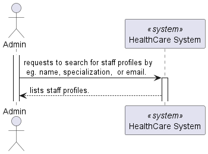
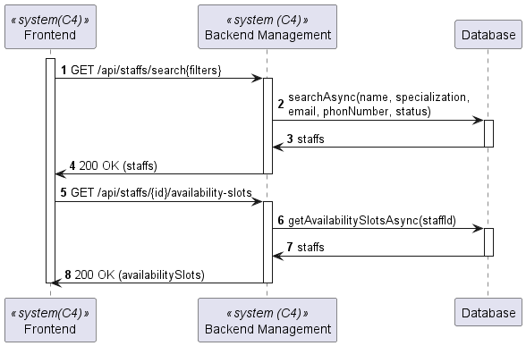
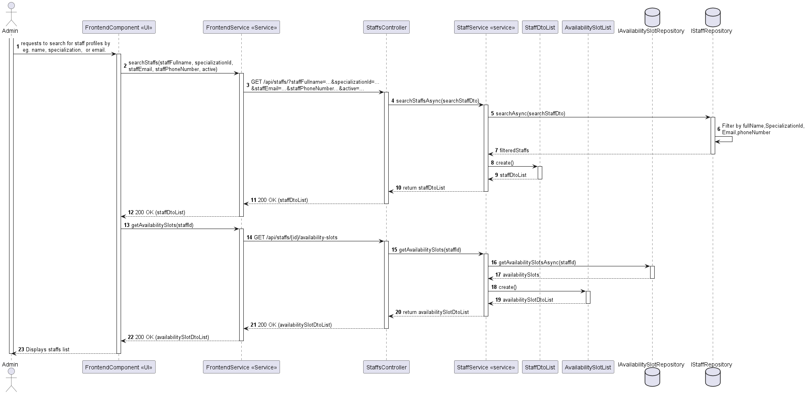

# US 5.1.15

As an Admin, I want to list/search staff profiles, so that I can see the details, edit, and remove staff profiles.

## 2. Requirements

**US 5.1.15**As an Admin, I want to list/search staff profiles, so that I can see the details, edit, and remove staff profiles.

**Acceptance Criteria:**

5.1.15.1 - Admins can search staff profiles by attributes such as name, email, or specialization.
5.1.15.2 - The system displays search results in a list view with key staff information (name, email,specialization).
5.1.15.3 - Admins can select a profile from the list to view, edit, or deactivate.
5.1.15.4 - The search results are paginated, and filters are available for refining the search results.
## 3. Views

The global views are available in the views folder. 

### LEVEL 1

### LEVEL 2

### LEVEL 3

