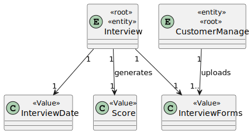
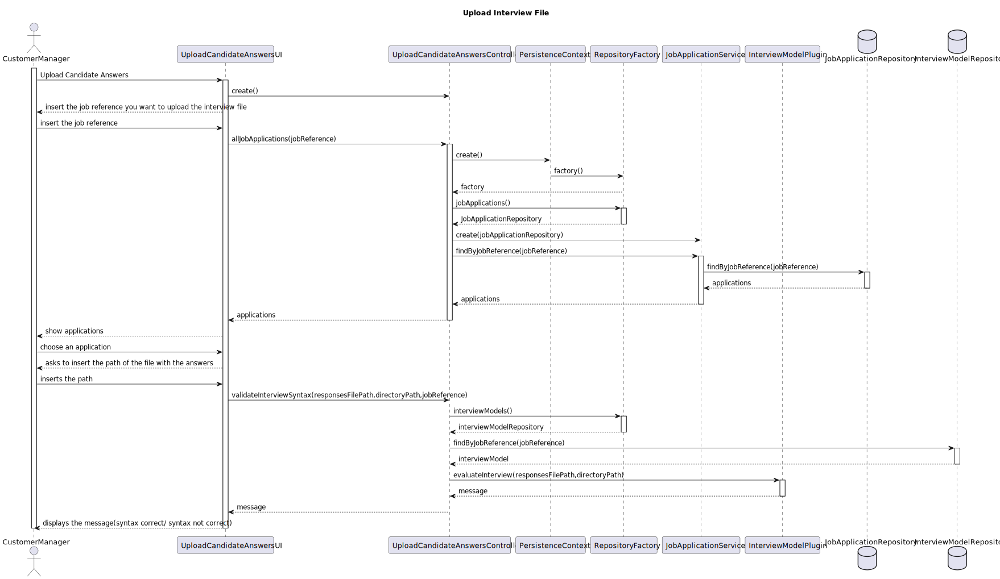
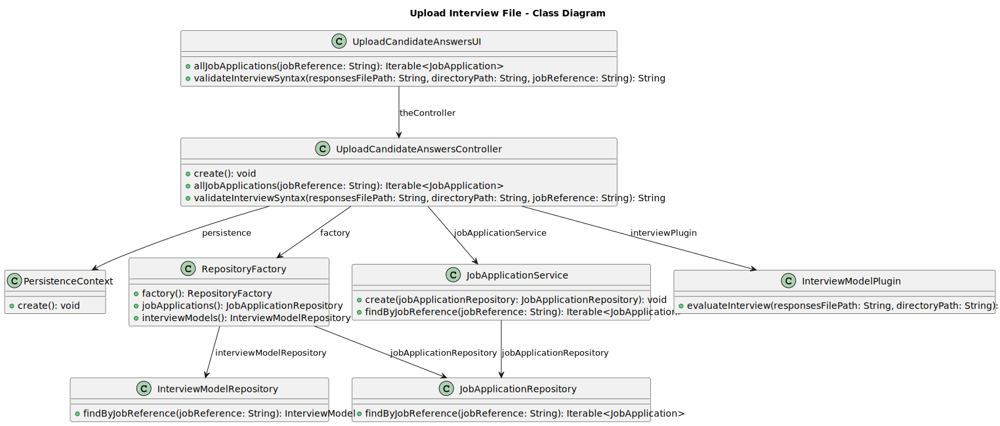

# US 3004

- As Customer Manager, I want to upload a text file with the candidate responses for an interview.

## 1. Context

## 2. Requirements

**US 1017** As Customer Manager, I want to upload a text file with the candidate responses for an interview.

**Acceptance Criteria:**

- 1017.1. The system should verify the syntax of the file uploaded.

- 1017.2. In case the file doesn´t follow the syntax the system should not move the file.

## 3. Analysis

## 4. Design

### 4.2. Class Diagram

### 4.3. Applied Patterns

### 4.4. Tests

# Test related to 1017.2 - File doesn´t follow the rules
    -Enter a file path with a file with a wrong syntax
    -The system should return a message saying the syntax is not correct and where is the mistake
    -The file should not be moved

# Test File follow the rules
    -Enter a file path with a file with a correct syntax
    -The system should return a message saying the syntax correct
    -The file should be moved