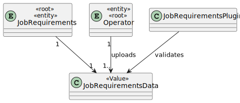
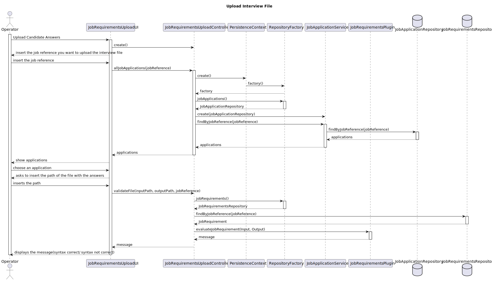
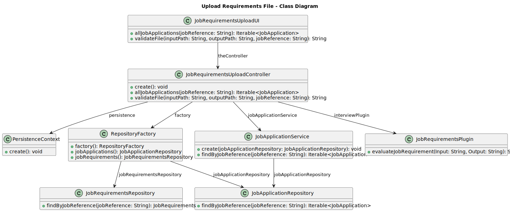

# US 2004

- As Operator, I want to upload a text file with the data fields (requirements ) of a candidate for its verification.

## 1. Context

## 2. Requirements

**US 2004** As Operator, I want to upload a text file with the data fields (requirements ) of a candidate for its verification.

**Acceptance Criteria:**

- 2004.1. The system should verify the syntax of the file uploaded.

- 2004.2. In case the file doesn´t follow the syntax the system should not move the file.

## 3. Analysis

## 4. Design

### 4.2. Class Diagram

### 4.3. Applied Patterns

### 4.4. Tests

Test related to 2004.2 
Enter a file path with a file with a wrong syntax
The system should return a message saying the syntax is not correct and where is the mistake
The file should not be moved