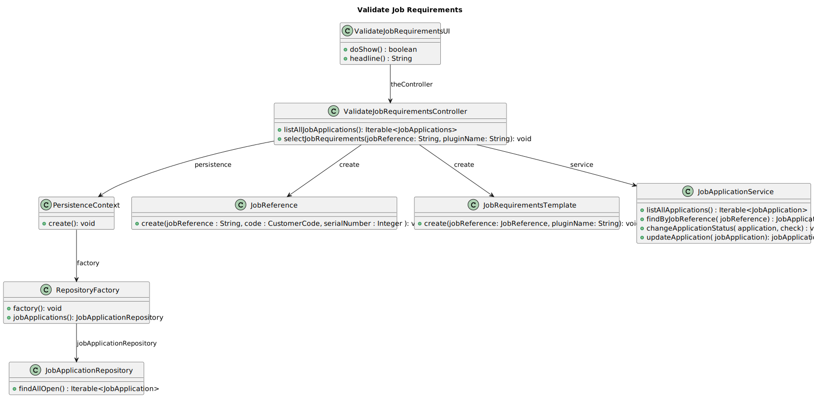
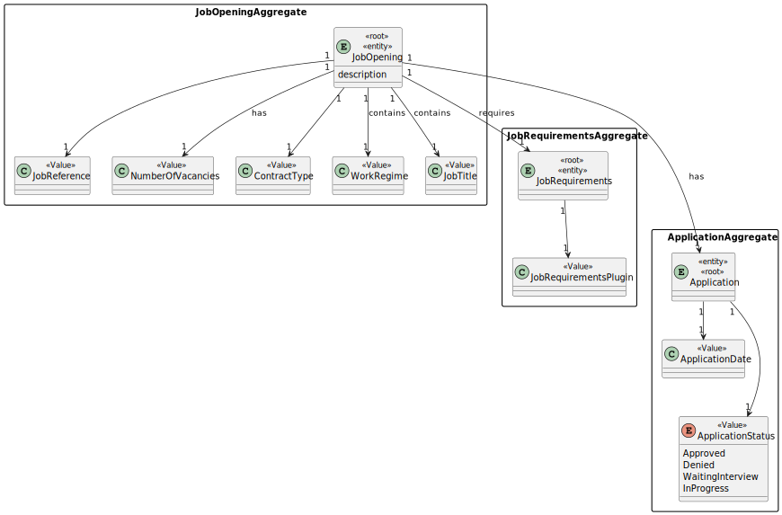
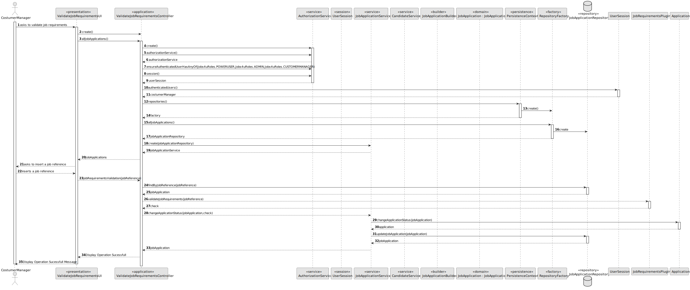

# 1015 → As Customer Manager, I want to execute the process of verification of requirements of applications for a job opening

## 1. Context

*In this task story we are asked to carry out the process of evaluating interviews for a job opening, as customer manager*

## 2. Requirements

*In this section you should present the functionality that is being developed, how do you understand it, as well as possible correlations to other requirements (i.e., dependencies). You should also add acceptance criteria.*

**1015** - As Customer Manager, I want to execute the process of verification of requirements of applications for a job opening.

**Acceptance Criteria:**

- 1015.1. If the job requirements  meets the job openings necessities then the Application state must be changed into waiting-interview.
- 1015.2. If the job requirements  are not enough to the job opening needs then the Application state must be changed into requirements rejected.

## 3. Tests

--------------------
TEST PLAN
--------------------

--------------------
CASE #1 : Job Requirements are not met 
--------------------

1. Create or verify the existence of "Applications".
2. Select the Job Requirements plugin to evaluate the target application
3. Select the option to evaluate job requirements, inserting the pretended job reference
4. A requirements not met will appear, application status will be updated

--------------------
CASE #2 : Job Requirements are accepted
--------------------

1. Create or verify the existence of "Applications".
2. Select the Job Requirements plugin to evaluate the target application
3. Select the option to evaluate job requirements, inserting the pretended job reference
4. A requirements not met will appear, application status will be updated

## 4. Design

*In this sections, the team should present the solution design that was adopted to solve the requirement. This should include, at least, a diagram of the realization of the functionality (e.g., sequence diagram), a class diagram (presenting the classes that support the functionality), the identification and rational behind the applied design patterns and the specification of the main tests used to validade the functionality.*

### 5.1. Realization

### 5.2. Class Diagram

