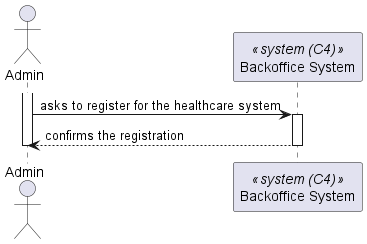
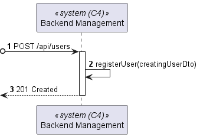
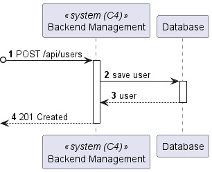
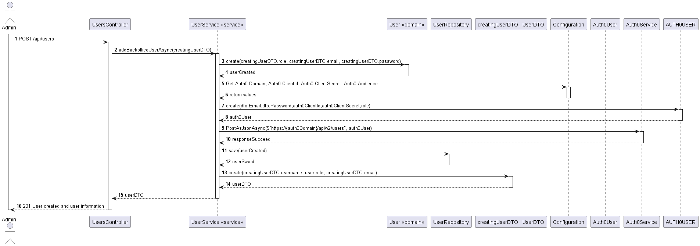

# US 5.1.1

As an Admin, I want to register new backoffice users via an out-of-band process, so that they can access the backoffice system with appropriate permissions.


## 2. Requirements

**US 5.1.1** As an Admin, I want to register new backoffice users via an out-of-band process, so that they can access the backoffice system with appropriate permissions.

**Acceptance Criteria:**

- 5.1.1.1 - - Backoffice users (e.g., doctors, nurses, technicians) are registered by an Admin via an internal process, not via self-registration.

- 5.1.1.2 - - Admin assigns roles (e.g., Doctor, Nurse, Technician) during the registration process.

- 5.1.1.3 - - Registered users receive a one-time setup link via email to set their password and activate their account.

- 5.1.1.4 - The system enforces strong password requirements for security.

- 5.1.1.5 - - A confirmation email is sent to verify the user’s registration.

## 3. Views

The global views are available in the views folder. 

### LEVEL 1



### LEVEL 2



### LEVEL 3





## 4. Design

*In this sections, the team should present the solution design that was adopted to solve the requirement. This should include, at least, a diagram of the realization of the functionality (e.g., sequence diagram), a class diagram (presenting the classes that support the functionality), the identification and rational behind the applied design patterns and the specification of the main tests used to validade the functionality.*

### 4.1. Realization

### 4.2. Class Diagram


### 4.3. Applied Patterns

### 4.4. Tests

Include here the main tests used to validate the functionality. Focus on how they relate to the acceptance criteria.

**Test 1:** *Verifies that it is not possible to ...*

**Refers to Acceptance Criteria:** 


```
@Test(expected = IllegalArgumentException.class)
public void ensureXxxxYyyy() {
    ...
}
```

## 5. Implementation

*In this section the team should present, if necessary, some evidencies that the implementation is according to the design. It should also describe and explain other important artifacts necessary to fully understand the implementation like, for instance, configuration files.*

*It is also a best practice to include a listing (with a brief summary) of the major commits regarding this requirement.*

## 6. Integration/Demonstration

*In this section the team should describe the efforts realized in order to integrate this functionality with the other parts/components of the system*

*It is also important to explain any scripts or instructions required to execute an demonstrate this functionality*

## 7. Observations

*This section should be used to include any content that does not fit any of the previous sections.*

*The team should present here, for instance, a critical prespective on the developed work including the analysis of alternative solutioons or related works*

*The team should include in this section statements/references regarding third party works that were used in the development this work.*