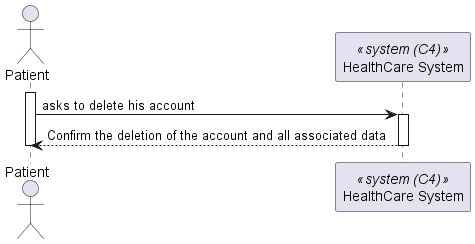
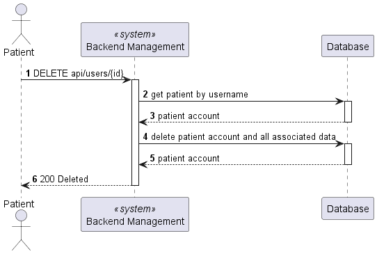
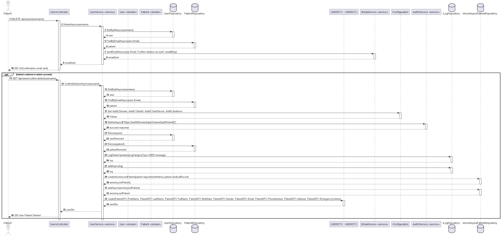

# US 5.1.5

As a Patient, I want to delete my account and all associated data, so that I can exercise my right to be forgotten as per GDPR.

## 2. Requirements

**US 5.1.5** As a Patient, I want to delete my account and all associated data, so that I can exercise my right to be forgotten as per GDPR.

**Acceptance Criteria:**

- 5.1.5.1 - Patients can request to delete their account through the profile settings.
- 5.1.5.2- The system sends a confirmation email to the patient before proceeding with account deletion.
- 5.1.5.3- Upon confirmation, all personal data is permanently deleted from the system within the legally required time frame (e.g., 30 days).
- 5.1.5.4- Patients are notified once the deletion is complete, and the system logs the action for GDPR compliance.
- 5.1.5.5- Some anonymized data may be retained for legal or research purposes, but all identifiable information is erased.

## 3. Views

The global views are available in the views folder. 

### LEVEL 1

### LEVEL 2

### LEVEL 3

## Observations

*This section should be used to include any content that does not fit any of the previous sections.*

*The team should present here, for instance, a critical prespective on the developed work including the analysis of alternative solutioons or related works*

*The team should include in this section statements/references regarding third party works that were used in the development this work.*