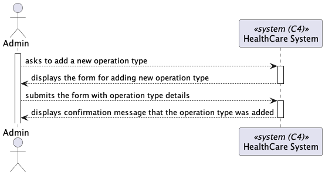
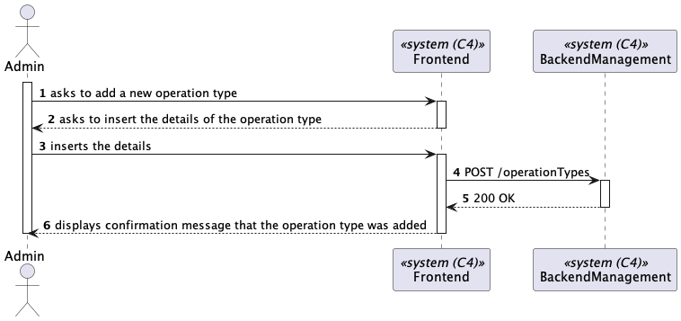
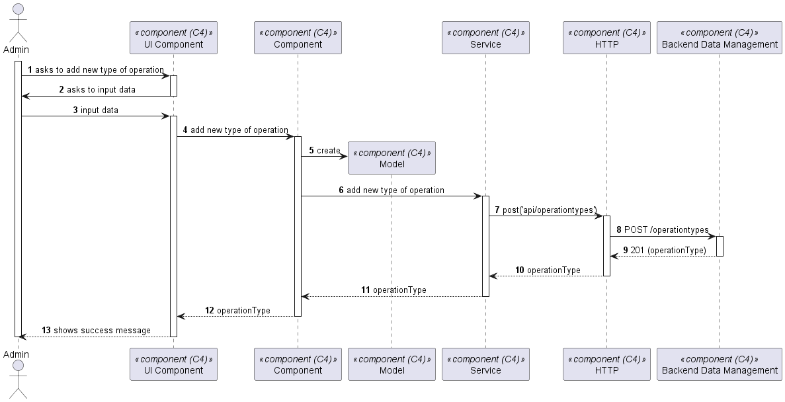

# US 5.1.20

As an Admin, I want to add new types of operations, so that I can reflect the available medical procedures in the system.

## 2. Requirements

**US 5.1.20** As an Admin, I want to add new types of operations, so that I can reflect the available medical procedures in the system.

**Acceptance Criteria:**

5.1.20.1. Admins can add new operation types with attributes like:
 - Operation Name
 - Required Staff by Specialization
 - Estimated Duration

5.1.20.2. The system validates that the operation name is unique.

5.1.20.3. The system logs the creation of new operation types and makes them available for scheduling
immediately.

## 3. Views

The global views are available in the views folder. 

### LEVEL 1

### LEVEL 2

### LEVEL 3

