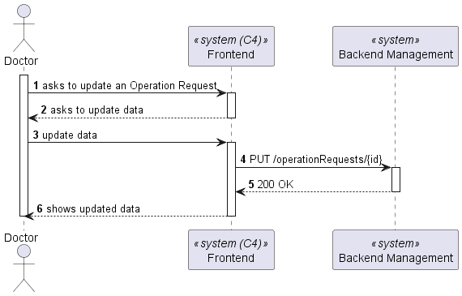

# US 5.1.17

As a Doctor, I want to update an operation requisition, so that the Patient has access to the necessary healthcare

## 2. Requirements


**US 5.1.17** As a Doctor, I want to update an operation requisition, so that the Patient has access to the necessary healthcare


**Acceptance Criteria:**

- 5.1.17.1 - Doctors can update operation requests they created (e.g., change the deadline or priority). 

- 5.1.17.2 -  The system checks that only the requesting doctor can update the operation request.

- 5.1.17.3 - The system logs all updates to the operation request (e.g., changes to priority or deadline).

- 5.1.17.4 - Updated requests are reflected immediately in the system and notify the Planning Module of any changes. 

## 3. Views

The global views are available in the views folder. 

### LEVEL 1


### LEVEL 2



### LEVEL 3

 
 


### 4.4. Tests

Include here the main tests used to validate the functionality. Focus on how they relate to the acceptance criteria.

**Test 1:** *Verifies that it is not possible to ...*

**Refers to Acceptance Criteria:** G002.1


```
@Test(expected = IllegalArgumentException.class)
public void ensureXxxxYyyy() {
	...
}
````

## 5. Implementation

*In this section the team should present, if necessary, some evidencies that the implementation is according to the design. It should also describe and explain other important artifacts necessary to fully understand the implementation like, for instance, configuration files.*

*It is also a best practice to include a listing (with a brief summary) of the major commits regarding this requirement.*

## 6. Integration/Demonstration

*In this section the team should describe the efforts realized in order to integrate this functionality with the other parts/components of the system*

*It is also important to explain any scripts or instructions required to execute an demonstrate this functionality*

## 7. Observations

*This section should be used to include any content that does not fit any of the previous sections.*

*The team should present here, for instance, a critical prespective on the developed work including the analysis of alternative solutioons or related works*

*The team should include in this section statements/references regarding third party works that were used in the development this work.*