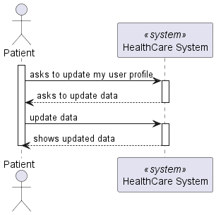
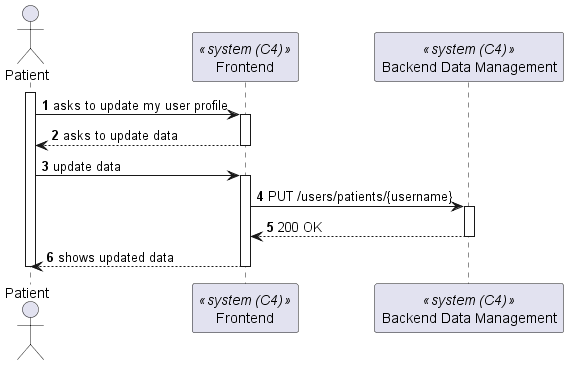
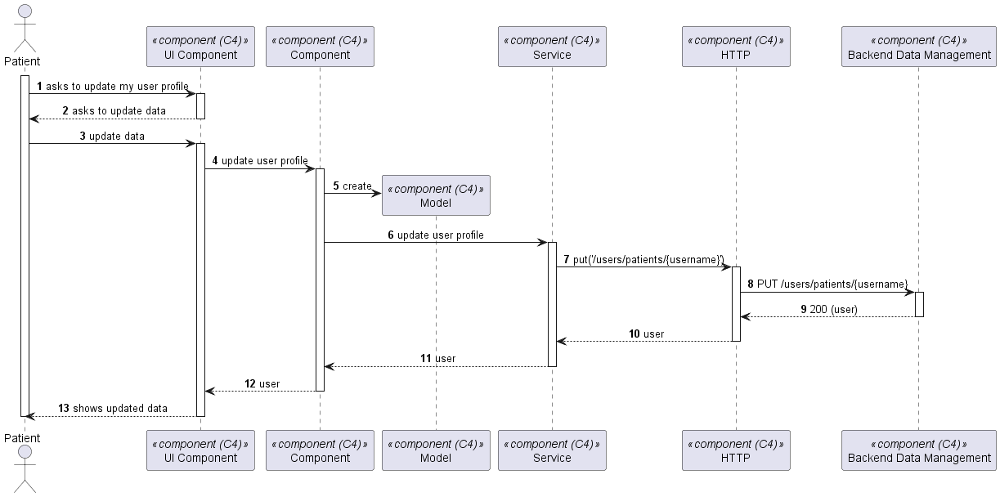

# US 5.1.4

As a Patient, I want to update my user profile, so that I can change my personal details and preferences.

## 2. Requirements

**US 5.1.4** As a Patient, I want to update my user profile, so that I can change my personal details and preferences.

**Acceptance Criteria:**

5.1.4.1 - Patients can log in and update their profile details (e.g., name, contact information,preferences).
5.1.4.2 - Changes to sensitive data, such as email, trigger an additional verification step (e.g.,confirmation email).
5.1.4.3 - All profile updates are securely stored in the system.
5.1.4.4 -The system logs all changes made to the patient's profile for audit purposes.

## 3. Views

The global views are available in the views folder. 

### LEVEL 1

### LEVEL 2

### LEVEL 3

