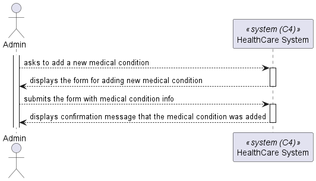
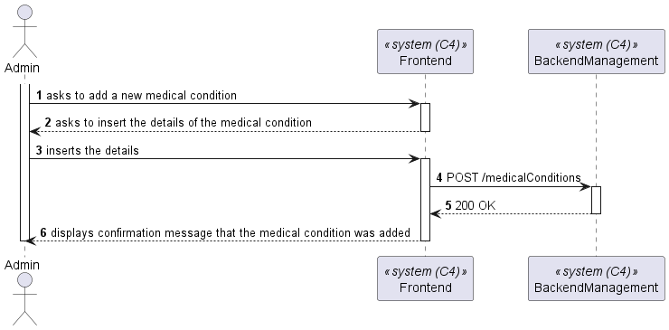
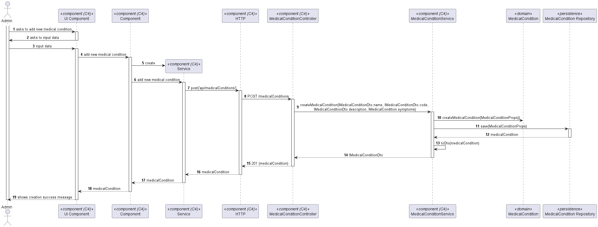

# US 7.2.4

As an Admin, I want to add new Medical Condition, so that the Doctors can use it to update the Patient Medical Record.

## 2. Requirements

**US 7.2.4**  As an Admin, I want to add new Medical Condition, so that the Doctors can use it to update the Patient Medical Record.

**Acceptance Criteria:**

## 3. Views

The global views are available in the views folder. 

### LEVEL 1

### LEVEL 2

### LEVEL 3

