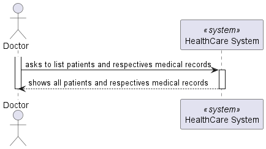
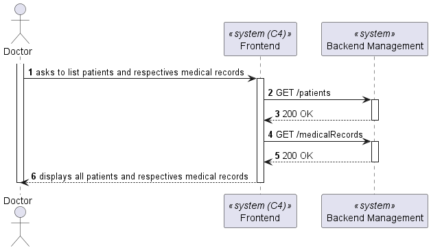
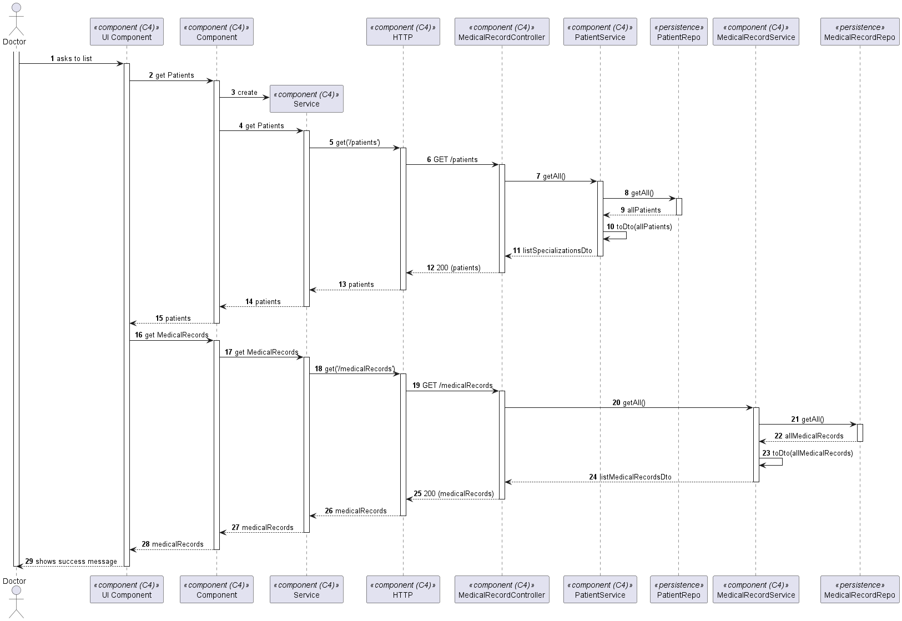

# US 7.2.14

As a Doctor, I want to include the access of the Patient Medical Record during the patient profile visualization and management, so that I manage it in that context.

## 2. Requirements

**US 7.2.14** As a Doctor, I want to include the access of the Patient Medical Record during the patient profile visualization and management, so that I manage it in that context.

## 3. Views

The global views are available in the views folder. 

### LEVEL 1

### LEVEL 2

### LEVEL 3

